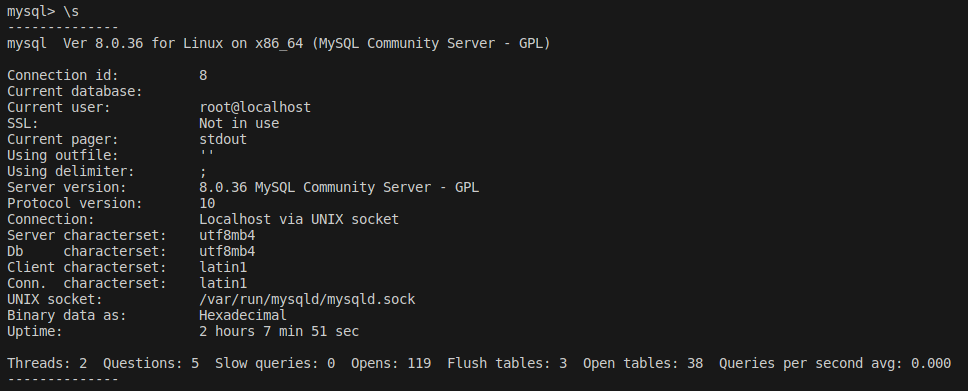

## Задача 1

Используя Docker, поднимите инстанс MySQL (версию 8). Данные БД сохраните в volume.

Изучите [бэкап БД](https://github.com/netology-code/virt-homeworks/tree/virt-11/06-db-03-mysql/test_data) и 
восстановитесь из него.

Перейдите в управляющую консоль `mysql` внутри контейнера.<br/>
Используя команду `\h`, получите список управляющих команд.<br/>
Найдите команду для выдачи статуса БД и **приведите в ответе** из её вывода версию сервера БД.<br/>
Подключитесь к восстановленной БД и получите список таблиц из этой БД.<br/>
**Приведите в ответе** количество записей с `price` > 300.

В следующих заданиях мы будем продолжать работу с этим контейнером.

## Решение 1

Создаём БД test_db и загружаем в неё дамп:

```shell
docker exec -i mysql sh -c 'exec mysql test_db' < ./test_dump.sql
```

В списке команд находим `\s`:



Отсюда из получаем версию сервера `8.0.36`:
```
Server version:         8.0.36 MySQL Community Server - GPL
```

Список таблиц:


Количество книг с ценой за 300 (и это только **My Little Pony**):


---

## Задача 2

Создайте пользователя test в БД c паролем test-pass, используя:
- плагин авторизации mysql_native_password
- срок истечения пароля — 180 дней 
- количество попыток авторизации — 3 
- максимальное количество запросов в час — 100
- аттрибуты пользователя:
    - Фамилия "Pretty"
    - Имя "James".

Предоставьте привилегии пользователю `test` на операции SELECT базы `test_db`.<br/>
Используя таблицу INFORMATION_SCHEMA.USER_ATTRIBUTES, получите данные по пользователю `test` и 
**приведите в ответе к задаче**.

## Решение 2

Создаём пользователя:

```SQL
CREATE USER 'test'@'localhost' 
IDENTIFIED WITH mysql_native_password BY 'test-pass'
WITH MAX_QUERIES_PER_HOUR 100
PASSWORD EXPIRE INTERVAL 180 DAY
FAILED_LOGIN_ATTEMPTS 3
ATTRIBUTE '{"Имя": "James", "Фамилия": "Pretty"}';
```

Выдаём привилегии:

```SQL
GRANT SELECT ON test_db.* TO 'test'@'localhost';
```

Проверяем привилегии:
```SQL
SELECT * FROM INFORMATION_SCHEMA.USER_ATTRIBUTES where USER='test';
```

Получаем:


---

## Задача 3

Установите профилирование `SET profiling = 1`.
Изучите вывод профилирования команд `SHOW PROFILES;`.<br/>
Исследуйте, какой `engine` используется в таблице БД `test_db` и **приведите в ответе**.<br/>
Измените `engine` и **приведите время выполнения и запрос на изменения из профайлера в ответе**:
- на `MyISAM`,
- на `InnoDB`.

## Решение 3

Проверяем текущий `engine`:

```SQL
SELECT TABLE_NAME, ENGINE FROM information_schema.TABLES where TABLE_SCHEMA = 'test_db';
```

Получаем, что для таблицы orders используется движок InnoDB:


Меняем движок на MyISAM:

```SQL
ALTER TABLE orders ENGINE = MyISAM;
```

Выполняем тот же запрос для проверки движка, находим номер запроса по `SHOW PROFILES;` и выводим:


Переключаемся на InnoDB и выполняем то же самое:


Время выполнения заметно увеличилось.

---

## Задача 4 

Изучите файл `my.cnf` в директории /etc/mysql.

Измените его согласно ТЗ (движок InnoDB):

- скорость IO важнее сохранности данных;
- нужна компрессия таблиц для экономии места на диске;
- размер буффера с незакомиченными транзакциями 1 Мб;
- буффер кеширования 30% от ОЗУ;
- размер файла логов операций 100 Мб.

Приведите в ответе изменённый файл `my.cnf`.

## Решение 4

В директории `/etc/mysql` файла не оказалось, он расположился прямо в  `/etc`. Вносим правки:

* скорость IO важнее сохранности данных:
выбираем стратегию записи данных о транзакциях на диск, указывая `innodb_flush_log_at_trx_commit​=0`. Здесь 0 – запись данных (примерно) раз в секунду, а не по завершении транзакции. Сбой может стереть результат транзакций за последнюю секунду, зато скорость значительно возрастает. 
* нужна компрессия таблиц для экономии места на диске: `innodb-file-per-table=ON` включает создание файла для каждой таблицы; теперь можно создавать/изменять таблицы, указывая `ROW_FORMAT=COMPRESSED;`.
* размер буффера с незакомиченными транзакциями 1 Мб: `innodb_log_buffer_size=1M`.
* буффер кеширования 30% от ОЗУ: здесь из чего-то похожего есть только `innodb_buffer_pool_size`, но он не позволяет задать именно процент, так что приходится забивать предварительно посчитанное значение.
* размер файла логов операций 100 Мб: `innodb_log_file_size=100M`.


Итого:
```
# For advice on how to change settings please see
# http://dev.mysql.com/doc/refman/8.0/en/server-configuration-defaults.html

[mysqld]
#
# Remove leading # and set to the amount of RAM for the most important data
# cache in MySQL. Start at 70% of total RAM for dedicated server, else 10%.
# innodb_buffer_pool_size = 128M
#
# Remove leading # to turn on a very important data integrity option: logging
# changes to the binary log between backups.
# log_bin
#
# Remove leading # to set options mainly useful for reporting servers.
# The server defaults are faster for transactions and fast SELECTs.
# Adjust sizes as needed, experiment to find the optimal values.
# join_buffer_size = 128M
# sort_buffer_size = 2M
# read_rnd_buffer_size = 2M

# Remove leading # to revert to previous value for default_authentication_plugin,
# this will increase compatibility with older clients. For background, see:
# https://dev.mysql.com/doc/refman/8.0/en/server-system-variables.html#sysvar_default_authentication_plugin
# default-authentication-plugin=mysql_native_password
skip-host-cache
skip-name-resolve
datadir=/var/lib/mysql
socket=/var/run/mysqld/mysqld.sock
secure-file-priv=/var/lib/mysql-files
user=mysql

pid-file=/var/run/mysqld/mysqld.pid
[client]
socket=/var/run/mysqld/mysqld.sock

!includedir /etc/mysql/conf.d/

innodb_flush_log_at_trx_commit​=0
innodb-file-per-table=ON
innodb_log_buffer_size=1M
innodb_buffer_pool_size=2458M
innodb_log_file_size=100M
```