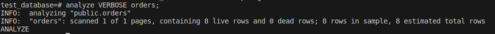
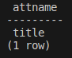

## Задача 1

Используя Docker, поднимите инстанс PostgreSQL (версию 13). Данные БД сохраните в volume.

Подключитесь к БД PostgreSQL, используя `psql`.<br/>
Воспользуйтесь командой `\?` для вывода подсказки по имеющимся в `psql` управляющим командам.<br/>
**Найдите и приведите** управляющие команды для:
- вывода списка БД,
- подключения к БД,
- вывода списка таблиц,
- вывода описания содержимого таблиц,
- выхода из psql.

## Решение 1

Вывод списка БД: `\l[+]   [PATTERN]`<br/> 
Подключение к БД: `\c[onnect] {[DBNAME|- USER|- HOST|- PORT|-] | conninfo}`<br/>
Вывод списка таблиц: `\dt[S+] [PATTERN]      list tables`<br/>
Вывода описания содержимого таблиц: `\d[S+]  NAME           describe table, view, sequence, or index`<br/>
Выход из psql: `\q      quit psql`


---

## Задача 2

Используя `psql`, создайте БД `test_database`.<br/>
Изучите [бэкап БД](https://github.com/netology-code/virt-homeworks/tree/virt-11/06-db-04-postgresql/test_data).
Восстановите бэкап БД в `test_database`.<br/>
Перейдите в управляющую консоль `psql` внутри контейнера.<br/>

Подключитесь к восстановленной БД и проведите операцию ANALYZE для сбора статистики по таблице.<br/>
Используя таблицу [pg_stats](https://postgrespro.ru/docs/postgresql/12/view-pg-stats), найдите столбец таблицы `orders` 
с наибольшим средним значением размера элементов в байтах.<br/>
**Приведите в ответе** команду, которую вы использовали для вычисления, и полученный результат.

## Решение 2

Создаём БД:

```SQL
CREATE DATABASE test_database;
```

Загружаем дамп:

```shell
docker exec -i postgres sh -c 'exec psql -U postgres test_database' < ./test_dump.sql
```

Запускаем `ANALYZE`:



Получаем столбец с наибольшим средним размером значения (получаем title):

```SQL
select
	attname
from
	pg_stats
where
	tablename = 'orders'
	and avg_width = (
	select
		max(avg_width)
	from
		pg_stats
	where
		tablename = 'orders');
```



---

## Задача 3

Архитектор и администратор БД выяснили, что ваша таблица orders разрослась до невиданных размеров и поиск по ней занимает долгое время. Вам как успешному выпускнику курсов DevOps в Нетологии предложили провести разбиение таблицы на 2: шардировать на orders_1 - price>499 и orders_2 - price<=499.<br/>
Предложите SQL-транзакцию для проведения этой операции.

Можно ли было изначально исключить ручное разбиение при проектировании таблицы orders?

## Решение 3

Создаём таблицы, наследующие orders:

```SQL
create table orders_1 (
    check ( price > 499 )
) inherits (orders);

create table orders_2 (
    check ( price <= 499 )
) inherits (orders);
```

Заполняем уже имеющимися данными, а данные из исходной таблицы удаляем:

```SQL
insert into orders_1 select * from orders where price > 499;
insert into orders_2 select * from orders where price <= 499;
delete from only orders;
```

Добавляем триггер для раскидывания данных по наследникам при добавлении данных:

```SQL
create or replace function order_insert_trigger()
returns trigger as $$
begin
    if ( NEW.price <= 499) then
        insert into orders_2 values (NEW.*);
	else
	    insert into orders_1 values (NEW.*);
	end if;
	return null;
end;
$$
language plpgsql;

create trigger order_insert_trigger
    before insert on orders
    for each row execute procedure order_insert_trigger();
```

Поскольку update применяется к таблицам-наследникам, нужен триггер на случай изменения цены (из-за чего запись должна перейти из одной таблицы в другую):

```SQL
create or replace function order_update_trigger()
returns trigger as $$
begin
	delete from orders where id = OLD.id;
	insert into orders values (NEW.*);
	return null;
end;
$$
language plpgsql;

create trigger order_1_update_trigger
    before update on orders_1
    for each row execute procedure order_update_trigger();
   
create trigger order_2_update_trigger
    before update on orders_2
    for each row execute procedure order_update_trigger();
```
Как будто можно сделать триггер лучше: 
* если изменяется price (да ещё и дополнительно можно проверять, что поменялась "категория", т.е. (old.price <= 499 AND new.price > 499 OR new.price <= 499 AND old.price > 499)), применять операции удаления/вставки;
* в противном случае возвращать NEW и пусть проводит update, как обычно.

Но тут нужно проверять скорость и целесообразность усложнения триггера.

Итого:

```SQL
begin;

create table orders_1 (
    check ( price > 499 )
) inherits (orders);

create table orders_2 (
    check ( price <= 499 )
) inherits (orders);

insert into orders_1 select * from orders where price > 499;
insert into orders_2 select * from orders where price <= 499;
delete from only orders;

create or replace function order_insert_trigger()
returns trigger as $$
begin
    if ( NEW.price <= 499) then
        insert into orders_2 values (NEW.*);
	else
	    insert into orders_1 values (NEW.*);
	end if;
	return null;
end;
$$
language plpgsql;


create or replace function order_update_trigger()
returns trigger as $$
begin
	delete from orders where id = OLD.id;
	insert into orders values (NEW.*);
	return null;
end;
$$
language plpgsql;

create trigger order_insert_trigger
    before insert on orders
    for each row execute procedure order_insert_trigger();
   
create trigger order_1_update_trigger
    before update on orders_1
    for each row execute procedure order_update_trigger();
   
create trigger order_2_update_trigger
    before update on orders_2
    for each row execute procedure order_update_trigger();

commit;
```

Если бы разбиение было сделано изначально, можно было бы обойтись без копирования и последующего удаления значений, но на этом отсутствие "ручного" труда и заканчивается.

---

## Задача 4

Используя утилиту `pg_dump`, создайте бекап БД `test_database`.<br/>
Как бы вы доработали бэкап-файл, чтобы добавить уникальность значения столбца `title` для таблиц `test_database`?

## Решение 4

Создаём дамп:

```SQL
pg_dump -U postgres test_database > test_database_dump.sql
```

Если уж править прямо дамп, то можно в строке с созданием таблицы добавить параметр UNIQUE

```SQL
CREATE TABLE public.orders (
    id integer NOT NULL,
    title character varying(80) NOT NULL UNIQUE,
    price integer DEFAULT 0
);
```

Наследующие таблицы это ограничение, соответственно, унаследуют.