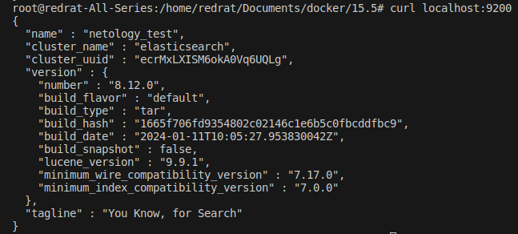
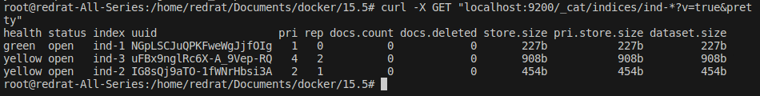
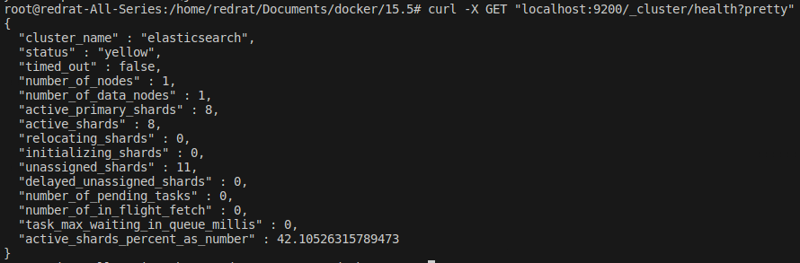
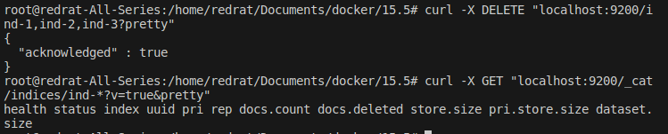
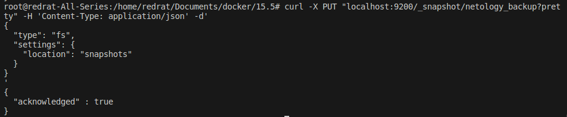
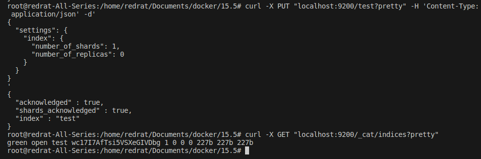
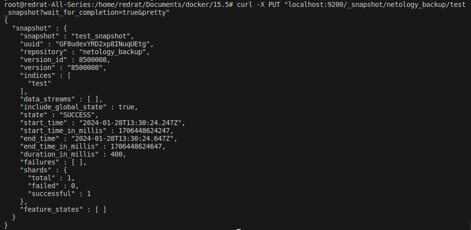
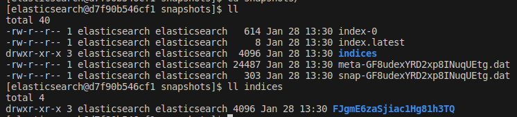
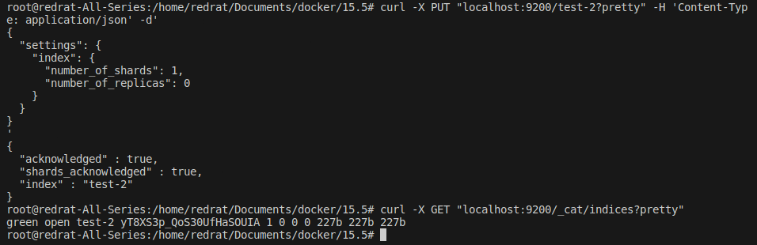
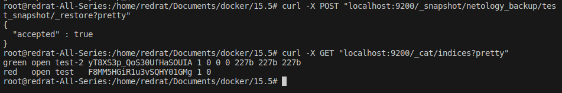

## Задача 1

В этом задании вы потренируетесь в:

- установке Elasticsearch,
- первоначальном конфигурировании Elasticsearch,
- запуске Elasticsearch в Docker.

Используя Docker-образ [centos:7](https://hub.docker.com/_/centos) как базовый и 
[документацию по установке и запуску Elastcisearch](https://www.elastic.co/guide/en/elasticsearch/reference/current/targz.html):

- составьте Dockerfile-манифест для Elasticsearch,
- соберите Docker-образ и сделайте `push` в ваш docker.io-репозиторий,
- запустите контейнер из получившегося образа и выполните запрос пути `/` c хост-машины.

Требования к `elasticsearch.yml`:

- данные `path` должны сохраняться в `/var/lib`,
- имя ноды должно быть `netology_test`.

В ответе приведите:

- текст Dockerfile-манифеста,
- ссылку на образ в репозитории dockerhub,
- ответ `Elasticsearch` на запрос пути `/` в json-виде.

Подсказки:

- возможно, вам понадобится установка пакета perl-Digest-SHA для корректной работы пакета shasum,
- при сетевых проблемах внимательно изучите кластерные и сетевые настройки в elasticsearch.yml,
- при некоторых проблемах вам поможет Docker-директива ulimit,
- Elasticsearch в логах обычно описывает проблему и пути её решения.

Далее мы будем работать с этим экземпляром Elasticsearch.

## Решение 1

Создадим Dockerfile следующего вида:

```Dockerfile
FROM centos:7

ENV container docker

EXPOSE 9200

RUN (cd /lib/systemd/system/sysinit.target.wants/; \
for i in *; \
do [ $i == systemd-tmpfiles-setup.service ] || rm -f $i; \
done); \
rm -f /lib/systemd/system/multi-user.target.wants/*;\
rm -f /etc/systemd/system/*.wants/*;\
rm -f /lib/systemd/system/local-fs.target.wants/*; \
rm -f /lib/systemd/system/sockets.target.wants/*udev*; \
rm -f /lib/systemd/system/sockets.target.wants/*initctl*; \
rm -f /lib/systemd/system/basic.target.wants/*;\
rm -f /lib/systemd/system/anaconda.target.wants/*;


WORKDIR /tmp

COPY elasticsearch-8.12.0-linux-x86_64.tar.gz .

RUN tar -xzf elasticsearch-8.12.0-linux-x86_64.tar.gz -C /opt/; \
echo "node.name: netology_test" >>  /opt/elasticsearch-8.12.0/config/elasticsearch.yml; \
echo "path.data: /var/lib" >> /opt/elasticsearch-8.12.0/config/elasticsearch.yml; \
echo "path.logs: /var/lib" >> /opt/elasticsearch-8.12.0/config/elasticsearch.yml; \
echo "xpack.security.enabled: false" >> /opt/elasticsearch-8.12.0/config/elasticsearch.yml; \
echo "xpack.security.enrollment.enabled: false" >> /opt/elasticsearch-8.12.0/config/elasticsearch.yml; \
echo "network.host: 127.0.0.1" >> /opt/elasticsearch-8.12.0/config/elasticsearch.yml; \
echo "http.host: 0.0.0.0" >> /opt/elasticsearch-8.12.0/config/elasticsearch.yml; \
useradd elasticsearch; \
chown -R elasticsearch /opt/elasticsearch-8.12.0/; \
chown -R elasticsearch /var/lib;

USER elasticsearch
CMD sh /opt/elasticsearch-8.12.0/bin/elasticsearch
```

Так как напрямую по ссылке нужный пакет Elasticsearch больше недоступен, был изменён способ установки. Предполагается, что пакет скачан заранее и находится на локальной машине. 

Помимо выполнения указанных требований добавлена возможность подключения без аутентификаци (для упрощения жизни, благо что использоваться он будет только для тестирования).

Публикуем. Тогда:

* Манифест:

```
{
        "schemaVersion": 2,
        "mediaType": "application/vnd.docker.distribution.manifest.v2+json",
        "config": {
                "mediaType": "application/vnd.docker.container.image.v1+json",
                "size": 4435,
                "digest": "sha256:a4b04af818c0a6da5ef97e60c9bcaf68db18561dee5505858263aa2488220f08"
        },
        "layers": [
                {
                        "mediaType": "application/vnd.docker.image.rootfs.diff.tar.gzip",
                        "size": 76097157,
                        "digest": "sha256:2d473b07cdd5f0912cd6f1a703352c82b512407db6b05b43f2553732b55df3bc"
                },
                {
                        "mediaType": "application/vnd.docker.image.rootfs.diff.tar.gzip",
                        "size": 1209,
                        "digest": "sha256:b63ff9376ce1c22702710f0559dc744d5d7c976b738658357de2c23d01d0abb9"
                },
                {
                        "mediaType": "application/vnd.docker.image.rootfs.diff.tar.gzip",
                        "size": 32,
                        "digest": "sha256:4f4fb700ef54461cfa02571ae0db9a0dc1e0cdb5577484a6d75e68dc38e8acc1"
                },
                {
                        "mediaType": "application/vnd.docker.image.rootfs.diff.tar.gzip",
                        "size": 618504071,
                        "digest": "sha256:b88c8c5900f3740e9087b537d0f9817c027a33ed6950806dc5753c34d06127ba"
                },
                {
                        "mediaType": "application/vnd.docker.image.rootfs.diff.tar.gzip",
                        "size": 634836129,
                        "digest": "sha256:e00e6f909fdae03f18825e4bb933067f071df83e30fc6c7355b7d1492facdb4a"
                }
        ]
}
```
* Образ на dockerHub: https://hub.docker.com/layers/redratinthehat/c7-elastic/1.2/images/sha256-18413923117e4cbb839c4962f0e497d3eea8f2ce550d0fec997d41d9836e4217?tab=layers
* Ответ из собранного контейнера:



---

## Задача 2

В этом задании вы научитесь:

- создавать и удалять индексы,
- изучать состояние кластера,
- обосновывать причину деградации доступности данных.

Ознакомьтесь с [документацией](https://www.elastic.co/guide/en/elasticsearch/reference/current/indices-create-index.html) 
и добавьте в `Elasticsearch` 3 индекса в соответствии с таблицей:

| Имя | Количество реплик | Количество шард |
|-----|-------------------|-----------------|
| ind-1| 0 | 1 |
| ind-2 | 1 | 2 |
| ind-3 | 2 | 4 |

Получите список индексов и их статусов, используя API, и **приведите в ответе** на задание.

Получите состояние кластера `Elasticsearch`, используя API.

Как вы думаете, почему часть индексов и кластер находятся в состоянии yellow?

Удалите все индексы.

**Важно**

При проектировании кластера Elasticsearch нужно корректно рассчитывать количество реплик и шард,
иначе возможна потеря данных индексов, вплоть до полной, при деградации системы.

## Решение 2

Создаём индексы:

```bash
curl -X PUT "localhost:9200/ind-1" -H 'Content-Type: appli
cation/json' -d'
{
  "settings": {
    "index": {
      "number_of_shards": 1,  
      "number_of_replicas": 0
    }
  }
}
'

curl -X PUT "localhost:9200/ind-2" -H 'Content-Type: application/json' -d'
{
  "settings": {
    "index": {
      "number_of_shards": 2,  
      "number_of_replicas": 1
    }
  }
}
'

curl -X PUT "localhost:9200/ind-3" -H 'Content-Type: application/json' -d'
{
  "settings": {
    "index": {
      "number_of_shards": 4,  
      "number_of_replicas": 2
    }
  }
}
'
```

Проверяем индексы и кластер целиком:





Индексы в частности и кластер в общем находятся в статусе `yellow`, так как для них указано количество реплик. При наличии всего одной ноды реплики не могут быть созданы.

Удаляем созданные индексы:



---

## Задача 3

В этом задании вы научитесь:

- создавать бэкапы данных,
- восстанавливать индексы из бэкапов.

Создайте директорию `{путь до корневой директории с Elasticsearch в образе}/snapshots`.

Используя API, [зарегистрируйте](https://www.elastic.co/guide/en/elasticsearch/reference/current/snapshots-register-repository.html#snapshots-register-repository) 
эту директорию как `snapshot repository` c именем `netology_backup`.

**Приведите в ответе** запрос API и результат вызова API для создания репозитория.

Создайте индекс `test` с 0 реплик и 1 шардом и **приведите в ответе** список индексов.

[Создайте `snapshot`](https://www.elastic.co/guide/en/elasticsearch/reference/current/snapshots-take-snapshot.html) 
состояния кластера `Elasticsearch`.

**Приведите в ответе** список файлов в директории со `snapshot`.

Удалите индекс `test` и создайте индекс `test-2`. **Приведите в ответе** список индексов.

[Восстановите](https://www.elastic.co/guide/en/elasticsearch/reference/current/snapshots-restore-snapshot.html) состояние
кластера `Elasticsearch` из `snapshot`, созданного ранее. 

**Приведите в ответе** запрос к API восстановления и итоговый список индексов.

Подсказки:

- возможно, вам понадобится доработать `elasticsearch.yml` в части директивы `path.repo` и перезапустить `Elasticsearch`.

## Решение 3

Немного правим Dockerfile, чтобы добавить path.repo, создаём новый image, запускаем новый контейнер.

Создаём путь для бэкапов:



И новый индекс:



Создаём бэкап:



Забегаем в директорию `snapshots`. Тут у нас появилось несколько файлов и директорий:



Удаляем старый индекс, создаём новый:



Восстанавливаем бэкап и любуемся:



Теперь у нас два индекса. `test`, впрочем, не сильно хорошо себя чувствует. Зато есть.

---