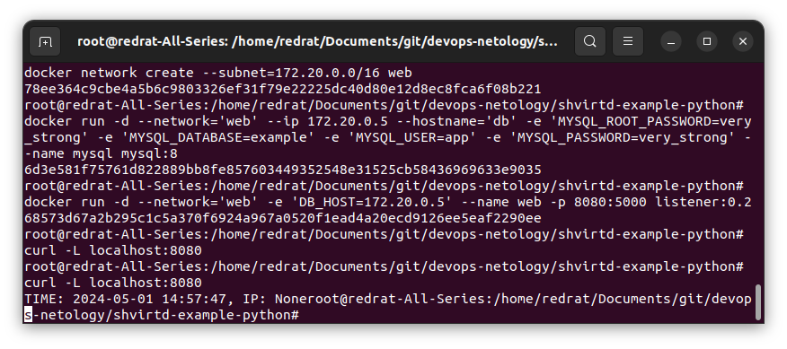
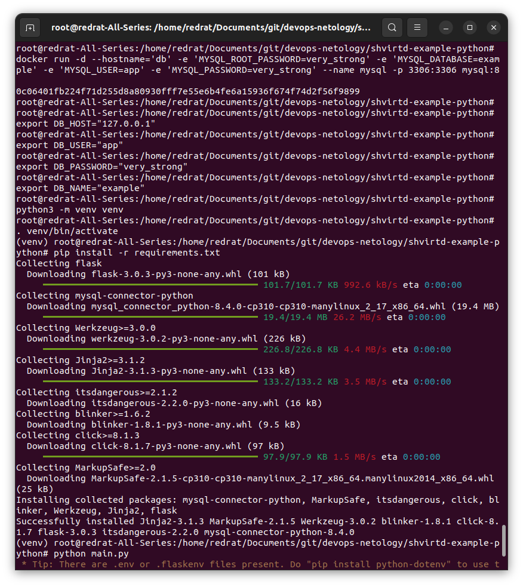
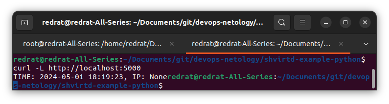
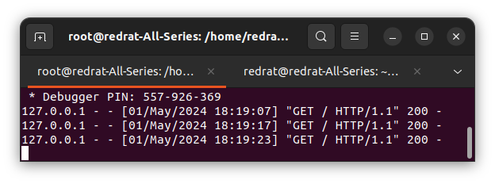
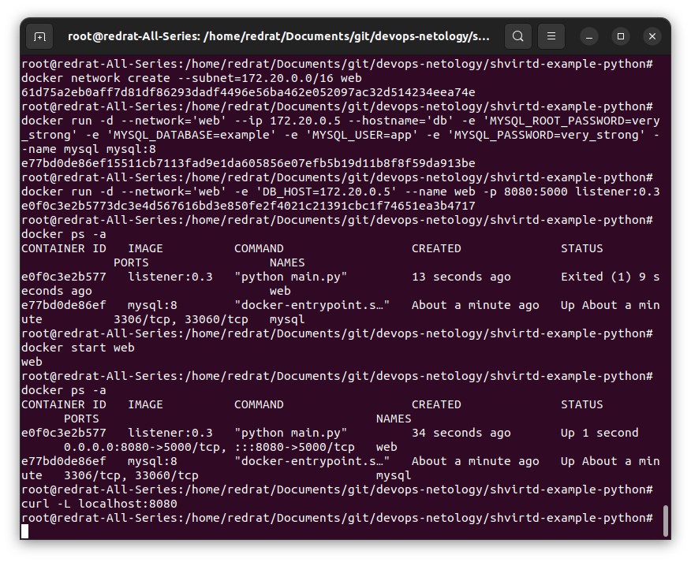
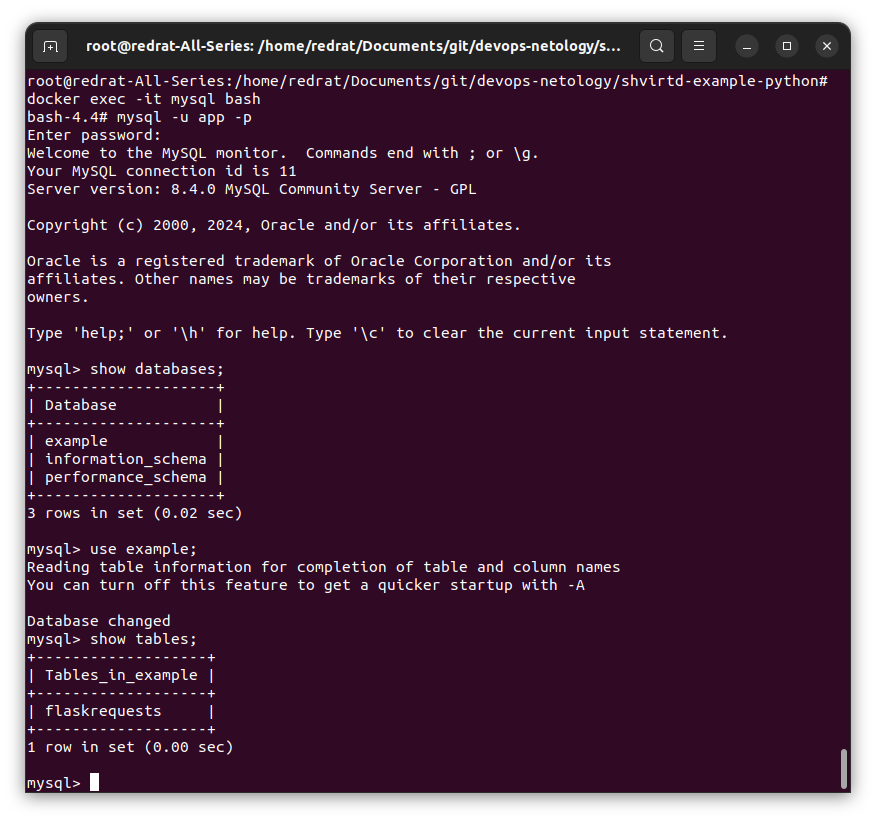
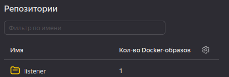
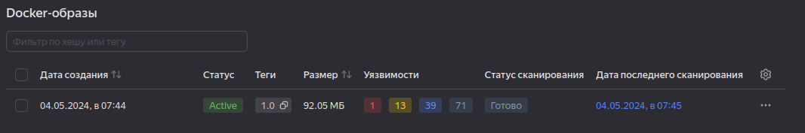
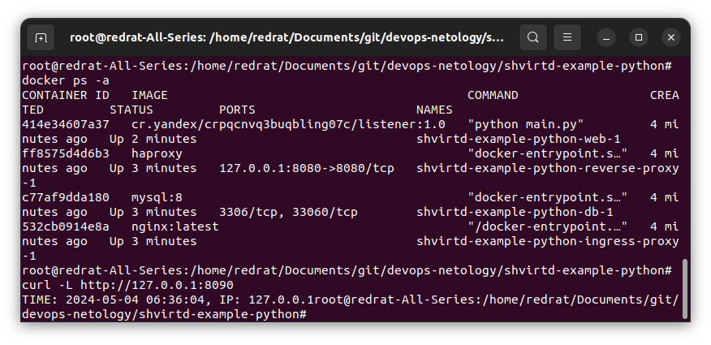
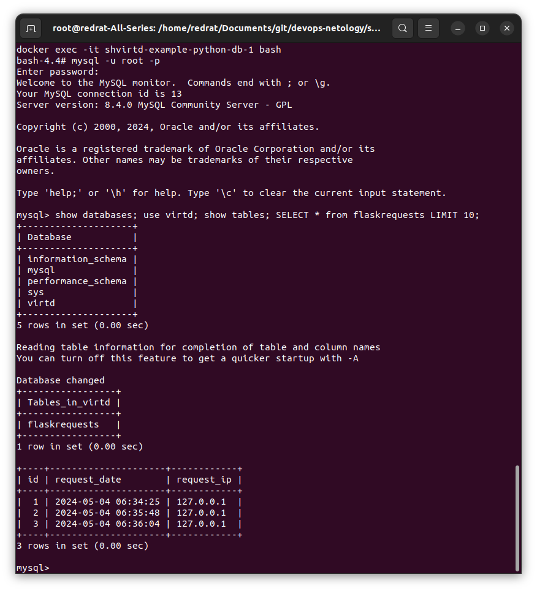

## Задача 1
1. Сделайте в своем github пространстве fork репозитория ```https://github.com/netology-code/shvirtd-example-python/blob/main/README.md```.   
2. Создайте файл с именем ```Dockerfile.python``` для сборки данного проекта(для 3 задания изучите https://docs.docker.com/compose/compose-file/build/ ). Используйте базовый образ ```python:3.9-slim```. Протестируйте корректность сборки. Не забудьте dockerignore. 
3. (Необязательная часть, *) Изучите инструкцию в проекте и запустите web-приложение без использования docker в venv. (Mysql БД можно запустить в docker run).
4. (Необязательная часть, *) По образцу предоставленного python кода внесите в него исправление для управления названием используемой таблицы через ENV переменную.

### Решение 1

1. Создан [форк](https://github.com/RedRatInTheHat/shvirtd-example-python)
2. Создаём [Dockerfile.python](https://github.com/RedRatInTheHat/shvirtd-example-python/blob/main/Dockerfile.python), а из него – образ. <br/>
Для проверки работоспособности поднимаем небольшой стенд:

```bash
docker network create --subnet=172.20.0.0/16 web
docker run -d --network='web' --ip 172.20.0.5 --hostname='db' -e 'MYSQL_ROOT_PASSWORD=very_strong' -e 'MYSQL_DATABASE=example' -e 'MYSQL_USER=app' -e 'MYSQL_PASSWORD=very_strong' --name mysql mysql:8
docker run -d --network='web' -e 'DB_HOST=172.20.0.5' --name web -p 8080:5000 listener:0.2
```

Успешно получаем значения из контейнера:



3. Запускаем `main.py` (почти) безо всяких этих докеров:



Проверяем:





4. Добавим возможность задавать имя таблицы. Для этого модифицируются файлы [Dockerfile.python](https://github.com/RedRatInTheHat/shvirtd-example-python/blob/main/Dockerfile.python) (добавляется значение по умолчанию) и [main.py](https://github.com/RedRatInTheHat/shvirtd-example-python/blob/main/main.py) (собственно, функционал установки имени таблицы).

Проверяем:



Контейнер запускается, что уже хорошо.

Проверим наличие таблицы:



Присутствует.

---

## Задача 2 (*)
1. Создайте в yandex cloud container registry с именем "test" с помощью "yc tool" . [Инструкция](https://cloud.yandex.ru/ru/docs/container-registry/quickstart/?from=int-console-help)
2. Настройте аутентификацию вашего локального docker в yandex container registry.
3. Соберите и залейте в него образ с python приложением из задания №1.
4. Просканируйте образ на уязвимости.
5. В качестве ответа приложите отчет сканирования.

### Решение 2

Загружаем образ, именуемый `listener`:



Сканируем:



Не очень-то безопасный образ получился.

---

## Задача 3
1. Изучите файл "proxy.yaml"
2. Создайте в репозитории с проектом файл ```compose.yaml```. С помощью директивы "include" подключите к нему файл "proxy.yaml".
3. Опишите в файле ```compose.yaml``` следующие сервисы: 

- ```web```. Образ приложения должен ИЛИ собираться при запуске compose из файла ```Dockerfile.python``` ИЛИ скачиваться из yandex cloud container registry(из задание №2 со *). Контейнер должен работать в bridge-сети с названием ```backend``` и иметь фиксированный ipv4-адрес ```172.20.0.5```. Сервис должен всегда перезапускаться в случае ошибок.
Передайте необходимые ENV-переменные для подключения к Mysql базе данных по сетевому имени сервиса ```web``` 

- ```db```. image=mysql:8. Контейнер должен работать в bridge-сети с названием ```backend``` и иметь фиксированный ipv4-адрес ```172.20.0.10```. Явно перезапуск сервиса в случае ошибок. Передайте необходимые ENV-переменные для создания: пароля root пользователя, создания базы данных, пользователя и пароля для web-приложения.Обязательно используйте уже существующий .env file для назначения секретных ENV-переменных!

2. Запустите проект локально с помощью docker compose , добейтесь его стабильной работы: команда ```curl -L http://127.0.0.1:8090``` должна возвращать в качестве ответа время и локальный IP-адрес. Если сервисы не стартуют воспользуйтесь командами: ```docker ps -a ``` и ```docker logs <container_name>``` 

5. Подключитесь к БД mysql с помощью команды ```docker exec <имя_контейнера> mysql -uroot -p<пароль root-пользователя>``` . Введите последовательно команды (не забываем в конце символ ; ): ```show databases; use <имя вашей базы данных(по-умолчанию example)>; show tables; SELECT * from requests LIMIT 10;```.

6. Остановите проект. В качестве ответа приложите скриншот sql-запроса.

### Решение 3

Контейнеры успешно поднялись; через некоторое время контейнер web получает возможность достучаться до mysql, запускается и корректно принимает запросы:



Подключаемся к контейнеру с mysql и просматриваем, что у нас там получилось (правда, используется другое имя таблицы, использованное для тестирования задания 2):



---

## Задача 4
1. Запустите в Yandex Cloud ВМ (вам хватит 2 Гб Ram).
2. Подключитесь к Вм по ssh и установите docker.
3. Напишите bash-скрипт, который скачает ваш fork-репозиторий в каталог /opt и запустит проект целиком.
4. Зайдите на сайт проверки http подключений, например(или аналогичный): ```https://check-host.net/check-http``` и запустите проверку вашего сервиса ```http://<внешний_IP-адрес_вашей_ВМ>:8090```. Таким образом трафик будет направлен в ingress-proxy.
5. (Необязательная часть) Дополнительно настройте remote ssh context к вашему серверу. Отобразите список контекстов и результат удаленного выполнения ```docker ps -a```
6. В качестве ответа повторите  sql-запрос и приложите скриншот с данного сервера, bash-скрипт и ссылку на fork-репозиторий.

### Решение 4

---

## Задача 5 (*)
1. Напишите и задеплойте на вашу облачную ВМ bash скрипт, который произведет резервное копирование БД mysql в директорию "/opt/backup" с помощью запуска в сети "backend" контейнера из образа ```schnitzler/mysqldump``` при помощи ```docker run ...``` команды. Подсказка: "документация образа."
2. Протестируйте ручной запуск
3. Настройте выполнение скрипта раз в 1 минуту через cron, crontab или systemctl timer. Придумайте способ не светить логин/пароль в git!!
4. Предоставьте скрипт, cron-task и скриншот с несколькими резервными копиями в "/opt/backup"

### Решение 5


---

## Задача 6
Скачайте docker образ ```hashicorp/terraform:latest``` и скопируйте бинарный файл ```/bin/terraform``` на свою локальную машину, используя dive и docker save.
Предоставьте скриншоты  действий .


## Задача 6.1
Добейтесь аналогичного результата, используя docker cp.  
Предоставьте скриншоты  действий .

## Задача 6.2 (**)
Предложите способ извлечь файл из контейнера, используя только команду docker build и любой Dockerfile.  
Предоставьте скриншоты  действий .

### Решение 6

---

## Задача 7 (***)
Запустите ваше python-приложение с помощью runC, не используя docker или containerd.  
Предоставьте скриншоты  действий .

### Решение 7

---