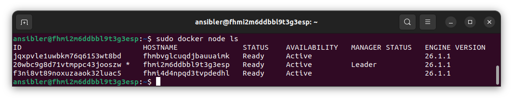

## Задача 1

Создайте ваш первый Docker Swarm-кластер в Яндекс Облаке.
Документация swarm: https://docs.docker.com/engine/reference/commandline/swarm_init/
1. Создайте 3 облачные виртуальные машины в одной сети.
2. Установите docker на каждую ВМ.
3. Создайте swarm-кластер из 1 мастера и 2-х рабочих нод.

4. Проверьте список нод командой:
```
docker node ls
```
5. (необязательное задание *). Задеплойте ваш python-fork из предыдущего ДЗ в получившийся кластер.
6. Удалите стенд.

### Решение 1

Создаём три ВМ, объединяем в swarm, проверяем:



Волевым решением было решено не разворачивать предыдущий проект, потому что:
1. `include` Docker Swarm не поддерживает (был добавлен файл `docker-compose.yml`, содержащий в себе `proxy.yaml`).
2. Сети в `compose` файле  тоже не нравятся `swarm`, а значит никаких ip-адресов.
3. Ну, предположим, оставляем общение по dns-именам в `docker-compose.yaml` и `harproxy.cfg`.
4. Поднимает получившуюся химеру через `docker compose` и упорно получаем 503.
5. Поднимаем swarm, и все контейнеры просто удаляются после ошибки.

Ну его, такие извращения.


## Задача 3 (*)

Если вы уже знакомы с terraform и ansible  - повторите практику по примеру лекции "Развертывание стека микросервисов в Docker Swarm кластере". Попробуйте улучшить пайплайн, запустив ansible через terraform. 

Проверьте доступность grafana.

Иначе вернитесь к выполнению задания после прохождения модулей "terraform" и "ansible".

### Решение 3

Для автоматического разворота (вместе с автоматическим неудачным запуском проекта) создан [terraform-проект](terraform/main.tf).