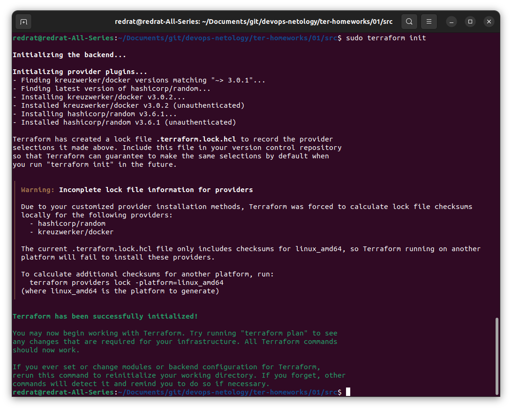

### Чек-лист готовности к домашнему заданию

1. Скачайте и установите **Terraform** версии =1.5.Х (версия 1.6 может вызывать проблемы с Яндекс провайдером) . Приложите скриншот вывода команды ```terraform --version```.
2. Скачайте на свой ПК этот git-репозиторий. Исходный код для выполнения задания расположен в директории **01/src**.
3. Убедитесь, что в вашей ОС установлен docker.
4. Зарегистрируйте аккаунт на сайте https://hub.docker.com/, выполните команду docker login и введите логин, пароль.


### Задание 1

1. Перейдите в каталог [**src**](https://github.com/netology-code/ter-homeworks/tree/main/01/src). Скачайте все необходимые зависимости, использованные в проекте. 
2. Изучите файл **.gitignore**. В каком terraform-файле, согласно этому .gitignore, допустимо сохранить личную, секретную информацию?
3. Выполните код проекта. Найдите  в state-файле секретное содержимое созданного ресурса **random_password**, пришлите в качестве ответа конкретный ключ и его значение.
4. Раскомментируйте блок кода, примерно расположенный на строчках 29–42 файла **main.tf**.
Выполните команду ```terraform validate```. Объясните, в чём заключаются намеренно допущенные ошибки. Исправьте их.
5. Выполните код. В качестве ответа приложите: исправленный фрагмент кода и вывод команды ```docker ps```.
6. Замените имя docker-контейнера в блоке кода на ```hello_world```. Не перепутайте имя контейнера и имя образа. Мы всё ещё продолжаем использовать name = "nginx:latest". Выполните команду ```terraform apply -auto-approve```.
Объясните своими словами, в чём может быть опасность применения ключа  ```-auto-approve```. Догадайтесь или нагуглите зачем может пригодиться данный ключ? В качестве ответа дополнительно приложите вывод команды ```docker ps```.
8. Уничтожьте созданные ресурсы с помощью **terraform**. Убедитесь, что все ресурсы удалены. Приложите содержимое файла **terraform.tfstate**. 
9. Объясните, почему при этом не был удалён docker-образ **nginx:latest**. Ответ **ОБЯЗАТЕЛЬНО НАЙДИТЕ В ПРЕДОСТАВЛЕННОМ КОДЕ**, а затем **ОБЯЗАТЕЛЬНО ПОДКРЕПИТЕ** строчкой из документации [**terraform провайдера docker**](https://docs.comcloud.xyz/providers/kreuzwerker/docker/latest/docs).  (ищите в классификаторе resource docker_image )

#### Решение 1

1. Проект инициализирован; при этом были загружены необходимые плагины:



2. Судя по `.gitignore` секретными файлами считаются:
* файлы директории `.terraform`, где бы она ни находилась;
* любые файлы с названиями, начинающимися на `.terraform*`, кроме конфигурационного файла `.terraformrc`.
* файлы состояния `.tfstate`
* в данном случае, пользователям для переменных выделен файл `personal.auto.tfvars`.

3. В файле `terraform.tfstate` под ключом `resources.instances.attributes.result` находим значение `eHJbtxPXcoVQ7lvs`.

4. Terraform говорит нам, что мы всюду неправы и нейминг у нас так себе. Ну что же, он прав:
* блок ресурсов должен иметь две метки, тип и название. А уж какое там должно быть имя, видно из следующего ресурса;
* имя должно начинаться с буквы, а вот дальше уже можно и буквы, и цифры, и нижнее подчёркивание, и тире;
* в ресурсе `docker_container.nginx` происходит обращение к ресурсу `random_password` с несуществующим именем, а затем по несуществующему ключу.

Исправляем:

```hcl
resource "docker_image" "nginx" {
  name         = "nginx:latest"
  keep_locally = true
}

resource "docker_container" "nginx" {
  image = docker_image.nginx.image_id
  name  = "example_${random_password.random_string.result}"

  ports {
    internal = 80
    external = 9090
  }
}
```

5. Запускаем. Проверяем docker:


Поднялось.

6. Меняем имя. Контейнер пересоздался с другим именем:


Чем гуглить или гадать, веселее попробовать иначе. При сравнении вывода обнаруживается отсутствие следующей строки:

```
Do you want to perform these actions?
  Terraform will perform the actions described above.
  Only 'yes' will be accepted to approve.

  Enter a value: yes
```

Слона-то я и не заметила.<br/>
Выходит, что при `auto-approve` terraform не спрашивает нас, а уверены ли мы в том, что вот эти результаты выше нам действительно нужны. Так можно пропустить нежелательные действия, но зато, если мы в себе уверены, эта опция будет назаменима при автоматизации процессов.

7. Уничтожаем ресурсы. В terraform.tfstate теперь пусто и грустно:

```
{
  "version": 4,
  "terraform_version": "1.5.3",
  "serial": 17,
  "lineage": "061ca6c4-7096-72de-e6bb-514f665c8aa7",
  "outputs": {},
  "resources": [],
  "check_results": null
}
```

8. `nginx:latest` при этом не удалён, несмотря на уничтожение ресурса `"docker_image.nginx"`. В ресурсе не так-то много настроек, так что под подозрением `keep_locally = true`, у которого и название характерное.

И действительно:<br/>
`keep_locally (Boolean) If true, then the Docker image won't be deleted on destroy operation. If this is false, it will delete the image from the docker local storage on destroy operation.`

При `keep_locally = true` уничтожение ресурса не приводит к удалению docker-образа.

------

## Дополнительное задание (со звёздочкой*)

**Настоятельно рекомендуем выполнять все задания со звёздочкой.** Они помогут глубже разобраться в материале.   
Задания со звёздочкой дополнительные, не обязательные к выполнению и никак не повлияют на получение вами зачёта по этому домашнему заданию. 

### Задание 2*

1. Создайте в облаке ВМ. Сделайте это через web-консоль, чтобы не слить по незнанию токен от облака в github(это тема следующей лекции). Если хотите - попробуйте сделать это через terraform, прочитав документацию yandex cloud. Используйте файл ```personal.auto.tfvars``` и гитигнор или иной, безопасный способ передачи токена!
2. Подключитесь к ВМ по ssh и установите стек docker.
3. Найдите в документации docker provider способ настроить подключение terraform на вашей рабочей станции к remote docker context вашей ВМ через ssh.
4. Используя terraform и  remote docker context, скачайте и запустите на вашей ВМ контейнер ```mysql:8``` на порту ```127.0.0.1:3306```, передайте ENV-переменные. Сгенерируйте разные пароли через random_password и передайте их в контейнер, используя интерполяцию из примера с nginx.(```name  = "example_${random_password.random_string.result}"```  , двойные кавычки и фигурные скобки обязательны!) 
```
    environment:
      - "MYSQL_ROOT_PASSWORD=${...}"
      - MYSQL_DATABASE=wordpress
      - MYSQL_USER=wordpress
      - "MYSQL_PASSWORD=${...}"
      - MYSQL_ROOT_HOST="%"
```

6. Зайдите на вашу ВМ , подключитесь к контейнеру и проверьте наличие секретных env-переменных с помощью команды ```env```. Запишите ваш финальный код в репозиторий.

#### Решение 2
