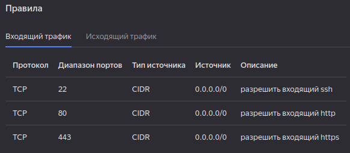
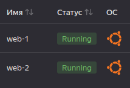
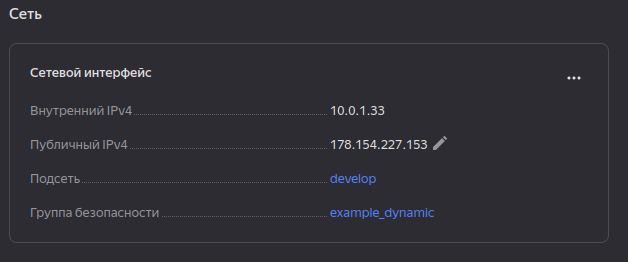
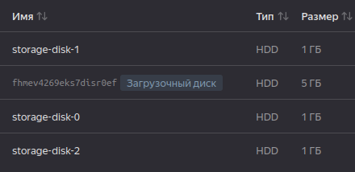
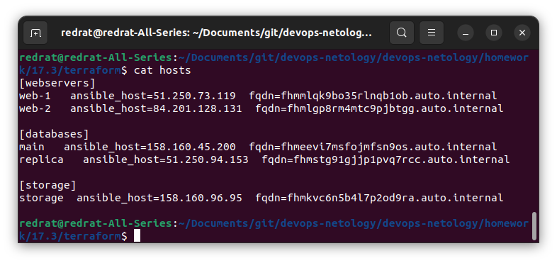
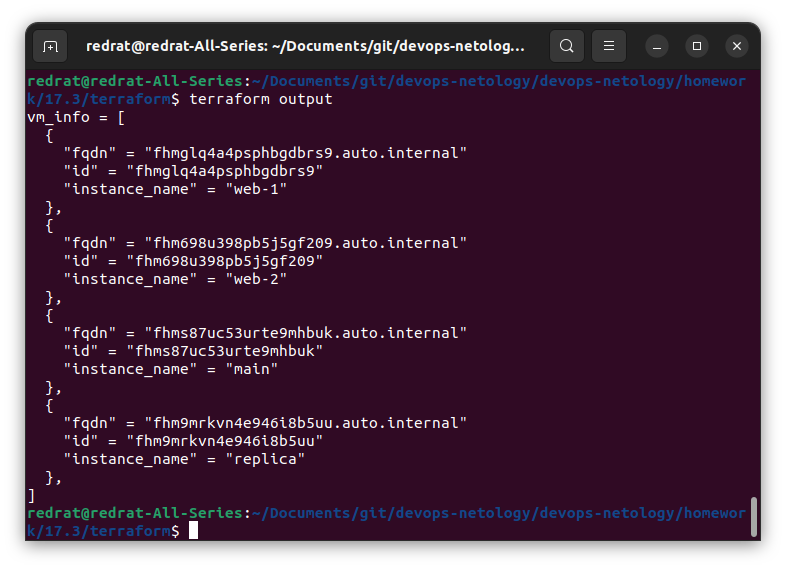
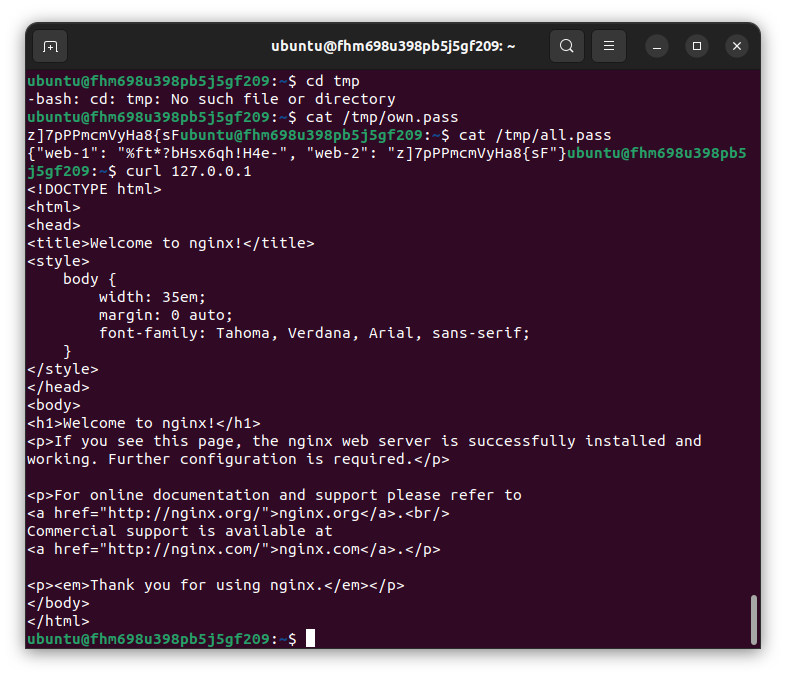
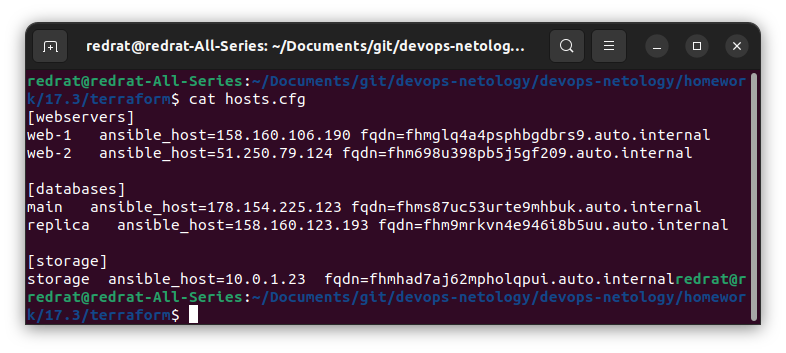

### Задание 1

1. Изучите проект.
2. Заполните файл personal.auto.tfvars.
3. Инициализируйте проект, выполните код. Он выполнится, даже если доступа к preview нет.

Примечание. Если у вас не активирован preview-доступ к функционалу «Группы безопасности» в Yandex Cloud, запросите доступ у поддержки облачного провайдера. Обычно его выдают в течение 24-х часов.

Приложите скриншот входящих правил «Группы безопасности» в ЛК Yandex Cloud или скриншот отказа в предоставлении доступа к preview-версии.

---

#### Решение 1

Заполнен файл `personal.auto.tfvars`, инициализирован и развёрнут проект terraform.

Итого созданы сеть и группы безопасности:




---

### Задание 2

1. Создайте файл count-vm.tf. Опишите в нём создание двух **одинаковых** ВМ  web-1 и web-2 (не web-0 и web-1) с минимальными параметрами, используя мета-аргумент **count loop**. Назначьте ВМ созданную в первом задании группу безопасности.(как это сделать узнайте в документации провайдера yandex/compute_instance )
2. Создайте файл for_each-vm.tf. Опишите в нём создание двух ВМ для баз данных с именами "main" и "replica" **разных** по cpu/ram/disk_volume , используя мета-аргумент **for_each loop**. Используйте для обеих ВМ одну общую переменную типа:
```
variable "each_vm" {
  type = list(object({  vm_name=string, cpu=number, ram=number, disk_volume=number }))
}
```  
При желании внесите в переменную все возможные параметры.

3. ВМ из пункта 2.1 должны создаваться после создания ВМ из пункта 2.2.
4. Используйте функцию file в local-переменной для считывания ключа ~/.ssh/id_rsa.pub и его последующего использования в блоке metadata, взятому из ДЗ 2.
6. Инициализируйте проект, выполните код.

---

#### Решение 2

Для web ВМ добавлен файл [count-vm.tf](terraform/count-vm.tf).<br/>
Для db ВМ добавлен файл [for_each-vm.tf](terraform/for_each-vm.tf)

Переменные объявляются в [variables.tf](terraform/variables.tf) и инициализируются в [variables.auto.tfvars](terraform/variables.auto.tfvars).<br/>
Имя, CPU, RAM, размер диска и core fraction вынесены в специфичные для каждого типа инстансов переменные; остальные переменные являются общими.<br/>
В целях отладки и экономии ради добавлены переменные для `allow_stopping_for_update`, `scheduling_policy.preemptible`, `network_interface.nat` и ранее упоминавшегося `resources.core_fraction`.

Переменная `metadata` вынесена в файл [locals.tf](terraform/locals.tf).

Созданные web ВМ:



Группы безопасности web ВМ (на примере одной из них):



Созданные db ВМ:


---

### Задание 3

1. Создайте 3 одинаковых виртуальных диска размером 1 Гб с помощью ресурса yandex_compute_disk и мета-аргумента count в файле **disk_vm.tf** .
2. Создайте в том же файле **одиночную**(использовать count или for_each запрещено из-за задания №4) ВМ c именем "storage"  . Используйте блок **dynamic secondary_disk{..}** и мета-аргумент for_each для подключения созданных вами дополнительных дисков.

---

#### Решение 3

Для создания дисков и storage инстанса добавлен файл [disk_vm.tf](terraform/disk_vm.tf). Так как для его создания использовались значения, схожие с web инстансами, ресурсы вынесены в общую переменную `vm_resources`.

В созданном инстансе видны 3 дополнительных диска по 1 Гб:



---

### Задание 4

1. В файле ansible.tf создайте inventory-файл для ansible.
Используйте функцию tepmplatefile и файл-шаблон для создания ansible inventory-файла из лекции.
Готовый код возьмите из демонстрации к лекции [**demonstration2**](https://github.com/netology-code/ter-homeworks/tree/main/03/demo).
Передайте в него в качестве переменных группы виртуальных машин из задания 2.1, 2.2 и 3.2, т. е. 5 ВМ.
2. Инвентарь должен содержать 3 группы и быть динамическим, т. е. обработать как группу из 2-х ВМ, так и 999 ВМ.
3. Добавьте в инвентарь переменную  [**fqdn**](https://cloud.yandex.ru/docs/compute/concepts/network#hostname).
``` 
[webservers]
web-1 ansible_host=<внешний ip-адрес> fqdn=<полное доменное имя виртуальной машины>
web-2 ansible_host=<внешний ip-адрес> fqdn=<полное доменное имя виртуальной машины>

[databases]
main ansible_host=<внешний ip-адрес> fqdn=<полное доменное имя виртуальной машины>
replica ansible_host<внешний ip-адрес> fqdn=<полное доменное имя виртуальной машины>

[storage]
storage ansible_host=<внешний ip-адрес> fqdn=<полное доменное имя виртуальной машины>
```
Пример fqdn: ```web1.ru-central1.internal```(в случае указания имени ВМ); ```fhm8k1oojmm5lie8i22a.auto.internal```(в случае автоматической генерации имени ВМ зона изменяется). нужную вам переменную найдите в документации провайдера или terraform console.

4. Выполните код. Приложите скриншот получившегося файла. 

Для общего зачёта создайте в вашем GitHub-репозитории новую ветку terraform-03. Закоммитьте в эту ветку свой финальный код проекта, пришлите ссылку на коммит.   
**Удалите все созданные ресурсы**.

---

#### Решение 4

В [ansible.tf](terraform/ansible.tf) добавлена генерация файла hosts.

Вывод файла:



---

## Дополнительные задания (со звездочкой*)

**Настоятельно рекомендуем выполнять все задания со звёздочкой.** Они помогут глубже разобраться в материале.   
Задания со звёздочкой дополнительные, не обязательные к выполнению и никак не повлияют на получение вами зачёта по этому домашнему заданию. 

### Задание 5* (необязательное)
1. Напишите output, который отобразит ВМ из ваших ресурсов count и for_each в виде списка словарей :
``` 
[
 {
  "name" = 'имя ВМ1'
  "id"   = 'идентификатор ВМ1'
  "fqdn" = 'Внутренний FQDN ВМ1'
 },
 {
  "name" = 'имя ВМ2'
  "id"   = 'идентификатор ВМ2'
  "fqdn" = 'Внутренний FQDN ВМ2'
 },
 ....
...итд любое количество ВМ в ресурсе(те требуется итерация по ресурсам, а не хардкод) !!!!!!!!!!!!!!!!!!!!!
]
```
Приложите скриншот вывода команды ```terrafrom output```.

---

#### Решение 5

Добавлен файл [outputs.tf](terraform/outputs.tf) для вывода данных по сложным инстансам (`web` и `db`).

Вывод:



---

### Задание 6* (необязательное)

1. Используя null_resource и local-exec, примените ansible-playbook к ВМ из ansible inventory-файла.
Готовый код возьмите из демонстрации к лекции [**demonstration2**](https://github.com/netology-code/ter-homeworks/tree/main/03/demo).
3. Модифицируйте файл-шаблон hosts.tftpl. Необходимо отредактировать переменную ```ansible_host="<внешний IP-address или внутренний IP-address если у ВМ отсутвует внешний адрес>```.

Для проверки работы уберите у ВМ внешние адреса(nat=false). Этот вариант используется при работе через bastion-сервер.
Для зачёта предоставьте код вместе с основной частью задания.

---

#### Решение 6

В [ansible.tf](terraform/ansible.tf) добавлен второй способ генерации файла hosts, а также запуск playbook'а (и генерация секретов, чтобы ansible не пропускал этот шаг).

На примере одного из web северов можно проверить, что playbook отработал:



В [hosts.tftpl](terraform/hosts.tftpl) также добавлена проверка наличия nat. Для проверки наличие nat убрано конкретно для `storage`:



---

### Задание 7* (необязательное)
Ваш код возвращает вам следущий набор данных: 
```
> local.vpc
{
  "network_id" = "enp7i560tb28nageq0cc"
  "subnet_ids" = [
    "e9b0le401619ngf4h68n",
    "e2lbar6u8b2ftd7f5hia",
    "b0ca48coorjjq93u36pl",
    "fl8ner8rjsio6rcpcf0h",
  ]
  "subnet_zones" = [
    "ru-central1-a",
    "ru-central1-b",
    "ru-central1-c",
    "ru-central1-d",
  ]
}
```
Предложите выражение в terraform console, которое удалит из данной переменной 3 элемент из: subnet_ids и subnet_zones.(значения могут быть любыми) Образец конечного результата:
```
> <некое выражение>
{
  "network_id" = "enp7i560tb28nageq0cc"
  "subnet_ids" = [
    "e9b0le401619ngf4h68n",
    "e2lbar6u8b2ftd7f5hia",
    "fl8ner8rjsio6rcpcf0h",
  ]
  "subnet_zones" = [
    "ru-central1-a",
    "ru-central1-b",
    "ru-central1-d",
  ]
}
```

---

#### Решение 7