### Задание 1

1. Возьмите из [демонстрации к лекции готовый код](https://github.com/netology-code/ter-homeworks/tree/main/04/demonstration1) для создания с помощью двух вызовов remote-модуля -> двух ВМ, относящихся к разным проектам(marketing и analytics) используйте labels для обозначения принадлежности.  В файле cloud-init.yml необходимо использовать переменную для ssh-ключа вместо хардкода. Передайте ssh-ключ в функцию template_file в блоке vars ={} .
Воспользуйтесь [**примером**](https://grantorchard.com/dynamic-cloudinit-content-with-terraform-file-templates/). Обратите внимание, что ssh-authorized-keys принимает в себя список, а не строку.
3. Добавьте в файл cloud-init.yml установку nginx.
4. Предоставьте скриншот подключения к консоли и вывод команды ```sudo nginx -t```, скриншот консоли ВМ yandex cloud с их метками. Откройте terraform console и предоставьте скриншот содержимого модуля. Пример: > module.marketing_vm
---

#### Решение 1

В файле [main.tf](terraform/main.tf) добавлен вызов модулей, в [cloud-init.yml](terraform/cloud-init.yml) добавлена подстановка ssh-ключа из переменной и установка nginx.

Nginx развернулся (на примере analytics):

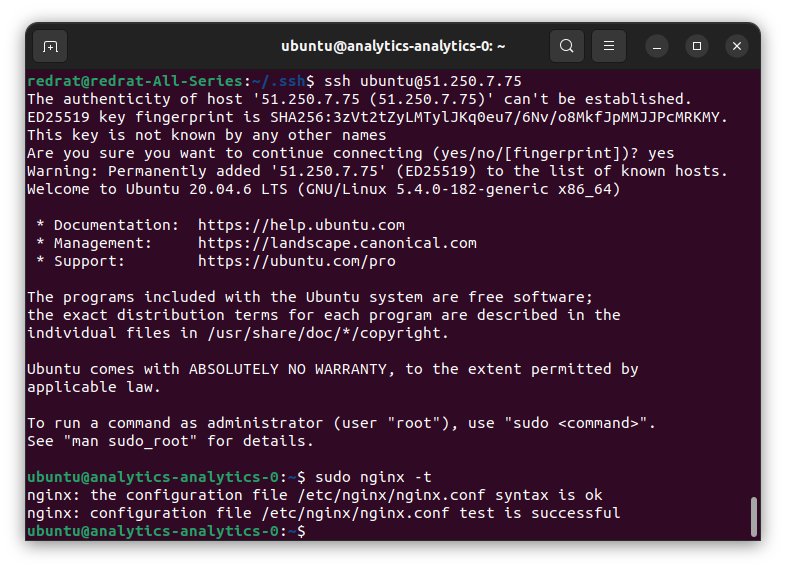

Виртуальные машины создались с соответствующими метками (на примере marketing):

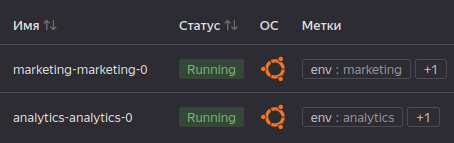

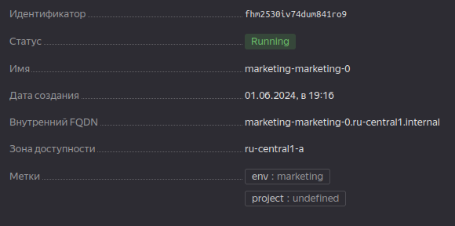

Описание созданного ресурса (marketing):

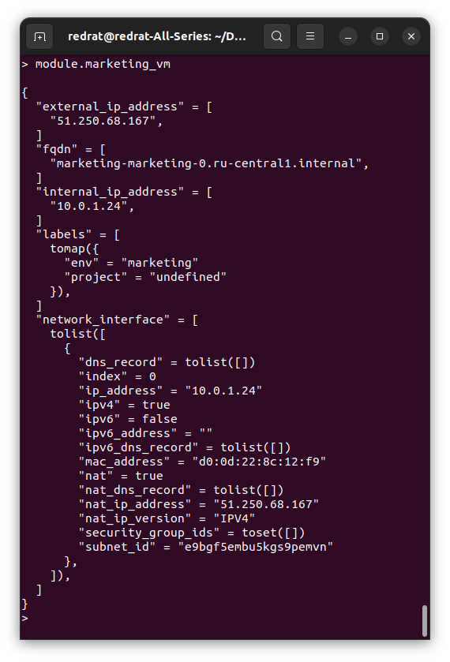

---

### Задание 2

1. Напишите локальный модуль vpc, который будет создавать 2 ресурса: **одну** сеть и **одну** подсеть в зоне, объявленной при вызове модуля, например: ```ru-central1-a```.
2. Вы должны передать в модуль переменные с названием сети, zone и v4_cidr_blocks.
3. Модуль должен возвращать в root module с помощью output информацию о yandex_vpc_subnet. Пришлите скриншот информации из terraform console о своем модуле. Пример: > module.vpc_dev  
4. Замените ресурсы yandex_vpc_network и yandex_vpc_subnet созданным модулем. Не забудьте передать необходимые параметры сети из модуля vpc в модуль с виртуальной машиной.
5. Сгенерируйте документацию к модулю с помощью terraform-docs.
 
Пример вызова

```
module "vpc_dev" {
  source       = "./vpc"
  env_name     = "develop"
  zone = "ru-central1-a"
  cidr = "10.0.1.0/24"
}
```

#### Решение 2

Из [main.tf](terraform/main.tf) убрано создание сети, добавлен вызов модуля `vpc_dev`.</br>
Создан модуль, сеть описана в [vpc.tf](terraform/vpc/vpc.tf), аргументы описаны в [variables.tf](terraform/vpc/variables.tf), необходимые возвращаемые значения и информация о созданной подсети – в [outputs.tf](terraform/vpc/outputs.tf).

Итого модуль возвращает:

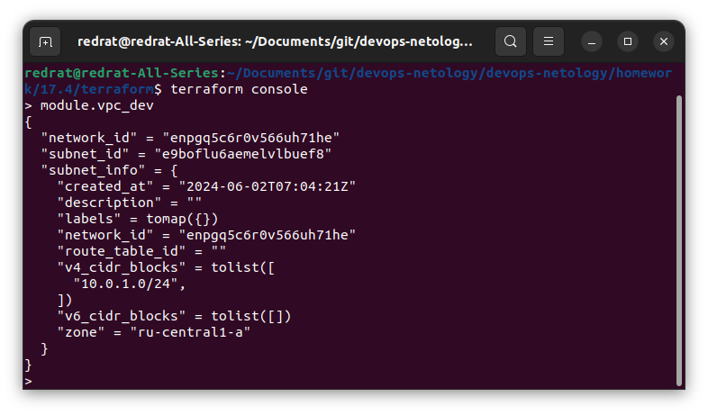

С помощью `terraform-docs` сформирована [документация к модулю vpc](terraform/terraform-docs/vpc.md):
```shell
docker run --rm --volume "$(pwd):/terraform-docs" -u $(id -u) quay.io/terraform-docs/terraform-docs:0.16.0 markdown /terraform-docs > ../terraform-docs/vpc.md
```

---

### Задание 3
1. Выведите список ресурсов в стейте.
2. Полностью удалите из стейта модуль vpc.
3. Полностью удалите из стейта модуль vm.
4. Импортируйте всё обратно. Проверьте terraform plan. Значимых(!!) изменений быть не должно.
Приложите список выполненных команд и скриншоты процессы.

---

#### Решение 3

Список ресурсов – cloud-init, ВМ, образы, сеть:

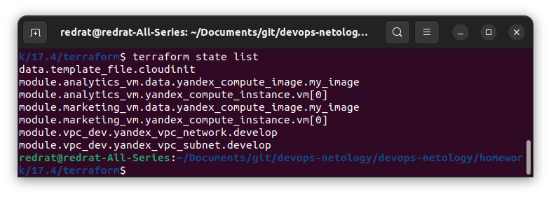

Удаляем ВМ (вместе с образом) и сеть:

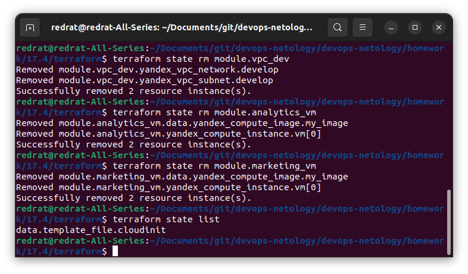

Возвращаем сеть и ВМ (образы идут в комплекте):

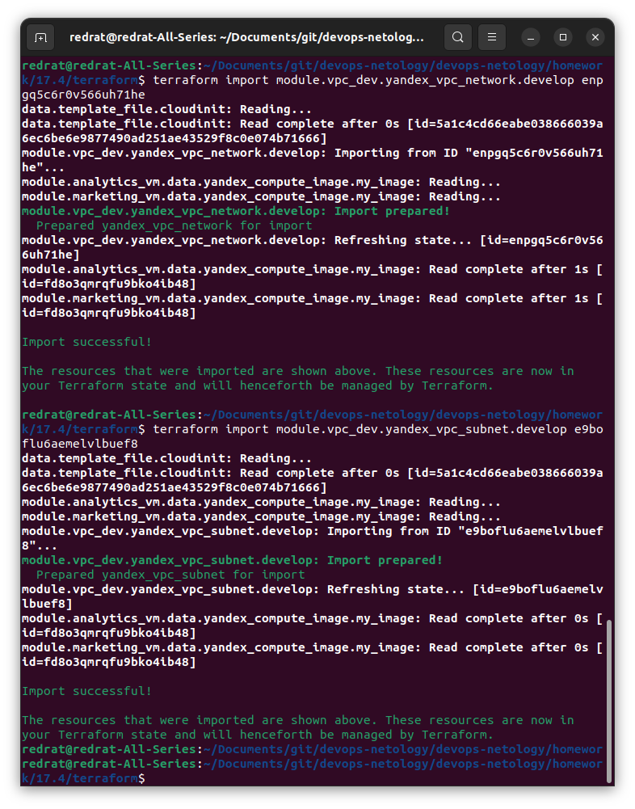

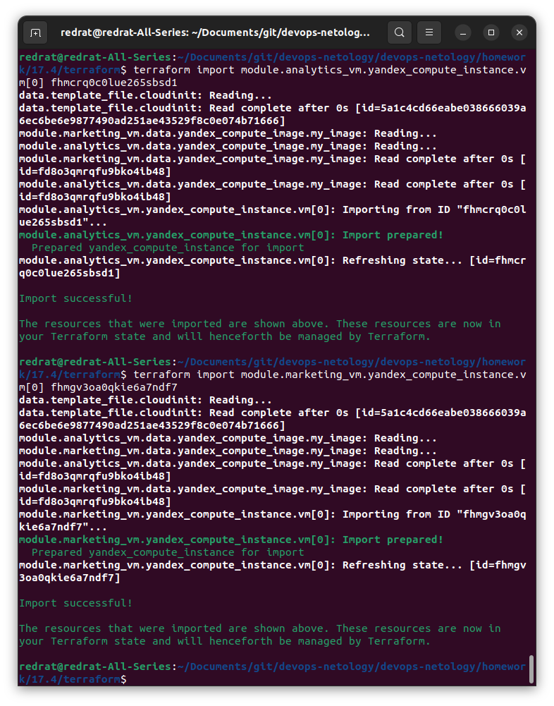

Проверяем state и создаём plan:

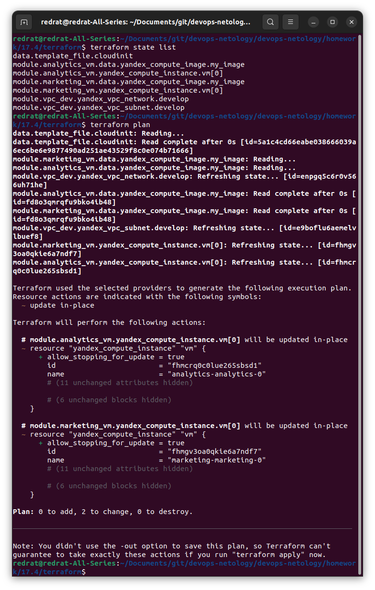

Terraform планирует обновить ВМ, но в остальном без особых изменений. `terraform apply` происходит без каких-либо ошибок.

---

### Задание 4*

1. Измените модуль vpc так, чтобы он мог создать подсети во всех зонах доступности, переданных в переменной типа list(object) при вызове модуля.  
  
Пример вызова
```
module "vpc_prod" {
  source       = "./vpc"
  env_name     = "production"
  subnets = [
    { zone = "ru-central1-a", cidr = "10.0.1.0/24" },
    { zone = "ru-central1-b", cidr = "10.0.2.0/24" },
    { zone = "ru-central1-c", cidr = "10.0.3.0/24" },
  ]
}

module "vpc_dev" {
  source       = "./vpc"
  env_name     = "develop"
  subnets = [
    { zone = "ru-central1-a", cidr = "10.0.1.0/24" },
  ]
}
```

Предоставьте код, план выполнения, результат из консоли YC.

---

#### Решение 4

В [variables.tf](terraform/vpc/variables.tf) и [outputs.tf](terraform/vpc/outputs.tf) адаптированы переменные, в [vpc.tf](terraform/vpc/vpc.tf) реализовано создание нескольких подсетей.

В [main.tf](terraform/main.tf) изменены отправляемые в модуль сети значения и формат получения id подсети в модулях ВМ.

План: [tfplan](terraform/plans/tfplan_4)

В консоли YC видим структуру следующего вида:

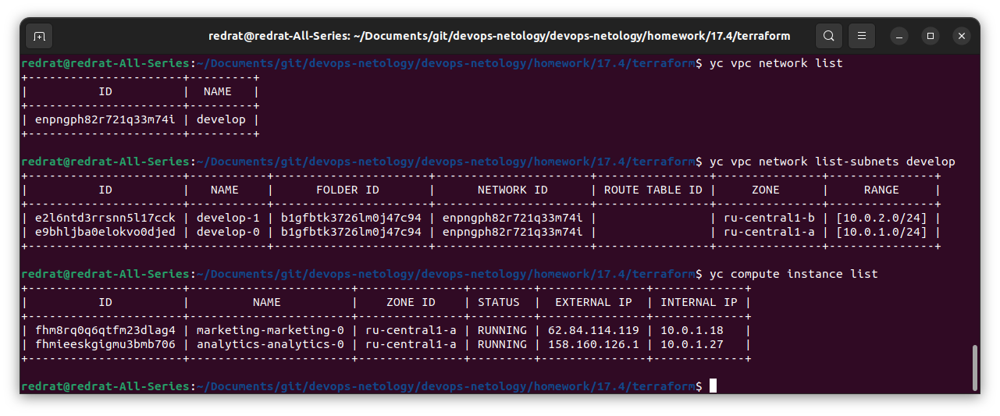

---

### Задание 5*

1. Напишите модуль для создания кластера managed БД Mysql в Yandex Cloud с одним или несколькими(2 по умолчанию) хостами в зависимости от переменной HA=true или HA=false. Используйте ресурс yandex_mdb_mysql_cluster: передайте имя кластера и id сети.
2. Напишите модуль для создания базы данных и пользователя в уже существующем кластере managed БД Mysql. Используйте ресурсы yandex_mdb_mysql_database и yandex_mdb_mysql_user: передайте имя базы данных, имя пользователя и id кластера при вызове модуля.
3. Используя оба модуля, создайте кластер example из одного хоста, а затем добавьте в него БД test и пользователя app. Затем измените переменную и превратите сингл хост в кластер из 2-х серверов.
4. Предоставьте план выполнения и по возможности результат. Сразу же удаляйте созданные ресурсы, так как кластер может стоить очень дорого. Используйте минимальную конфигурацию.

---

#### Решение 5

Для создания кластера создан модуль mysql-cluster:
* [mysql-cluster.tf](terraform/mysql-cluster/mysql-cluster.tf)
* [variables.tf](terraform/mysql-cluster/variables.tf)
* [outputs.tf](terraform/mysql-cluster/outputs.tf)

Для создания БД и пользователя создан модуль mysql-db:
* [mysql-db.tf](terraform/mysql-db/mysql-db.tf)
* [variables.tf](terraform/mysql-db/variables.tf)

План для создания кластера `example` из одного хоста: [tfplan](terraform/plans/tfplan_5_1).<br/>
Поднимаем:

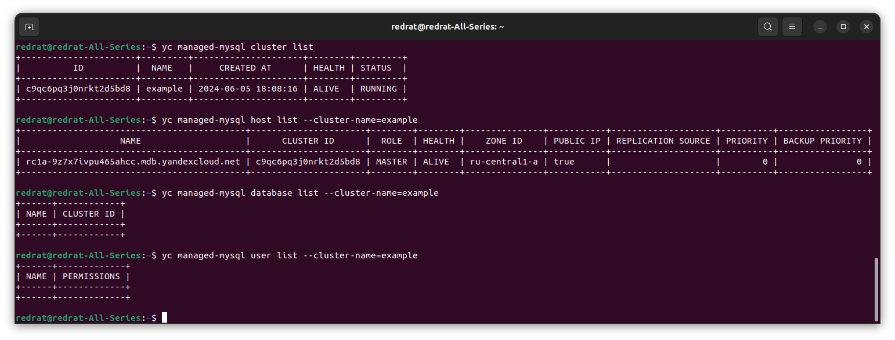

Добавляем базу данных и пользователя.<br/>
План: [tfplan](terraform/plans/tfplan_5_2)<br/>
Результат:

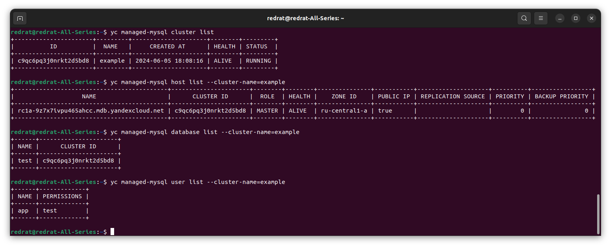

Теперь передаём `is_HA=true`, превращая это всё в нечто более похожее на кластер.<br/>
План: [tfplan](terraform/plans/tfplan_5_3)<br/>
Результат:

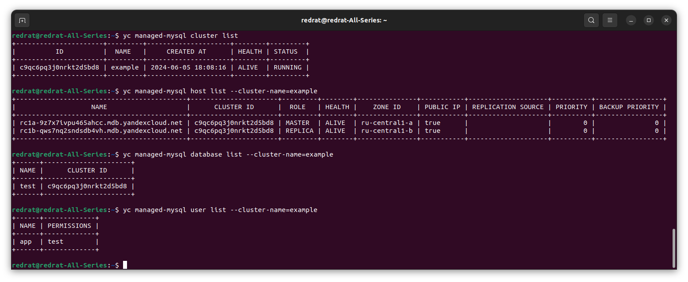

Видны оба кластера; второй занял позицию реплики.

---

### Задание 6*
1. Используя готовый yandex cloud terraform module и пример его вызова(examples/simple-bucket): https://github.com/terraform-yc-modules/terraform-yc-s3 .
Создайте и не удаляйте для себя s3 бакет размером 1 ГБ(это бесплатно), он пригодится вам в ДЗ к 5 лекции.

---

#### Решение 6

Чтобы не сорить всяческими зависимостями и не копаться со state, проект вынесен в директорию s3. Созданы файлы [main.tf](terraform/s3/main.tf), [s3.tf](terraform/s3/s3.tf), [variables.tf](terraform/s3/variables.tf).

Создан bucket netology-bucket-<id>:

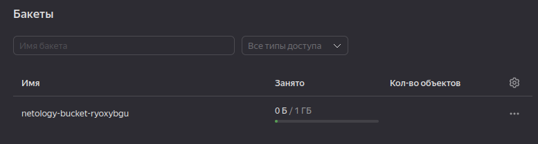

А заодно и storage-admin-<id>.

---

### Задание 7*

1. Разверните у себя локально vault, используя docker-compose.yml в проекте.
2. Для входа в web-интерфейс и авторизации terraform в vault используйте токен "education".
3. Создайте новый секрет по пути http://127.0.0.1:8200/ui/vault/secrets/secret/create<br/>
Path: example<br/>
secret data key: test<br/> 
secret data value: congrats!<br/>  
4. Считайте этот секрет с помощью terraform и выведите его в output по примеру:
```
provider "vault" {
 address = "http://<IP_ADDRESS>:<PORT_NUMBER>"
 skip_tls_verify = true
 token = "education"
}
data "vault_generic_secret" "vault_example"{
 path = "secret/example"
}

output "vault_example" {
 value = "${nonsensitive(data.vault_generic_secret.vault_example.data)}"
} 

Можно обратиться не к словарю, а конкретному ключу:
terraform console: >nonsensitive(data.vault_generic_secret.vault_example.data.<имя ключа в секрете>)
```
5. Попробуйте самостоятельно разобраться в документации и записать новый секрет в vault с помощью terraform. 

---

#### Решение 7

Vault вместе с compose-файлом тоже вынесен в отдельную директорию:
* [docker-compose.yml](terraform/vault/docker-compose.yml)
* [main.tf](terraform/vault/main.tf)
* [vault.tf](terraform/vault/vault.tf)
* [variables.tf](terraform/vault/variables.tf)
* [outputs.tf](terraform/outputs.tf)

Поднимаем, проверяем output:

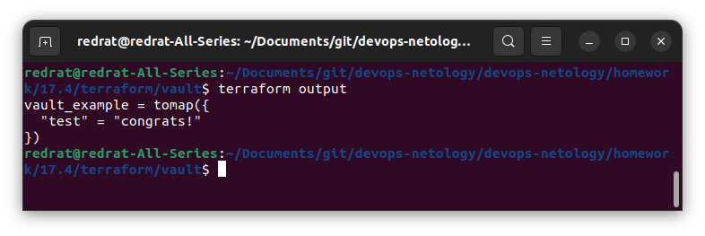

Похоже на правду.

В [vault.tf](terraform/vault/vault.tf) добавлен ресурс `vault_generic_secret`. Для обновления данных пришлось добавить ещё один блок `data`, забирающий данные после применения ресурса (как вариант, можно было бы просто выводить `vault_generic_secret.netology_secret.data_json`, но это не так красиво). А без первоначального состояния данных как будто тоже не получится, данные затрутся. Так что имеем то, что имеем.

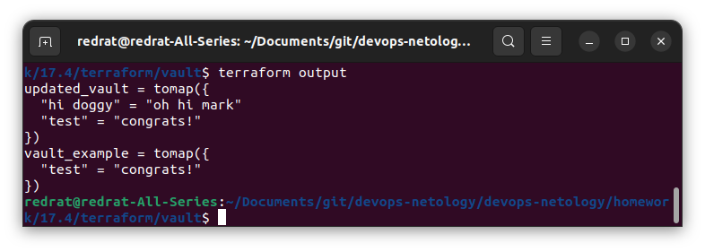

---

### Задание 8*
Попробуйте самостоятельно разобраться в документаци и с помощью terraform remote state разделить root модуль на два отдельных root-модуля: создание VPC , создание ВМ.