### Задание 1

1. Возьмите код:
- из [ДЗ к лекции 4](https://github.com/netology-code/ter-homeworks/tree/main/04/src),
- из [демо к лекции 4](https://github.com/netology-code/ter-homeworks/tree/main/04/demonstration1).
2. Проверьте код с помощью tflint и checkov. Вам не нужно инициализировать этот проект.
3. Перечислите, какие **типы** ошибок обнаружены в проекте (без дублей).

---

#### Решение 1

Запускаем tflint:
```shell
docker run --rm -v "$(pwd):/tflint" ghcr.io/terraform-linters/tflint --chdir /tflint
```

Обнаружены следующие типы ошибок:
* Не указана версия провайдера (например, в terraform.required_providers.yandex в `src`).
* Объявленные, но неиспользуемые переменные (например, `vms_ssh_root_key` в `src`).
* В модуле используется ветка по умолчанию вместо использования конкретной версии (например, `main` в `demonstartion1`).

Запускаем checkov:
```shell
docker run --rm --tty --volume $(pwd):/tf --workdir /tf bridgecrew/checkov --download-external-modules true --directory /tf
```

Во-первых, он выводит красивый логотип, а во-вторых, абсолютно доволен директорией `src`, всё безопасно. И примерно насколько же недоволен
директорией `demonstration1`:
* Виртуальным машинам не назначена группа безопасности.
* Виртуальным машинам назначен публичный IP.
* Chekov'у тоже не сильно нравится, что мы используем дефолтную ветку. Он чрезвычайно рекомендует указывать конкретный коммит или конкретную версию.


---

### Задание 2

1. Возьмите ваш GitHub-репозиторий с **выполненным ДЗ 4** в ветке 'terraform-04' и сделайте из него ветку 'terraform-05'.
2. Повторите демонстрацию лекции: настройте YDB, S3 bucket, yandex service account, права доступа и мигрируйте state проекта в S3 с блокировками. Предоставьте скриншоты процесса в качестве ответа.
3. Закоммитьте в ветку 'terraform-05' все изменения.
4. Откройте в проекте terraform console, а в другом окне из этой же директории попробуйте запустить terraform apply.
5. Пришлите ответ об ошибке доступа к state.
6. Принудительно разблокируйте state. Пришлите команду и вывод.

---

#### Решение 2

Сложно на данный момент сказать, выполнено 4 ДЗ или нет, но как-то оно работает. :D

S3 bucket и сервисный аккаунт были созданы ранее в рамках [ДЗ 4.6](terraform/s3/s3.tf).

В остальном:
* Если бы создавался bucket, это выглядело бы как-то так:

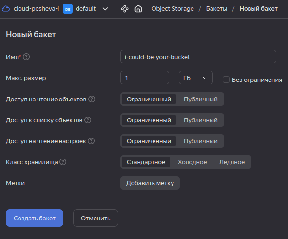

* Создаём YDB:

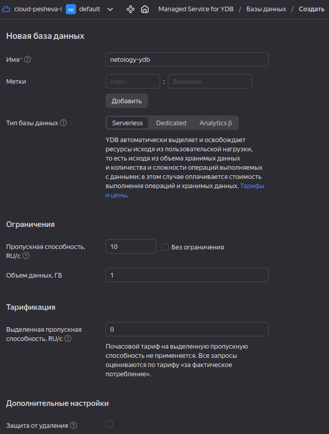

* В ней создаём таблицу:

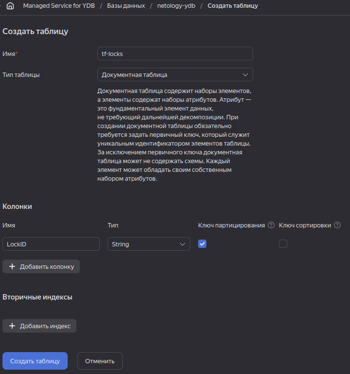

* Выдаём созданному ранее вместе с bucket'ом сервисному аккаунту права:

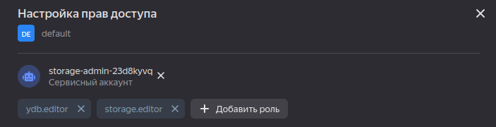

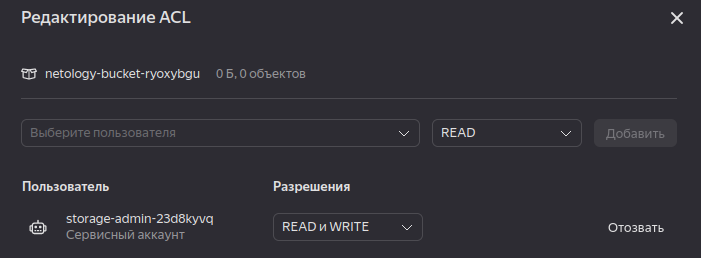

Инициализируем проект с данными сервисного аккаунта, применяем и проверям:

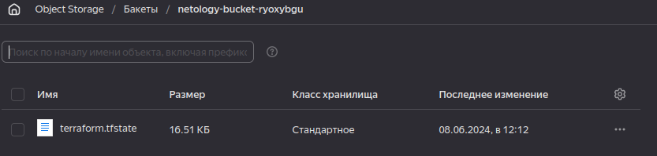

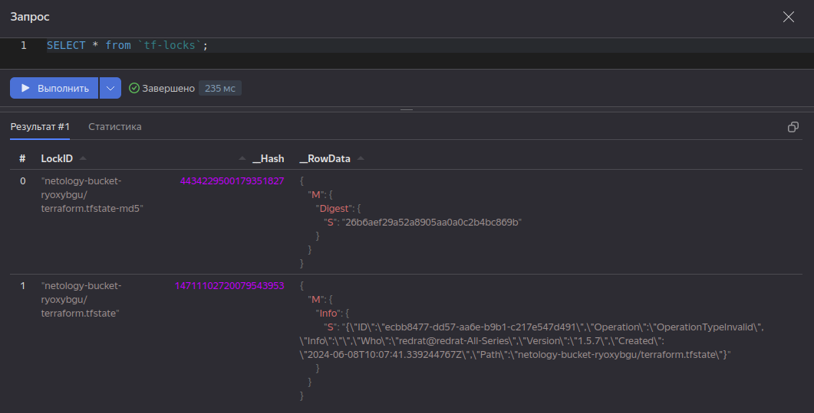

Открытие консоли не позволяет применить `apply`; после разброкировки применяется:

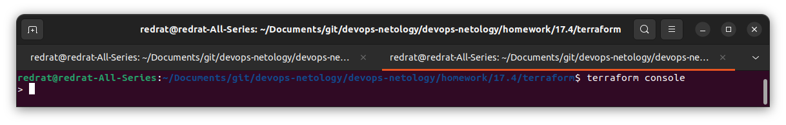

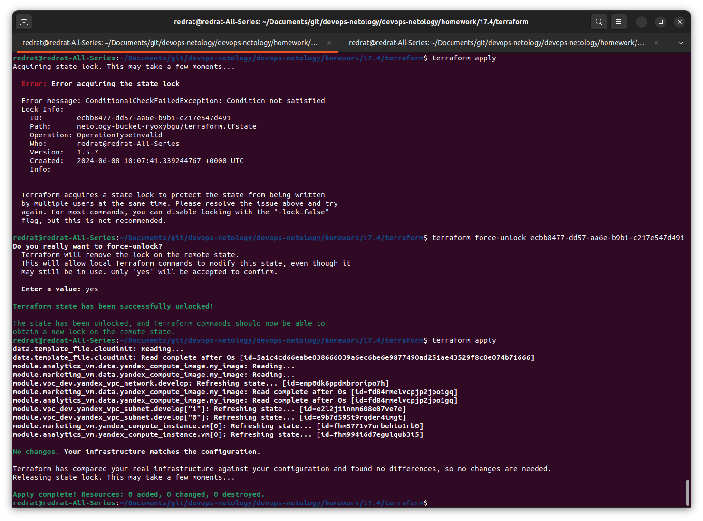

При выходе из консоли отображается ошибка:

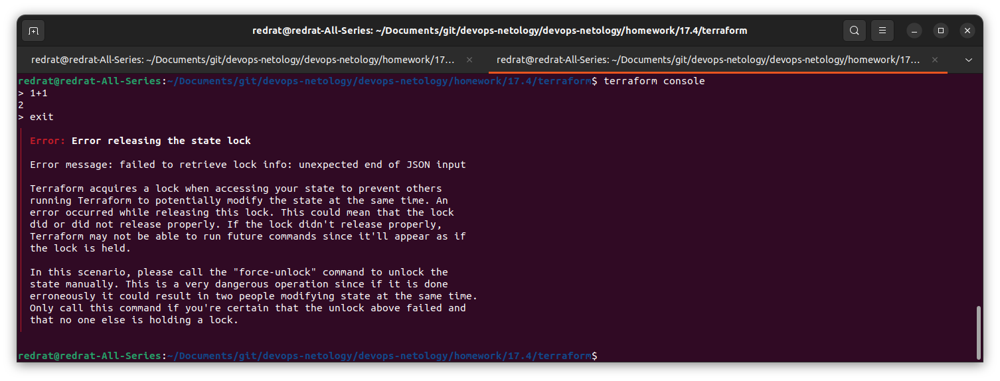

---

### Задание 3  

1. Сделайте в GitHub из ветки 'terraform-05' новую ветку 'terraform-hotfix'.
2. Проверье код с помощью tflint и checkov, исправьте все предупреждения и ошибки в 'terraform-hotfix', сделайте коммит.
3. Откройте новый pull request 'terraform-hotfix' --> 'terraform-05'. 
4. Вставьте в комментарий PR результат анализа tflint и checkov, план изменений инфраструктуры из вывода команды terraform plan.
5. Пришлите ссылку на PR для ревью. Вливать код в 'terraform-05' не нужно.

---

#### Решение 3

Добавлен pull-request https://github.com/RedRatInTheHat/devops-netology/pull/3

Для успешного создания непогрешимого кода:

* Убраны неиспользуемые переменные.
* При стягивании модулей из git теперь используются номера коммитов.
* Для всех провайдеров указаны требуемые версии.
* Инстансы добавлены в группы безопасности.
* В группу безопасности также добавлен mysql-cluster; чтобы chekov его признал, пришлось раскомметриовать объявление модуля.

---
### Задание 4

1. Напишите переменные с валидацией и протестируйте их, заполнив default верными и неверными значениями. Предоставьте скриншоты проверок из terraform console. 

- type=string, description="ip-адрес" — проверка, что значение переменной содержит верный IP-адрес с помощью функций cidrhost() или regex(). Тесты:  "192.168.0.1" и "1920.1680.0.1";
- type=list(string), description="список ip-адресов" — проверка, что все адреса верны. Тесты:  ["192.168.0.1", "1.1.1.1", "127.0.0.1"] и ["192.168.0.1", "1.1.1.1", "1270.0.0.1"].

---

#### Решение 4

Переменные с указанными значениями добавлены в файл [validation.tf](../17.4/terraform/validation.tf).

При открытии консоли Terraform выводит ошибку с указанием переменных, содержащих некорректные ip-адреса:

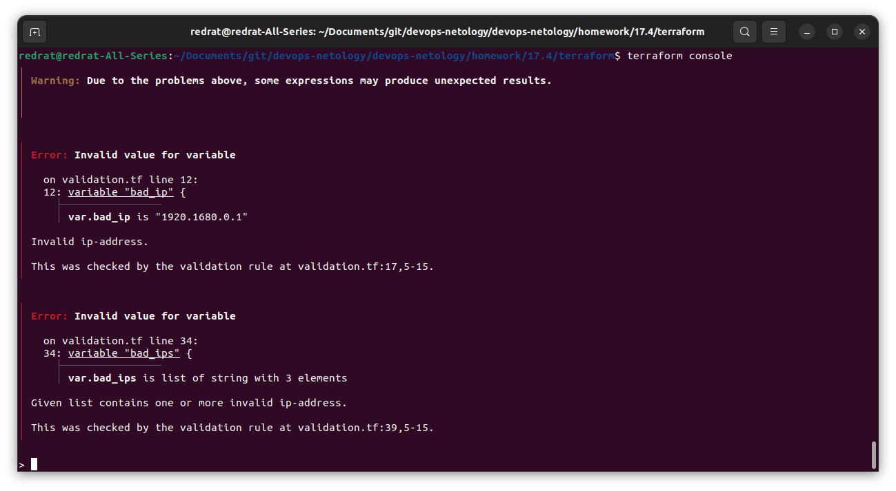

---

## Дополнительные задания (со звёздочкой*)

**Настоятельно рекомендуем выполнять все задания со звёздочкой.** Их выполнение поможет глубже разобраться в материале.   
Задания со звёздочкой дополнительные, не обязательные к выполнению и никак не повлияют на получение вами зачёта по этому домашнему заданию. 
------
### Задание 5*
1. Напишите переменные с валидацией:
- type=string, description="любая строка" — проверка, что строка не содержит символов верхнего регистра;
- type=object — проверка, что одно из значений равно true, а второе false, т. е. не допускается false false и true true:
```
variable "in_the_end_there_can_be_only_one" {
    description="Who is better Connor or Duncan?"
    type = object({
        Dunkan = optional(bool)
        Connor = optional(bool)
    })

    default = {
        Dunkan = true
        Connor = false
    }

    validation {
        error_message = "There can be only one MacLeod"
        condition = <проверка>
    }
}
```

---

#### Решение 5

В [validation.tf](../17.4/terraform/validation.tf) добавлены переменные `lower_case_string` и `in_the_end_there_can_be_only_one`.

---

### Задание 6*

1. Настройте любую известную вам CI/CD-систему. Если вы ещё не знакомы с CI/CD-системами, настоятельно рекомендуем вернуться к этому заданию после изучения Jenkins/Teamcity/Gitlab.
2. Скачайте с её помощью ваш репозиторий с кодом и инициализируйте инфраструктуру.
3. Уничтожьте инфраструктуру тем же способом.

---

#### Решение 6

Отсутствует до изучения CI/CD.

------
### Задание 7*
1. Настройте отдельный terraform root модуль, который будет создавать YDB, s3 bucket для tfstate и сервисный аккаунт с необходимыми правами. 
