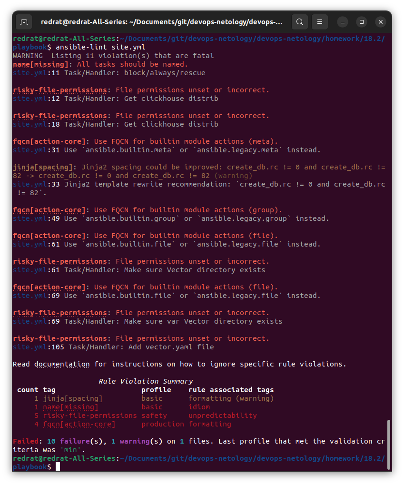
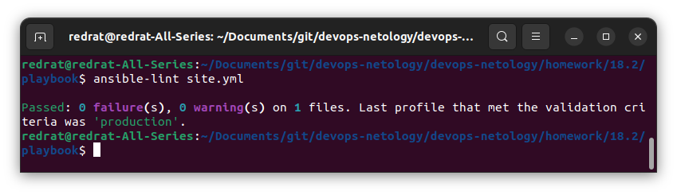
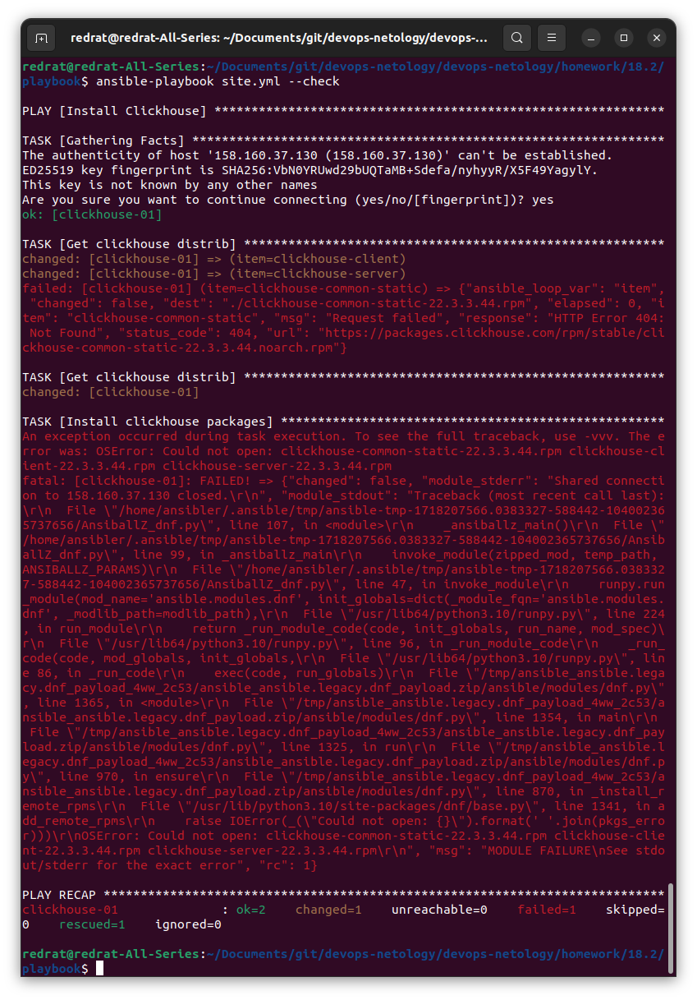
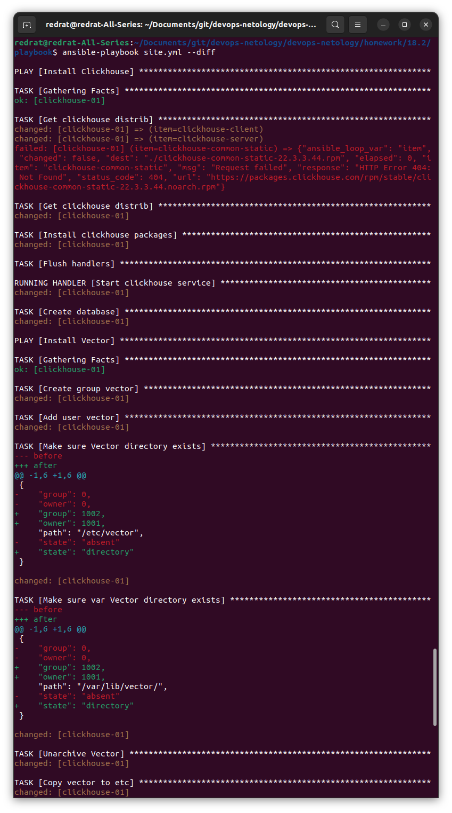
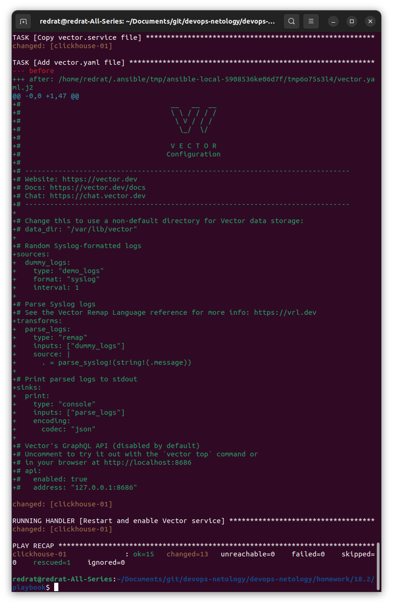
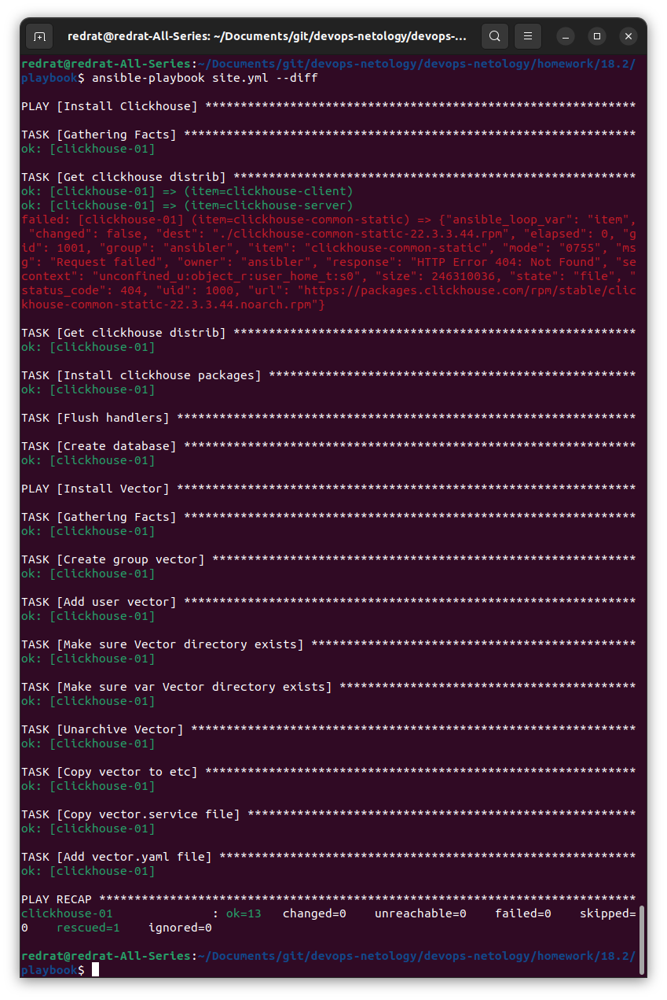

## Основная часть

1. Подготовьте свой inventory-файл `prod.yml`.
2. Допишите playbook: нужно сделать ещё один play, который устанавливает и настраивает [vector](https://vector.dev). Конфигурация vector должна деплоиться через template файл jinja2. От вас не требуется использовать все возможности шаблонизатора, просто вставьте стандартный конфиг в template файл. Информация по шаблонам по [ссылке](https://www.dmosk.ru/instruktions.php?object=ansible-nginx-install). не забудьте сделать handler на перезапуск vector в случае изменения конфигурации!
3. При создании tasks рекомендую использовать модули: `get_url`, `template`, `unarchive`, `file`.
4. Tasks должны: скачать дистрибутив нужной версии, выполнить распаковку в выбранную директорию, установить vector.
5. Запустите `ansible-lint site.yml` и исправьте ошибки, если они есть.
6. Попробуйте запустить playbook на этом окружении с флагом `--check`.
7. Запустите playbook на `prod.yml` окружении с флагом `--diff`. Убедитесь, что изменения на системе произведены.
8. Повторно запустите playbook с флагом `--diff` и убедитесь, что playbook идемпотентен.
9. Подготовьте README.md-файл по своему playbook. В нём должно быть описано: что делает playbook, какие у него есть параметры и теги. Пример качественной документации ansible playbook по [ссылке](https://github.com/opensearch-project/ansible-playbook). Так же приложите скриншоты выполнения заданий №5-8
10. Готовый playbook выложите в свой репозиторий, поставьте тег `08-ansible-02-playbook` на фиксирующий коммит, в ответ предоставьте ссылку на него.

### Решение

Для создания инфраструктуры используется [terraform](terraform/main.tf). Там же заполняется [prod.yml](playbook/inventory/prod.yml).

Для запуска clickhouse был добавлен параметр `disable_gpg_check: true`, чтобы избежать возникновения ошибки.

Судя по описанию, требуется решение с скачиванием и распаковкой архива. Для этого модифицированы файлы [site.yml](playbook/site.yml), [vars.yml](playbook/group_vars/clickhouse/vars.yml), добавлен шаблон [vector.yaml.j2](playbook/templates/vector.yaml.j2) (нагло скопирован из того же архива).

Проверяем, как справились по версии linter'а:

Он не впечатлён. И файлам права доступа не назначены, и у модулей не полное имя, и вообще мы писать не умеем. Исправляем:

Проверяем с помощью `--check`:

Далеко не уходим, так как сложно распаковать архив, который не был скачан.

Запускаем с `--diff`:

При повторном запуске ничего не меняется. Идемпотентность во всей красе:

По playbook'у подготовлен [README.md](playbook/README.md).
