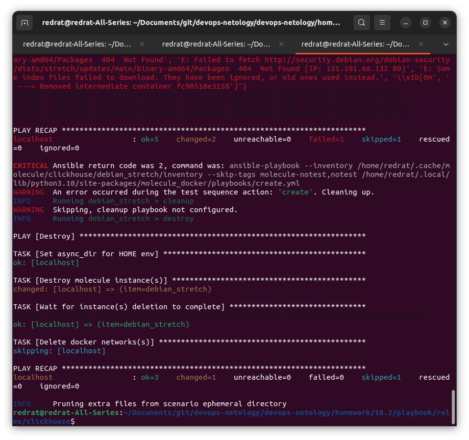
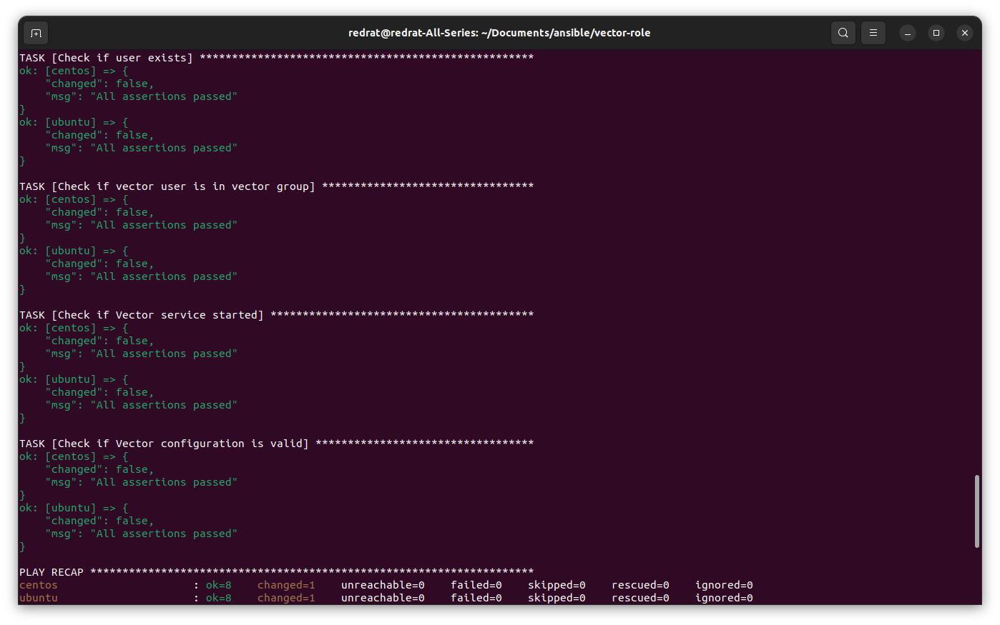
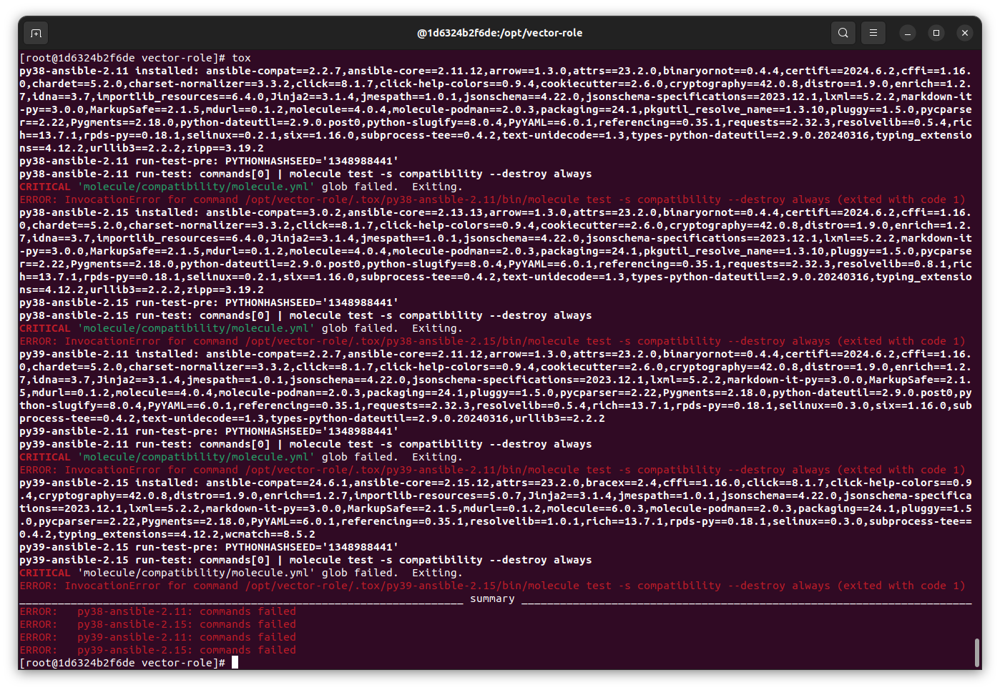
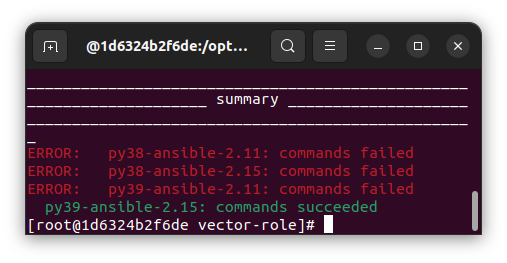
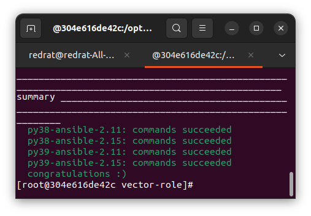

## Основная часть

Ваша цель — настроить тестирование ваших ролей. 

Задача — сделать сценарии тестирования для vector. 

Ожидаемый результат — все сценарии успешно проходят тестирование ролей.

### Molecule

1. Запустите  `molecule test -s ubuntu_xenial` (или с любым другим сценарием, не имеет значения) внутри корневой директории clickhouse-role, посмотрите на вывод команды. Данная команда может отработать с ошибками или не отработать вовсе, это нормально. Наша цель - посмотреть как другие в реальном мире используют молекулу И из чего может состоять сценарий тестирования.
2. Перейдите в каталог с ролью vector-role и создайте сценарий тестирования по умолчанию при помощи `molecule init scenario --driver-name docker`.
3. Добавьте несколько разных дистрибутивов (oraclelinux:8, ubuntu:latest) для инстансов и протестируйте роль, исправьте найденные ошибки, если они есть.
4. Добавьте несколько assert в verify.yml-файл для  проверки работоспособности vector-role (проверка, что конфиг валидный, проверка успешности запуска и др.). 
5. Запустите тестирование роли повторно и проверьте, что оно прошло успешно.
5. Добавьте новый тег на коммит с рабочим сценарием в соответствии с семантическим версионированием.

### Tox

1. Добавьте в директорию с vector-role файлы из [директории](./example).
2. Запустите `docker run --privileged=True -v <path_to_repo>:/opt/vector-role -w /opt/vector-role -it aragast/netology:latest /bin/bash`, где path_to_repo — путь до корня репозитория с vector-role на вашей файловой системе.
3. Внутри контейнера выполните команду `tox`, посмотрите на вывод.
5. Создайте облегчённый сценарий для `molecule` с драйвером `molecule_podman`. Проверьте его на исполнимость.
6. Пропишите правильную команду в `tox.ini`, чтобы запускался облегчённый сценарий.
8. Запустите команду `tox`. Убедитесь, что всё отработало успешно.
9. Добавьте новый тег на коммит с рабочим сценарием в соответствии с семантическим версионированием.

После выполнения у вас должно получится два сценария molecule и один tox.ini файл в репозитории. Не забудьте указать в ответе теги решений Tox и Molecule заданий. В качестве решения пришлите ссылку на  ваш репозиторий и скриншоты этапов выполнения задания. 

---

### Решение

Запущен Ansible для Debian Stretch модуля Clickhouse:

Не всё прошло гладко, но запускается.

Для Vector добавлены converge и verify сценарии. 
Тестирование проводится в контейнерах с Ubuntu (24.04) и Centos (7). 
В рамках тестирования проверяется наличие пользователя Vector, наличие у него соответствующей группы, запуск сервиса и правильность конфигурации.

Тесты успешно проходятся:

Тесты: https://github.com/RedRatInTheHat/vector-role/tree/v0.2.0/molecule/default

---

При первом запуске `tox` можно получить только ошибки, так как пока что никакого сценария с названием compatibility у нас нет.

Ради интереса можно скопировать default, но тогда в контейнере не обнаружится `docker`. Не завезли.

Также были изменены версии для python и ansible (ansible теперь берётся по версии ядра).

Создаём сценарий compatibility. 
Для начала в него скопирован сценарий default, разве что драйер указан другой.

Пробный запуск показывает, что дела наши так себе:

Впрочем, комбинация python3.9 и ansible-2.15 работет.  
Если же убрать из проверяемых инстансов ubuntu, работают вообще все комбинации:

Что ж, не мудрствуя лукаво, обзовём это той самой облегчённой версией и на том закончим.

Версия с новыми тестами: https://github.com/RedRatInTheHat/vector-role/tree/v0.3.0

## Необязательная часть

1. Проделайте схожие манипуляции для создания роли LightHouse.
2. Создайте сценарий внутри любой из своих ролей, который умеет поднимать весь стек при помощи всех ролей.
3. Убедитесь в работоспособности своего стека. Создайте отдельный verify.yml, который будет проверять работоспособность интеграции всех инструментов между ними.
4. Выложите свои roles в репозитории.

В качестве решения пришлите ссылки и скриншоты этапов выполнения задания.

---

#TODO в лучшие времена