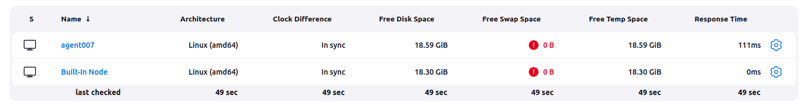
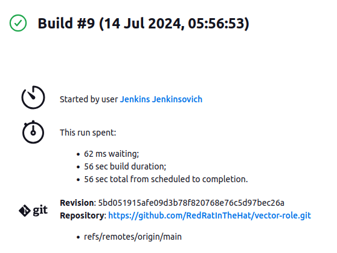
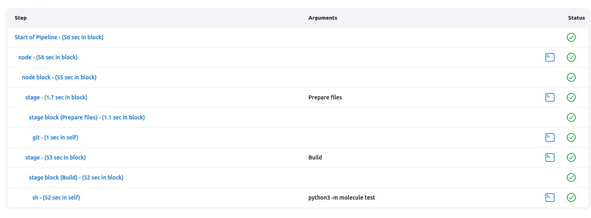
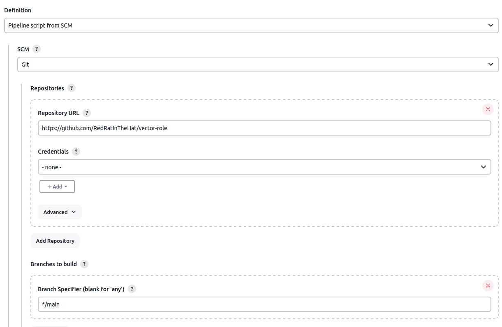
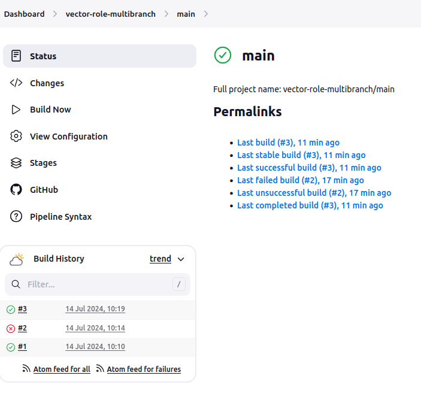
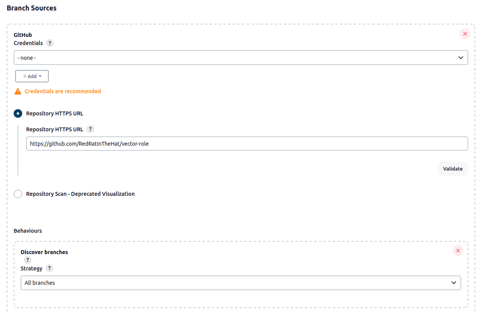
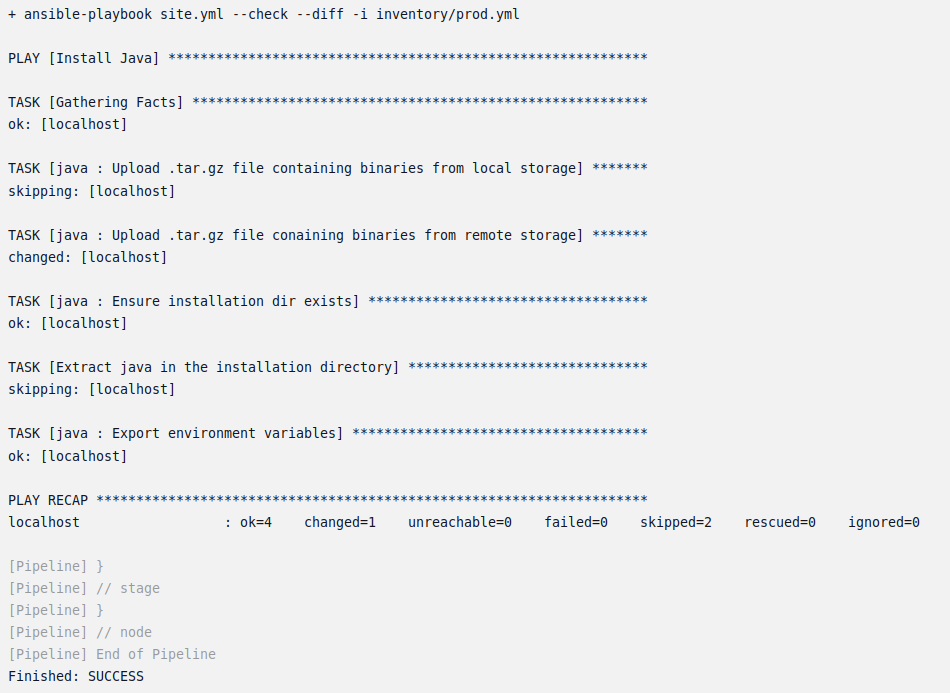
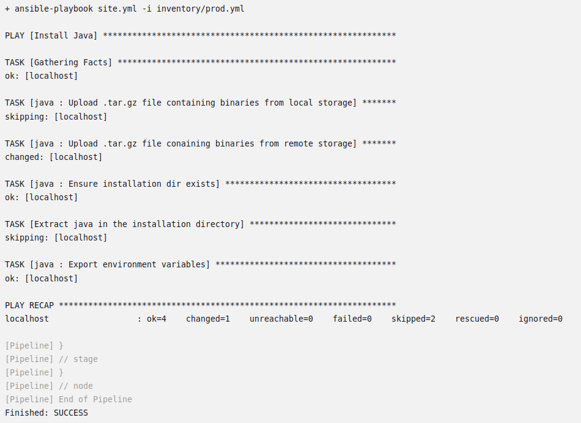

## Подготовка к выполнению

1. Создать два VM: для jenkins-master и jenkins-agent.
2. Установить Jenkins при помощи playbook.
3. Запустить и проверить работоспособность.
4. Сделать первоначальную настройку.

### Решение

Для создания инстансов используется [Terraform](terraform/main.tf).

Для корректного запуска в таске [Install JDK](infrastructure/site.yml) использована ссылка; версия JDK [вынесена в переменную jdk_version](infrastructure/inventory/cicd/group_vars/jenkins.yml).

Агент подключен, у мастера отобраны executor'ы:



---

## Основная часть

1. Сделать Freestyle Job, который будет запускать `molecule test` из любого вашего репозитория с ролью.
2. Сделать Declarative Pipeline Job, который будет запускать `molecule test` из любого вашего репозитория с ролью.
3. Перенести Declarative Pipeline в репозиторий в файл `Jenkinsfile`.
4. Создать Multibranch Pipeline на запуск `Jenkinsfile` из репозитория.
5. Создать Scripted Pipeline, наполнить его скриптом из [pipeline](./pipeline).
6. Внести необходимые изменения, чтобы Pipeline запускал `ansible-playbook` без флагов `--check --diff`, если не установлен параметр при запуске джобы (prod_run = True). По умолчанию параметр имеет значение False и запускает прогон с флагами `--check --diff`.
7. Проверить работоспособность, исправить ошибки, исправленный Pipeline вложить в репозиторий в файл `ScriptedJenkinsfile`.
8. Отправить ссылку на репозиторий с ролью и Declarative Pipeline и Scripted Pipeline.
9. Сопроводите процесс настройки скриншотами для каждого пункта задания!!

### Решение

Для Freestyle Job использовался следующий скрип:
```shell
rm -r vector-role
git clone https://github.com/RedRatInTheHat/vector-role.git

cd vector-role
python3 -m molecule test
```

Предварительно были проделаны следующие вещи:
* на стороне агента через yum установлен Ansible (иначе не видна кофигурация);
* через pip3 установлен Ansible;
* руками пришлось влезть в docker-модуль Ansible (фу так делать, но сочтено примемлемым временным решением);
* в vector-role закомментирована часть, относящаяся к ubuntu, так как (предположительно) из-за недостаточной вресии Python падает модуль ansible.module_utils.six.moves, и нет у меня больше сил никаких дальше жонглировать версиями.

Job отработал успешно:

<details>
<summary>log</summary>
<code>
Started by user Jenkins Jenkinsovich
Running as SYSTEM
Building remotely on agent-007 in workspace /opt/jenkins_agent/workspace/test vector
[test vector] $ /bin/sh -xe /tmp/jenkins14467026683115622986.sh
+ rm -r vector-role
+ git clone https://github.com/RedRatInTheHat/vector-role.git
Cloning into 'vector-role'...
+ cd vector-role
+ python3 -m molecule test
/usr/local/lib/python3.6/site-packages/requests/__init__.py:104: RequestsDependencyWarning: urllib3 (1.26.19) or chardet (5.0.0)/charset_normalizer (2.0.12) doesn't match a supported version!
  RequestsDependencyWarning)
INFO     default scenario test matrix: dependency, lint, cleanup, destroy, syntax, create, prepare, converge, idempotence, side_effect, verify, cleanup, destroy
INFO     Performing prerun...
INFO     Set ANSIBLE_LIBRARY=/root/.cache/ansible-compat/4865c4/modules:/root/.ansible/plugins/modules:/usr/share/ansible/plugins/modules
INFO     Set ANSIBLE_COLLECTIONS_PATHS=/root/.cache/ansible-compat/4865c4/collections:/root/.ansible/collections:/usr/share/ansible/collections
INFO     Set ANSIBLE_ROLES_PATH=/root/.cache/ansible-compat/4865c4/roles:/root/.ansible/roles:/usr/share/ansible/roles:/etc/ansible/roles
INFO     Using /root/.ansible/roles/netology.vector_role symlink to current repository in order to enable Ansible to find the role using its expected full name.
INFO     Running default > dependency
WARNING  Skipping, missing the requirements file.
WARNING  Skipping, missing the requirements file.
INFO     Running default > lint
INFO     Lint is disabled.
INFO     Running default > cleanup
WARNING  Skipping, cleanup playbook not configured.
INFO     Running default > destroy
INFO     Sanity checks: 'docker'

PLAY [Destroy] *****************************************************************

TASK [Destroy molecule instance(s)] ********************************************
changed: [localhost] => (item=centos)

TASK [Wait for instance(s) deletion to complete] *******************************
ok: [localhost] => (item=centos)

TASK [Delete docker networks(s)] ***********************************************

PLAY RECAP *********************************************************************
localhost                  : ok=2    changed=1    unreachable=0    failed=0    skipped=1    rescued=0    ignored=0

INFO     Running default > syntax

playbook: /opt/jenkins_agent/workspace/test vector/vector-role/molecule/default/converge.yml
INFO     Running default > create

PLAY [Create] ******************************************************************

TASK [Log into a Docker registry] **********************************************
skipping: [localhost] => (item=None) 
skipping: [localhost]

TASK [Check presence of custom Dockerfiles] ************************************
ok: [localhost] => (item={u'pre_build_image': True, u'name': u'centos', u'cgroupns_mode': u'host', u'image': u'geerlingguy/docker-centos8-ansible:latest', u'command': u'/usr/sbin/init', u'volumes': [u'/sys/fs/cgroup:/sys/fs/cgroup:rw'], u'privileged': True, u'override_command': False})

TASK [Create Dockerfiles from image names] *************************************
skipping: [localhost] => (item={u'pre_build_image': True, u'name': u'centos', u'cgroupns_mode': u'host', u'image': u'geerlingguy/docker-centos8-ansible:latest', u'command': u'/usr/sbin/init', u'volumes': [u'/sys/fs/cgroup:/sys/fs/cgroup:rw'], u'privileged': True, u'override_command': False})

TASK [Discover local Docker images] ********************************************
ok: [localhost] => (item={u'item': {u'pre_build_image': True, u'name': u'centos', u'cgroupns_mode': u'host', u'image': u'geerlingguy/docker-centos8-ansible:latest', u'command': u'/usr/sbin/init', u'volumes': [u'/sys/fs/cgroup:/sys/fs/cgroup:rw'], u'privileged': True, u'override_command': False}, u'skipped': True, u'ansible_loop_var': u'item', u'skip_reason': u'Conditional result was False', u'i': 0, u'ansible_index_var': u'i', u'changed': False})

TASK [Build an Ansible compatible image (new)] *********************************
skipping: [localhost] => (item=molecule_local/geerlingguy/docker-centos8-ansible:latest)

TASK [Create docker network(s)] ************************************************

TASK [Determine the CMD directives] ********************************************
skipping: [localhost] => (item={u'pre_build_image': True, u'name': u'centos', u'cgroupns_mode': u'host', u'image': u'geerlingguy/docker-centos8-ansible:latest', u'command': u'/usr/sbin/init', u'volumes': [u'/sys/fs/cgroup:/sys/fs/cgroup:rw'], u'privileged': True, u'override_command': False})

TASK [Create molecule instance(s)] *********************************************
changed: [localhost] => (item=centos)

TASK [Wait for instance(s) creation to complete] *******************************
FAILED - RETRYING: Wait for instance(s) creation to complete (300 retries left).
changed: [localhost] => (item={u'ansible_loop_var': u'item', u'ansible_job_id': u'631416223294.50913', u'failed': False, u'started': 1, u'changed': True, u'item': {u'pre_build_image': True, u'name': u'centos', u'cgroupns_mode': u'host', u'image': u'geerlingguy/docker-centos8-ansible:latest', u'command': u'/usr/sbin/init', u'volumes': [u'/sys/fs/cgroup:/sys/fs/cgroup:rw'], u'privileged': True, u'override_command': False}, u'finished': 0, u'results_file': u'/root/.ansible_async/631416223294.50913'})

PLAY RECAP *********************************************************************
localhost                  : ok=4    changed=2    unreachable=0    failed=0    skipped=5    rescued=0    ignored=0

INFO     Running default > prepare
WARNING  Skipping, prepare playbook not configured.
INFO     Running default > converge

PLAY [Converge] ****************************************************************

TASK [Include vector-role] *****************************************************

TASK [vector-role : Create group vector] ***************************************
changed: [centos]

TASK [vector-role : Add user vector] *******************************************
changed: [centos]

TASK [vector-role : Make sure Vector directory exists] *************************
changed: [centos]

TASK [vector-role : Make sure var Vector directory exists] *********************
changed: [centos]

TASK [vector-role : Unarchive Vector] ******************************************
changed: [centos]

TASK [vector-role : Copy vector to etc] ****************************************
changed: [centos]

TASK [vector-role : Copy vector.service file] **********************************
changed: [centos]

TASK [vector-role : Add vector.yaml file] **************************************
changed: [centos]

RUNNING HANDLER [vector-role : Restart and enable Vector service] **************
changed: [centos]

PLAY RECAP *********************************************************************
centos                     : ok=9    changed=9    unreachable=0    failed=0    skipped=0    rescued=0    ignored=0

INFO     Running default > idempotence

PLAY [Converge] ****************************************************************

TASK [Include vector-role] *****************************************************

TASK [vector-role : Create group vector] ***************************************
ok: [centos]

TASK [vector-role : Add user vector] *******************************************
ok: [centos]

TASK [vector-role : Make sure Vector directory exists] *************************
ok: [centos]

TASK [vector-role : Make sure var Vector directory exists] *********************
ok: [centos]

TASK [vector-role : Unarchive Vector] ******************************************
ok: [centos]

TASK [vector-role : Copy vector to etc] ****************************************
ok: [centos]

TASK [vector-role : Copy vector.service file] **********************************
ok: [centos]

TASK [vector-role : Add vector.yaml file] **************************************
ok: [centos]

PLAY RECAP *********************************************************************
centos                     : ok=8    changed=0    unreachable=0    failed=0    skipped=0    rescued=0    ignored=0

INFO     Idempotence completed successfully.
INFO     Running default > side_effect
WARNING  Skipping, side effect playbook not configured.
INFO     Running default > verify
INFO     Running Ansible Verifier

PLAY [Verify] ******************************************************************

TASK [Get vector user info] ****************************************************
ok: [centos]

TASK [Get vector group info] ***************************************************
ok: [centos]

TASK [Get Vector service info] *************************************************
ok: [centos]

TASK [Get Vector configuration validation result] ******************************
changed: [centos]

TASK [Check if user exists] ****************************************************
ok: [centos] => {
    "changed": false, 
    "msg": "All assertions passed"
}

TASK [Check if vector user is in vector group] *********************************
ok: [centos] => {
    "changed": false, 
    "msg": "All assertions passed"
}

TASK [Check if Vector service started] *****************************************
ok: [centos] => {
    "changed": false, 
    "msg": "All assertions passed"
}

TASK [Check if Vector configuration is valid] **********************************
ok: [centos] => {
    "changed": false, 
    "msg": "All assertions passed"
}

PLAY RECAP *********************************************************************
centos                     : ok=8    changed=1    unreachable=0    failed=0    skipped=0    rescued=0    ignored=0

INFO     Verifier completed successfully.
INFO     Running default > cleanup
WARNING  Skipping, cleanup playbook not configured.
INFO     Running default > destroy

PLAY [Destroy] *****************************************************************

TASK [Destroy molecule instance(s)] ********************************************
changed: [localhost] => (item=centos)

TASK [Wait for instance(s) deletion to complete] *******************************
FAILED - RETRYING: Wait for instance(s) deletion to complete (300 retries left).
changed: [localhost] => (item=centos)

TASK [Delete docker networks(s)] ***********************************************

PLAY RECAP *********************************************************************
localhost                  : ok=2    changed=2    unreachable=0    failed=0    skipped=1    rescued=0    ignored=0

INFO     Pruning extra files from scenario ephemeral directory
Finished: SUCCESS
</code>
</details>

Создан следующий declarative pipeline:

```
pipeline {
    agent any
    stages {
        stage("Prepare files") {
            steps {
                dir ('vector-role') {
                    git branch: 'main', url: 'https://github.com/RedRatInTheHat/vector-role.git'
                }
            }
        }
        stage("Build") {
            steps {
                dir ('vector-role') {
                    sh 'python3 -m molecule test'
                }
            }
        }
    }
}
```

Также успешно отрабатывает:





Скрипт перенесён в [репозиторий vector-role](https://github.com/RedRatInTheHat/vector-role/blob/main/Jenkinsfile), для declarative pipline подключено обращение в репозиторий:



Создан multibranch pipeline. Какой-то особой конфигруации не создавалось, просто репозиторий vector-role. Pipeline отрабатывает успешно:





Scripted pipeline изменён для скачивания не через ssh, ноде-агенту добавлена метка linux, в скрипт добавлено изменение поведения в зависимости от переменной prod_run:

```
node("linux"){
    stage("Git checkout"){
        git 'https://github.com/aragastmatb/example-playbook.git'
    }
    stage("Sample define secret_check"){
        secret_check=true
        prod_run = true
    }
    stage("Run playbook"){
        if (secret_check){
            additional_parameters = prod_run ? "" : "--check --diff"
            sh "ansible-playbook site.yml ${ additional_parameters } -i inventory/prod.yml"
        }
        else{
            echo 'need more action'
        }
        
    }
}
```

prod_run == false:



prod_run == true:



Скрипт добавлен в файл [ScriptedJenkinsfile](https://github.com/RedRatInTheHat/vector-role/blob/main/ScriptedJenkinsfile).

---

## Необязательная часть

1. Создать скрипт на groovy, который будет собирать все Job, завершившиеся хотя бы раз неуспешно. Добавить скрипт в репозиторий с решением и названием `AllJobFailure.groovy`.
2. Создать Scripted Pipeline так, чтобы он мог сначала запустить через Yandex Cloud CLI необходимое количество инстансов, прописать их в инвентори плейбука и после этого запускать плейбук. Мы должны при нажатии кнопки получить готовую к использованию систему.

#TODO когда-нибудь
