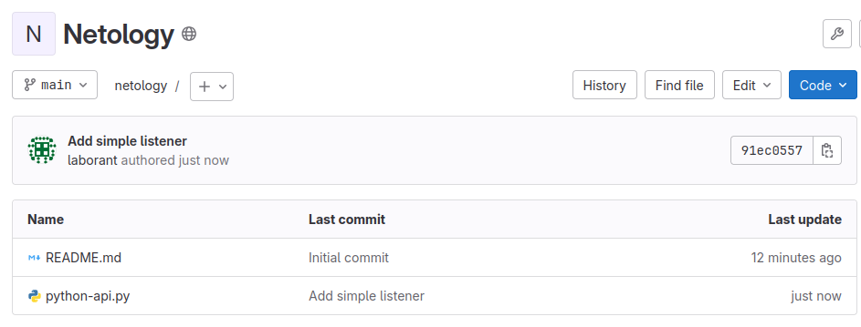
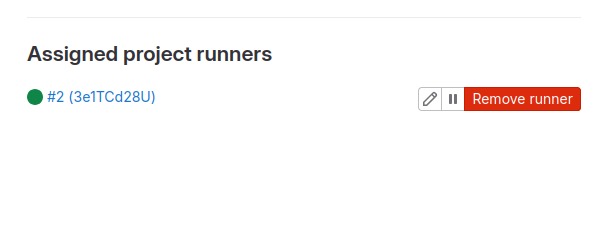
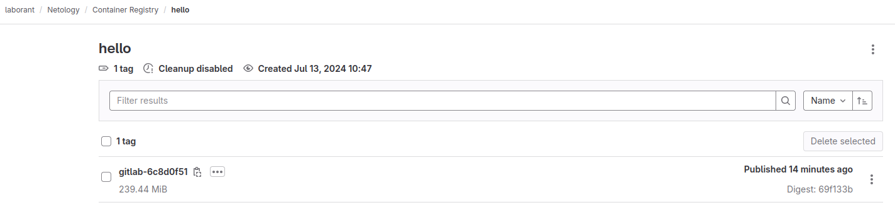
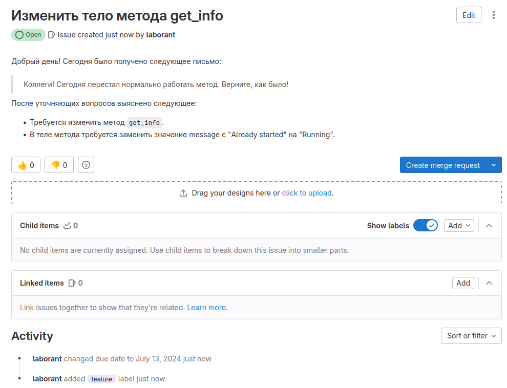
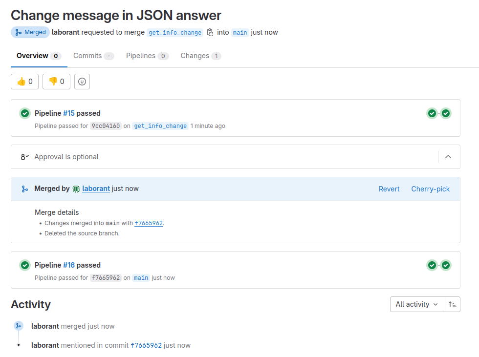
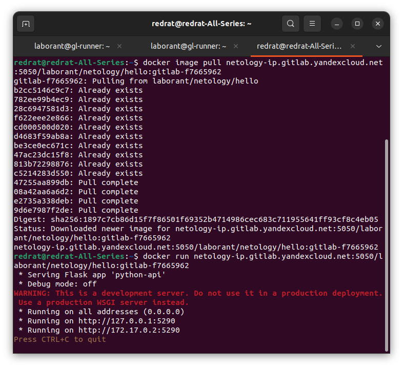
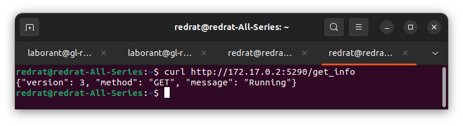
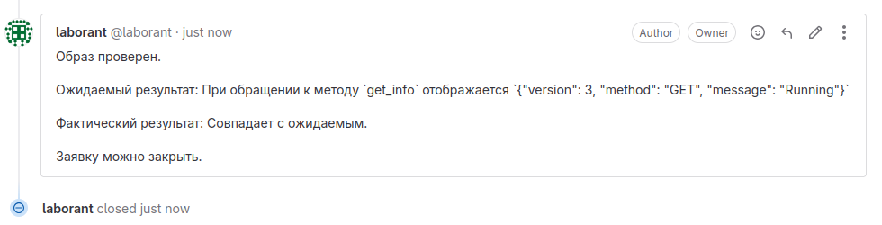

## Подготовка к выполнению

1. Или подготовьте к работе Managed GitLab от yandex cloud [по инструкции](https://cloud.yandex.ru/docs/managed-gitlab/operations/instance/instance-create) .
Или создайте виртуальную машину из публичного образа [по инструкции](https://cloud.yandex.ru/marketplace/products/yc/gitlab ) .
2. Создайте виртуальную машину и установите на нее gitlab runner, подключите к вашему серверу gitlab  [по инструкции](https://docs.gitlab.com/runner/install/linux-repository.html) .

3. (* Необязательное задание повышенной сложности. )  Если вы уже знакомы с k8s попробуйте выполнить задание, запустив gitlab server и gitlab runner в k8s  [по инструкции](https://cloud.yandex.ru/docs/tutorials/infrastructure-management/gitlab-containers). 

4. Создайте свой новый проект.
5. Создайте новый репозиторий в GitLab, наполните его [файлами](./repository).
6. Проект должен быть публичным, остальные настройки по желанию.

### Решение 

Добавлен GitLab, создан проект Netology, в него добавлен файл python-api.py; к проекту подключен gitlab-runner:

---

## Основная часть

### DevOps

В репозитории содержится код проекта на Python. Проект — RESTful API сервис. Ваша задача — автоматизировать сборку образа с выполнением python-скрипта:

1. Образ собирается на основе [centos:7](https://hub.docker.com/_/centos?tab=tags&page=1&ordering=last_updated).
2. Python версии не ниже 3.7.
3. Установлены зависимости: `flask` `flask-jsonpify` `flask-restful`.
4. Создана директория `/python_api`.
5. Скрипт из репозитория размещён в /python_api.
6. Точка вызова: запуск скрипта.
7. При комите в любую ветку должен собираться docker image с форматом имени hello:gitlab-$CI_COMMIT_SHORT_SHA . Образ должен быть выложен в Gitlab registry или yandex registry.

### Решение

В репозиторий добавлены файлы [Dockerfile](files/Dockerfile) и [requirements.txt](files/requirements.txt). Чтобы не проводить манипуляций со сменой зеркал centos:7, был взят образ centos/python-38-centos7.

Построен [pipeline для сборки и загрузки образа](files/gitlab-ci.yml). Все данные закатаны в переменные проекта.

Образ успешно загружен:

---

### Product Owner

Вашему проекту нужна бизнесовая доработка: нужно поменять JSON ответа на вызов метода GET `/rest/api/get_info`, необходимо создать Issue в котором указать:

1. Какой метод необходимо исправить.
2. Текст с `{ "message": "Already started" }` на `{ "message": "Running"}`.
3. Issue поставить label: feature.

### Решение

Если я что-то понимаю в задачах бизнеса, то заявка будет выглядеть примерно так:

---

### Developer

Пришёл новый Issue на доработку, вам нужно:

1. Создать отдельную ветку, связанную с этим Issue.
2. Внести изменения по тексту из задания.
3. Подготовить Merge Request, влить необходимые изменения в `master`, проверить, что сборка прошла успешно.

### Решение

В ветке `get_info_change` внесены изменения в файле `python-api.py`. Слияние прошло успешно:

Лог:

build

<pre><code>
Running with gitlab-runner 17.1.0 (fe451d5a)
  on blade-runner 3e1TCd28U, system ID: s_4e8d95cc559c
Preparing the "shell" executor 00:00
Using Shell (bash) executor...
Preparing environment 00:00
Running on gl-runner...
Getting source from Git repository 00:00
Fetching changes with git depth set to 20...
Reinitialized existing Git repository in /home/laborant/builds/3e1TCd28U/0/laborant/netology/.git/
Checking out f7665962 as detached HEAD (ref is main)...
Skipping Git submodules setup
Executing "step_script" stage of the job script 00:01
$ docker --version
Docker version 27.0.3, build 7d4bcd8
$ whoami
root
$ docker build -t $REGISTRY_BASE/$GITLAB_USER/$PROJECT_NAME/$DOCKER_IMAGE_BASE_NAME-$CI_COMMIT_SHORT_SHA .
#0 building with "default" instance using docker driver
#1 [internal] load build definition from Dockerfile
#1 transferring dockerfile: 255B done
#1 DONE 0.0s
#2 [internal] load metadata for docker.io/centos/python-38-centos7:latest
#2 DONE 0.5s
#3 [internal] load .dockerignore
#3 transferring context: 2B done
#3 DONE 0.0s
#4 [1/5] FROM docker.io/centos/python-38-centos7:latest@sha256:4b66b1a8da1cba90313da11b518852baf120f6bba794d6ece2abde4d54cebb1a
#4 DONE 0.0s
#5 [internal] load build context
#5 transferring context: 70B done
#5 DONE 0.0s
#6 [2/5] COPY requirements.txt requirements.txt
#6 CACHED
#7 [3/5] RUN pip3 install -r requirements.txt
#7 CACHED
#8 [4/5] RUN mkdir python-api
#8 CACHED
#9 [5/5] COPY python-api.py python-api/python-api.py
#9 CACHED
#10 exporting to image
#10 exporting layers done
#10 writing image sha256:9efecdf34dadaa25f1f576245e0347896975fe6464d309c716245b6a0a6288b6 done
#10 naming to netology-ip.gitlab.yandexcloud.net:5050/laborant/netology/hello:gitlab-f7665962 done
#10 DONE 0.0s
Cleaning up project directory and file based variables 00:00
Job succeeded
</code></pre>

deploy

<pre><code>
Running with gitlab-runner 17.1.0 (fe451d5a)
  on blade-runner 3e1TCd28U, system ID: s_4e8d95cc559c
Preparing the "shell" executor 00:00
Using Shell (bash) executor...
Preparing environment 00:00
Running on gl-runner...
Getting source from Git repository 00:00
Fetching changes with git depth set to 20...
Reinitialized existing Git repository in /home/laborant/builds/3e1TCd28U/0/laborant/netology/.git/
Checking out f7665962 as detached HEAD (ref is main)...
Skipping Git submodules setup
Executing "step_script" stage of the job script 00:00
$ docker login -u $GITLAB_USER -p $GITLAB_PASSWORD $REGISTRY_BASE
WARNING! Using --password via the CLI is insecure. Use --password-stdin.
WARNING! Your password will be stored unencrypted in /root/.docker/config.json.
Configure a credential helper to remove this warning. See
https://docs.docker.com/engine/reference/commandline/login/#credential-stores
Login Succeeded
$ docker push $REGISTRY_BASE/$GITLAB_USER/$PROJECT_NAME/$DOCKER_IMAGE_BASE_NAME-$CI_COMMIT_SHORT_SHA
The push refers to repository [netology-ip.gitlab.yandexcloud.net:5050/laborant/netology/hello]
8971f12214ac: Preparing
2fdeb77ce753: Preparing
38d906a23ebf: Preparing
2772444b7efd: Preparing
c2f3ac6ca11d: Preparing
b944e0b64a51: Preparing
c0dc5fde85ba: Preparing
1030e34f7f41: Preparing
4eb735472655: Preparing
4723c2f8b39b: Preparing
96c3e66225c5: Preparing
b53a66890a58: Preparing
46d98914fe04: Preparing
53498d66ad83: Preparing
b944e0b64a51: Waiting
c0dc5fde85ba: Waiting
1030e34f7f41: Waiting
4eb735472655: Waiting
4723c2f8b39b: Waiting
96c3e66225c5: Waiting
b53a66890a58: Waiting
46d98914fe04: Waiting
53498d66ad83: Waiting
2fdeb77ce753: Layer already exists
c2f3ac6ca11d: Layer already exists
2772444b7efd: Layer already exists
38d906a23ebf: Layer already exists
8971f12214ac: Layer already exists
c0dc5fde85ba: Layer already exists
b944e0b64a51: Layer already exists
1030e34f7f41: Layer already exists
4eb735472655: Layer already exists
4723c2f8b39b: Layer already exists
96c3e66225c5: Layer already exists
b53a66890a58: Layer already exists
46d98914fe04: Layer already exists
53498d66ad83: Layer already exists
gitlab-f7665962: digest: sha256:1897c7cb86d15f7f86501f69352b4714986cec683c711955641ff93cf8c4eb05 size: 3255
Cleaning up project directory and file based variables 00:00
Job succeeded
</code></pre>

---

### Tester

Разработчики выполнили новый Issue, необходимо проверить валидность изменений:

1. Поднять докер-контейнер с образом `python-api:latest` и проверить возврат метода на корректность.
2. Закрыть Issue с комментарием об успешности прохождения, указав желаемый результат и фактически достигнутый.

### Решение

Стягиваем и запускаем образ (правда, с другим названием):

Проверяем ответ:

Выглядит хорошо. Отписываемся в заявке и закрываем её:

