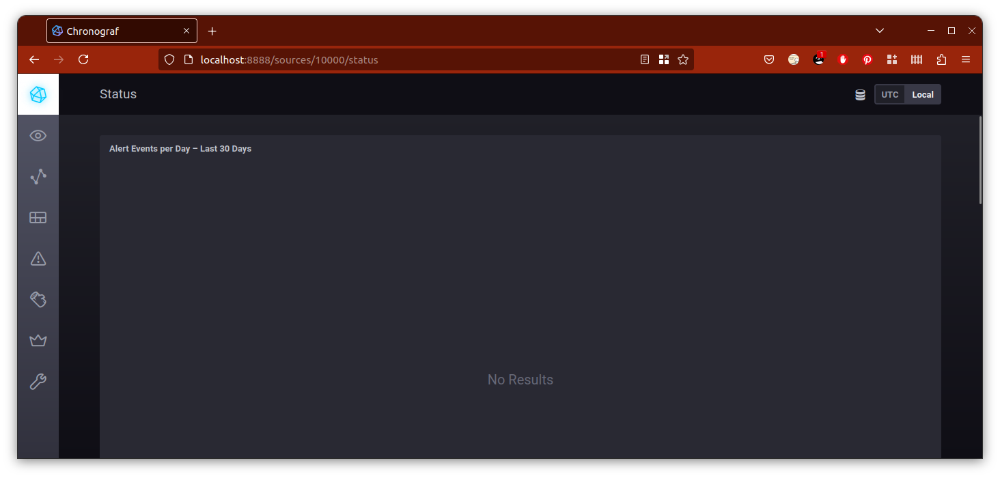
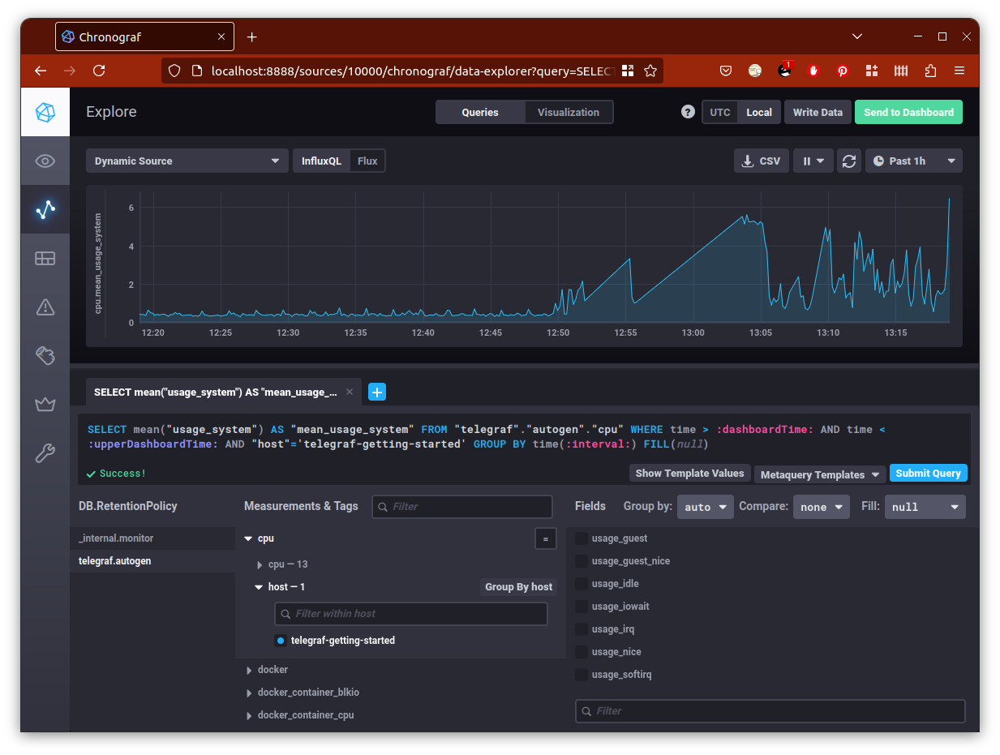
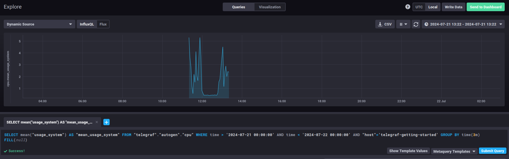
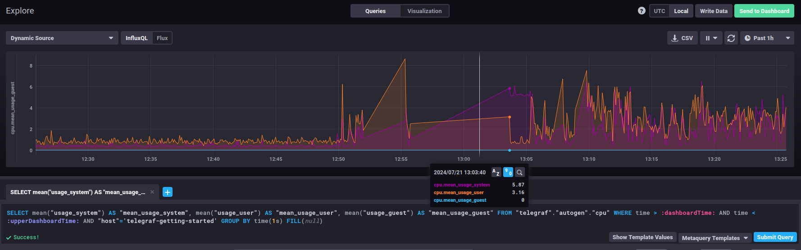

## Обязательные задания

## Задание 1

Вас пригласили настроить мониторинг на проект. На онбординге вам рассказали, что проект представляет из себя 
платформу для вычислений с выдачей текстовых отчетов, которые сохраняются на диск. Взаимодействие с платформой 
осуществляется по протоколу http. Также вам отметили, что вычисления загружают ЦПУ. Какой минимальный набор метрик вы
выведите в мониторинг и почему?

### Решение

Согласно приведённому набору метрик, стоит как минимум включить мониторинг:
* Количество свободного пространства на диске (free space). Отчёты сохраняются на диск и копятся там, небось, до последнего. Место может и закончиться.
* Количество inodes. Если отчёты ещё и разбиваются на маленькие файлы, то мы рискуем остаться без возможности создавать новые файлы.
* Нагрузку на центральный процессор (CPU utilization). Раз уж вычисления загружают ЦПУ хорошо бы отследить, когда такая загрузка не станет критической.
* Количество запросов, завершившихся ошибкой (с кодами ответа 4XX, 5XX). Для контроля количества ошибок при запросе к платформе. Их рост может означать, что что-то у нас знатно пошло не так.

Возможно также стоило бы отслеживать RAM (потому что это всегда хорошая идея), пропускную способность сетевого трафика (потому что к платформе будут обращаться по сети), количество запросов (чтобы проверить, не пора ли расширяться в связи с увеличением запросов) и времени отклика (для обнаружения возросшей нагрузки и последующих тормозов).

---

## Задание 2

Менеджер продукта посмотрев на ваши метрики сказал, что ему непонятно что такое RAM/inodes/CPUla. Также он сказал, 
что хочет понимать, насколько мы выполняем свои обязанности перед клиентами и какое качество обслуживания. Что вы 
можете ему предложить?

### Решение

~~Курсы повышения квалификации~~

Для перевода сухих данных в понятные менеджменту метрики можно использовать SLI. SLI будет зависеть от того, а что от нас хочет клиент. Если мы говорим о продукте из первого задания, то скорее всего от нас хотят, чтобы всё работало и быстро.

Так что одну метрику можно завязать на количество успешно обработанных данных `summ_2xx_requests / (summ_all_requests)`, а вторую на среднее отклонение от целевого времени ожидания (назовём это чем-то вроде `response_mean_deviation`).

---

## Задание 3 

Вашей DevOps команде в этом году не выделили финансирование на построение системы сбора логов. Разработчики в свою очередь хотят видеть все ошибки, которые выдают их приложения. Какое решение вы можете предпринять в этой ситуации, чтобы разработчики получали ошибки приложения?

### Решение

Ну, раз денег нет, ELK мы разработчикам не поднимем.

Но раз они эти приложения разработали, они могут управлять и форматом логов. А значит, и распарсить их должно быть относительно просто.<br/>
Так что нужно будет написать нехитрый скрипт, периодически проверяющий логи за прошедший промежуток времени, выцепляющий логи с некоторым вхождением (например, все, где после времени стоит `ERORR`), и отправляющий их в любой доступный канал, будь то брокер сообщений, базы данных или просто Telegram-канал.

---

## Задание 4

Вы, как опытный SRE, сделали мониторинг, куда вывели отображения выполнения SLA=99% по http кодам ответов. 
Вычисляете этот параметр по следующей формуле: summ_2xx_requests/summ_all_requests. Данный параметр не поднимается выше 
70%, но при этом в вашей системе нет кодов ответа 5xx и 4xx. Где у вас ошибка?

### Решение

В целом, существуют 5 категорий http-response. Информационный ответ (1ХХ), успешное выполнение (2ХХ), сообщения о перенаправлении (3ХХ), ошибка на стороне клиента (4ХХ), ошибка на стороне сервера (4ХХ).

Если мы считаем успешным всё, что не 4ХХ и 5ХХ, то и формулу нужно использовать соответствующую: либо `(summ_1xx_requests + summ_2xx_requests + summ_3xx_requests)/summ_all_requests`, либо `1 - (summ_4xx_requests + summ_5xx_requests)/summ_all_requests`.

---

## Задание 5 

Опишите основные плюсы и минусы pull и push систем мониторинга.

### Решение

| Модель | Плюсы | Минусы |
|--------|-------|--------|
| Pull | Можно вытянуть всё, что нужно, одним пакетом, не создавая нагрузки на трафик. Опрашиваем только тех агентов, которые нам нужны (и которым мы доверяем). Запрашиваем только то, что нужно. | Сложно поддерживать реплику. Сложно опрашивать большое число систем. При низкой частоте опроса данные могут быть устаревшими. |
| Push | Можно раскидывать данные сразу в несколько систем мониторинга (и их метрики). Не нужно опрашивать всех-всех-всех, данные придут сами. Данные приходят чаще, а потому могут быть актуальнее. | Нагрузка на сеть за счёт частоты отправки. Отправляется всё подряд, а там сами разберётесь. Если система мониторинга отвалилась, данные отправленные данные могут быть утеряны. | 

---

## Задание 6 

Какие из ниже перечисленных систем относятся к push модели, а какие к pull? А может есть гибридные?

    - Prometheus 
    - TICK
    - Zabbix
    - VictoriaMetrics
    - Nagios

### Решение

* Prometheus. Pull-модель. Есть вариант с Pushgateway, но его рекомендуют только в особых случаях.
* TICK. Push-модель.
* Zabbix. Поддерживает обе модели, гибридная.
* VictoriaMetrics. Гибридная.
* Nagios. Pull-модель.

---

## Задание 7

Склонируйте себе [репозиторий](https://github.com/influxdata/sandbox/tree/master) и запустите TICK-стэк, 
используя технологии docker и docker-compose.

В виде решения на это упражнение приведите скриншот веб-интерфейса ПО chronograf (`http://localhost:8888`). 

P.S.: если при запуске некоторые контейнеры будут падать с ошибкой - проставьте им режим `Z`, например
`./data:/var/lib:Z`

### Решение

Заменив все `docker-compose` на `docker compose` в скрипте `sandbox` и поменяв атрибуты доступа к прокидываемым директориям, запускаем, наконец, TICK:



---

## Задание 8

Перейдите в веб-интерфейс Chronograf (http://localhost:8888) и откройте вкладку Data explorer.
        
    - Нажмите на кнопку Add a query
    - Изучите вывод интерфейса и выберите БД telegraf.autogen
    - В `measurments` выберите cpu->host->telegraf-getting-started, а в `fields` выберите usage_system. Внизу появится график утилизации cpu.
    - Вверху вы можете увидеть запрос, аналогичный SQL-синтаксису. Поэкспериментируйте с запросом, попробуйте изменить группировку и интервал наблюдений.

Для выполнения задания приведите скриншот с отображением метрик утилизации cpu из веб-интерфейса.

### Решение

Выбираем все необходимые параметры, получаем следующее:



Пробуем всякое:





---

9. Изучите список [telegraf inputs](https://github.com/influxdata/telegraf/tree/master/plugins/inputs). 
Добавьте в конфигурацию telegraf следующий плагин - [docker](https://github.com/influxdata/telegraf/tree/master/plugins/inputs/docker):
```
[[inputs.docker]]
  endpoint = "unix:///var/run/docker.sock"
```

Дополнительно вам может потребоваться донастройка контейнера telegraf в `docker-compose.yml` дополнительного volume и 
режима privileged:
```
  telegraf:
    image: telegraf:1.4.0
    privileged: true
    volumes:
      - ./etc/telegraf.conf:/etc/telegraf/telegraf.conf:Z
      - /var/run/docker.sock:/var/run/docker.sock:Z
    links:
      - influxdb
    ports:
      - "8092:8092/udp"
      - "8094:8094"
      - "8125:8125/udp"
```

После настройке перезапустите telegraf, обновите веб интерфейс и приведите скриншотом список `measurments` в 
веб-интерфейсе базы telegraf.autogen . Там должны появиться метрики, связанные с docker.

Факультативно можете изучить какие метрики собирает telegraf после выполнения данного задания.

## Дополнительное задание (со звездочкой*) - необязательно к выполнению

1. Вы устроились на работу в стартап. На данный момент у вас нет возможности развернуть полноценную систему 
мониторинга, и вы решили самостоятельно написать простой python3-скрипт для сбора основных метрик сервера. Вы, как 
опытный системный-администратор, знаете, что системная информация сервера лежит в директории `/proc`. 
Также, вы знаете, что в системе Linux есть  планировщик задач cron, который может запускать задачи по расписанию.

Суммировав все, вы спроектировали приложение, которое:
- является python3 скриптом
- собирает метрики из папки `/proc`
- складывает метрики в файл 'YY-MM-DD-awesome-monitoring.log' в директорию /var/log 
(YY - год, MM - месяц, DD - день)
- каждый сбор метрик складывается в виде json-строки, в виде:
  + timestamp (временная метка, int, unixtimestamp)
  + metric_1 (метрика 1)
  + metric_2 (метрика 2)
  
     ...
     
  + metric_N (метрика N)
  
- сбор метрик происходит каждую 1 минуту по cron-расписанию

Для успешного выполнения задания нужно привести:

а) работающий код python3-скрипта,

б) конфигурацию cron-расписания,

в) пример верно сформированного 'YY-MM-DD-awesome-monitoring.log', имеющий не менее 5 записей,

P.S.: количество собираемых метрик должно быть не менее 4-х.
P.P.S.: по желанию можно себя не ограничивать только сбором метрик из `/proc`.

2. В веб-интерфейсе откройте вкладку `Dashboards`. Попробуйте создать свой dashboard с отображением:

    - утилизации ЦПУ
    - количества использованного RAM
    - утилизации пространства на дисках
    - количество поднятых контейнеров
    - аптайм
    - ...
    - фантазируйте)
    
    ---