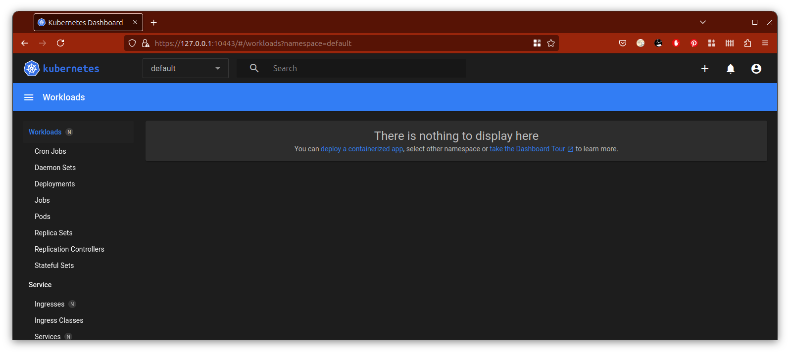

### Задание 1. Установка MicroK8S

1. Установить MicroK8S на локальную машину или на удалённую виртуальную машину.
2. Установить dashboard.
3. Сгенерировать сертификат для подключения к внешнему ip-адресу.

---

#### Решение

На удалённой машине установлен microK8S и установлен dashboard:

Прокинуты порты командой `microk8s kubectl port-forward -n kube-system service/kubernetes-dashboard 10443:443`.

Отредактирован файл `/var/snap/microk8s/current/certs/csr.conf.template` для добавления внешнего IP адреса.

Сгенерирован сертификат `fron-proxy-client.crt`.

---

### Задание 2. Установка и настройка локального kubectl
1. Установить на локальную машину kubectl.
2. Настроить локально подключение к кластеру.
3. Подключиться к дашборду с помощью port-forward.

---

#### Решение

На локальную машину установлен kubectl:

Установлено подлкючение к удалённой машине:

Прокинуты порты командой `kubectl port-forward -n kube-system service/kubernetes-dashboard 10443:443`. Теперь к дашборду можно подключиться локально:

