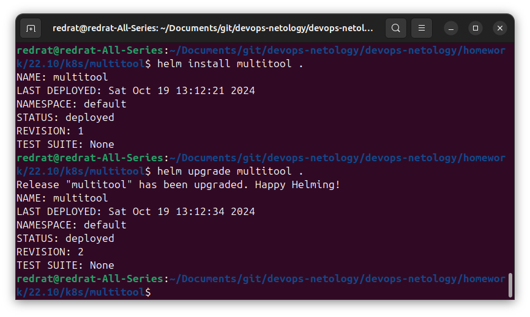
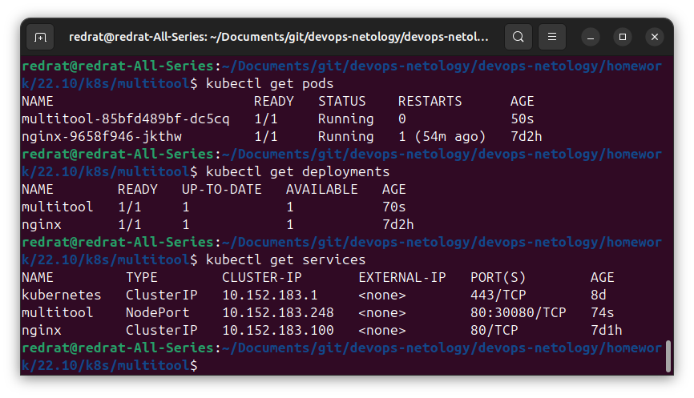

## Задание 1. Подготовить Helm-чарт для приложения

1. Необходимо упаковать приложение в чарт для деплоя в разные окружения. 
2. Каждый компонент приложения деплоится отдельным deployment’ом или statefulset’ом.
3. В переменных чарта измените образ приложения для изменения версии.

---

### Решение

В качестве приложения возьмём multitool. В качестве сервиса выбран NodePort для быстрой проверки работы.

Создаём chart, настраиваем в нём [Deployment](k8s/multitool/templates/deployment.yaml), [Service](k8s/multitool/templates/service.yaml) и [переменные для настройки всего этого дела](k8s/multitool/values.yaml).

По счастью, multitool как раз перешёл другому владельцу, так что для имитации обновления меняем образ с `praqma/network-multitool` на `wbitt/network-multitool`. Версия (ревизия) сменилась:

Поды и сервис поднялись:

---

## Задание 2. Запустить две версии в разных неймспейсах

1. Подготовив чарт, необходимо его проверить. Запуститe несколько копий приложения.
2. Одну версию в namespace=app1, вторую версию в том же неймспейсе, третью версию в namespace=app2.
3. Продемонстрируйте результат.
