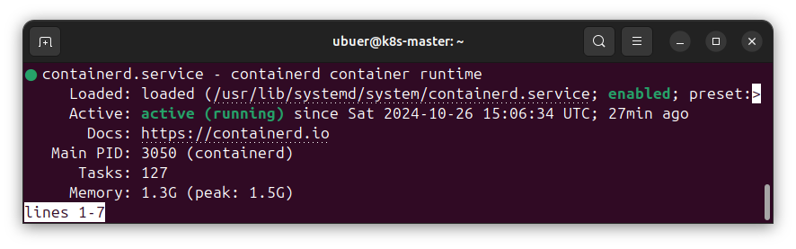
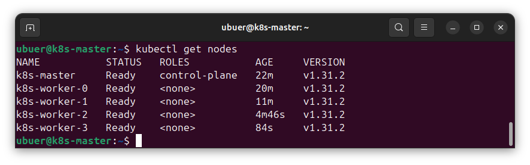
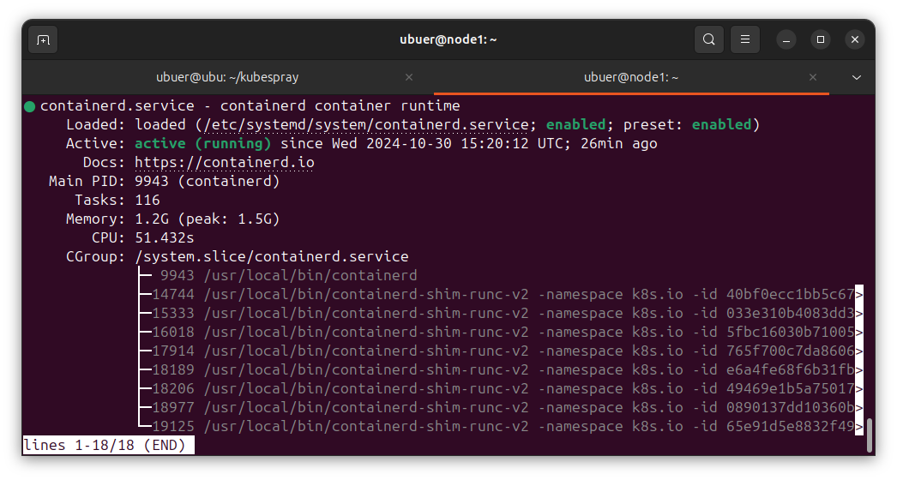
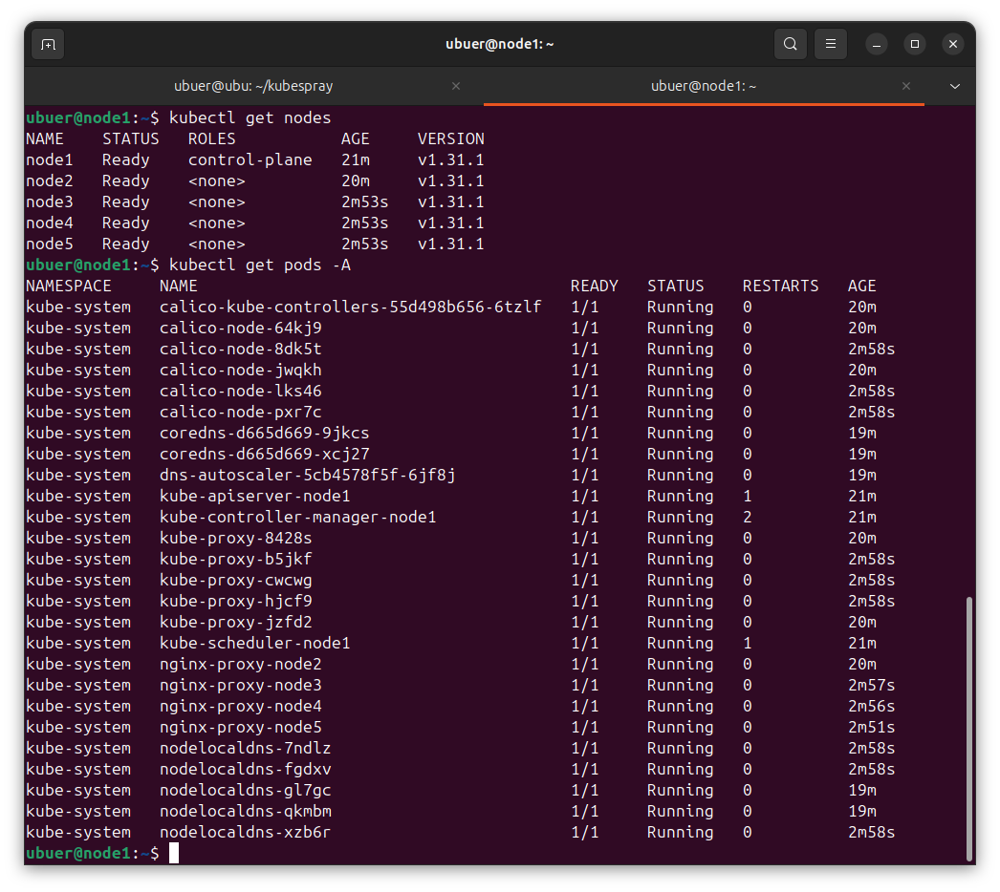

## Задание 1. Установить кластер k8s с 1 master node

1. Подготовка работы кластера из 5 нод: 1 мастер и 4 рабочие ноды.
2. В качестве CRI — containerd.
3. Запуск etcd производить на мастере.
4. Способ установки выбрать самостоятельно.

---

### Решение

1. kubeadm

Были подготовлены 5 машин.

Установлен containerd:

С помощью kubeadm настроена master-нода и подключены 4 worker'а.
Настроена их связность с помощью Calico.

Правда, поды kube-proxy и calico-node поочерёдно падали, 
так что было принято мужественное решение оставить этот воспрос на 
следующее домашнее задание, и установить всё с помощью kubespray.

2. kubespray

Для наглядности прилагается полученный файл [hosts.yml](files/hosts.yaml).

containerd устновлен:

Ноды связаны, поды поднялись:

