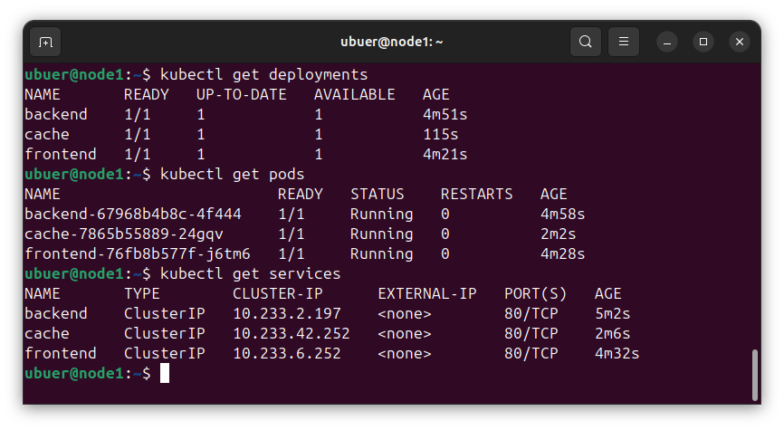
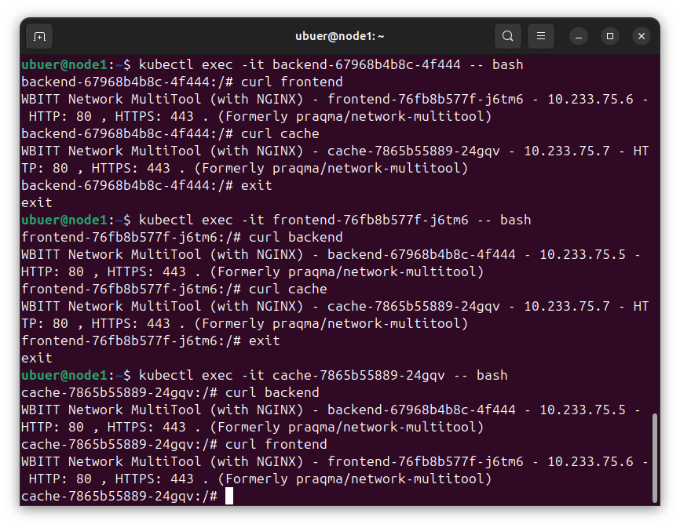
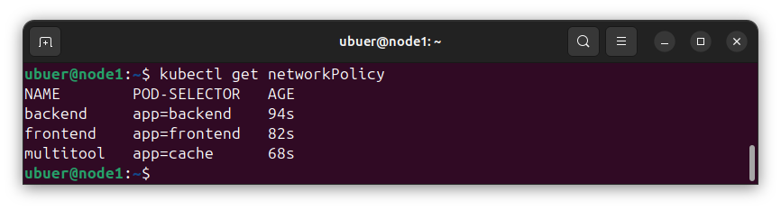
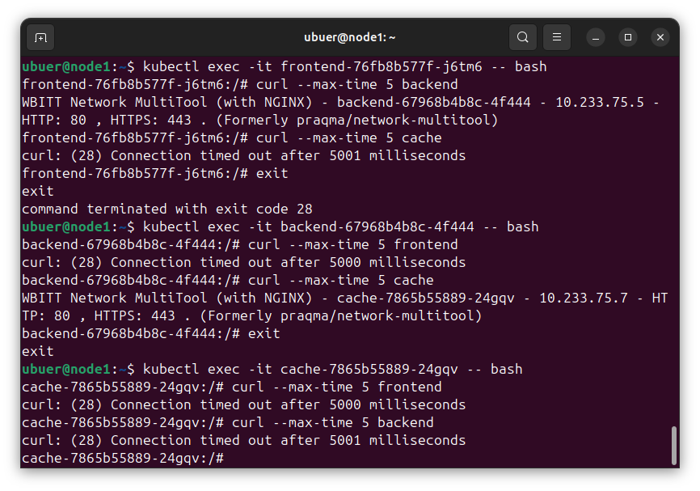

## Задание 1. Создать сетевую политику или несколько политик для обеспечения доступа

1. Создать deployment'ы приложений frontend, backend и cache и соответсвующие сервисы.
2. В качестве образа использовать network-multitool.
3. Разместить поды в namespace App.
4. Создать политики, чтобы обеспечить доступ frontend -> backend -> cache. Другие виды подключений должны быть запрещены.
5. Продемонстрировать, что трафик разрешён и запрещён.

---

### Решение

Для создания deployment, service и networkPolicy на каждое приложение, используется helm chart с template'ами [deployment.yaml](k8s/app/templates/deployment.yaml), [service.yaml](k8s/app/templates/service.yaml) и [ingressNetworkPolicy](k8s/app/templates/ingressNetworkPolicy.yaml) соответствено.

Ещё до создания шаблона для network policy, применяем шаблоны с файлами переменных [backend.yaml](k8s/app/backend.yaml), [frontend.yaml](k8s/app/frontend.yaml) и [cache.yaml](k8s/app/cache.yaml) соответственно.

Получаем три deployment'а, три service'а и три pod'а:

Пока что они все могут друг к другу обращаться:

Создадим политики:

Теперь frontend может обращаться только к backend'у, backend -- к cache'у, а cache вообще никуда не может достучаться:

