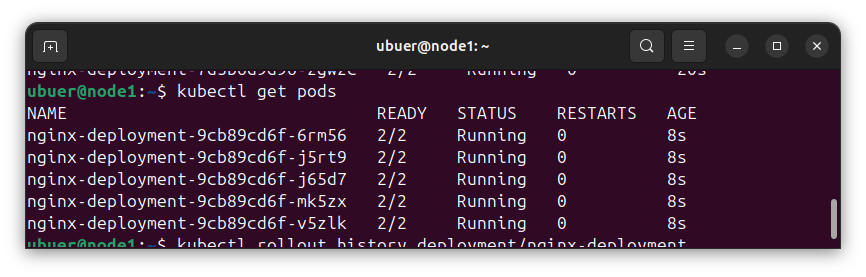
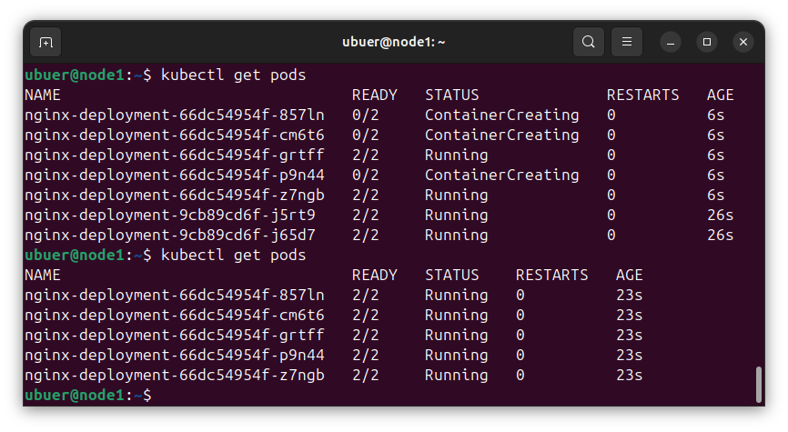
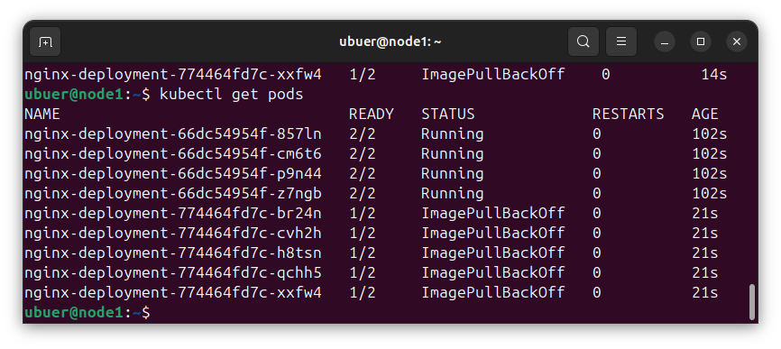
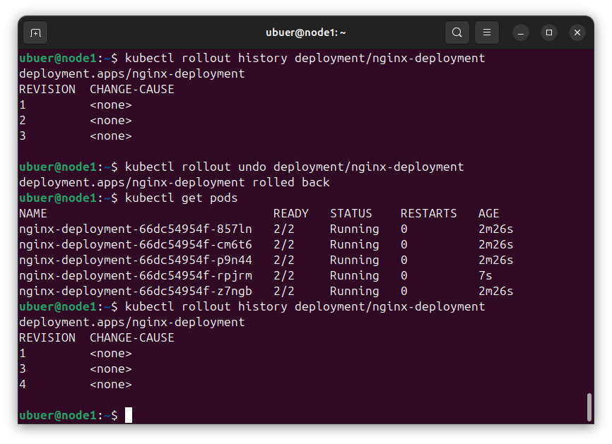

## Задание 1. Выбрать стратегию обновления приложения и описать ваш выбор

1. Имеется приложение, состоящее из нескольких реплик, которое требуется обновить.
2. Ресурсы, выделенные для приложения, ограничены, и нет возможности их увеличить.
3. Запас по ресурсам в менее загруженный момент времени составляет 20%.
4. Обновление мажорное, новые версии приложения не умеют работать со старыми.
5. Вам нужно объяснить свой выбор стратегии обновления приложения.

--- 

### Решение

С учётом, что обновление мажорное и не совместимое со старой версией – подошли бы Recreate и Blue-green. В противном случае, у нас будут ботаться частично новые, частично старые поды, и состояние ничем не будет отличаться от простоя.

Recreate полностью подходит подо все условия – это быстро и не требует дополнительных условий. Но мажорное обновление ~~стрёмно~~ неспокойно вот так выкатывать без каких-то тестов.

Можно использовать имеющиеся 20% (а скорее всего меньше) для реализации Blue-Green deployment. Правда, с мгновенным переключением могут возникнуть проблемы.

В порядке бреда – возможно, можно сначала попробовать Blue-Green на имеющихся ресурсах и далее, будучи уверенными, использовать Recreate.

---

## Задание 2. Обновить приложение

1. Создать deployment приложения с контейнерами nginx и multitool. Версию nginx взять 1.19. Количество реплик — 5.
2. Обновить версию nginx в приложении до версии 1.20, сократив время обновления до минимума. Приложение должно быть доступно.
3. Попытаться обновить nginx до версии 1.28, приложение должно оставаться доступным.
4. Откатиться после неудачного обновления.

---

### Решение

Создан [deployment.yaml](k8s/deployment.yaml). Стратегией обновления приложения выбираем Rolling deployment. Одновременно дубли сразу всех подов.

Раскатываем его с версией nginx 1.19:

Меняем версию:

Меняем версию на несуществующую:

Вертаем всё назад:

---

## Задание 3*. Создать Canary deployment

1. Создать два deployment'а приложения nginx.
2. При помощи разных ConfigMap сделать две версии приложения — веб-страницы.
3. С помощью ingress создать канареечный деплоймент, чтобы можно было часть трафика перебросить на разные версии приложения.

---

### Решение

