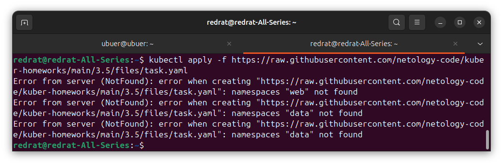
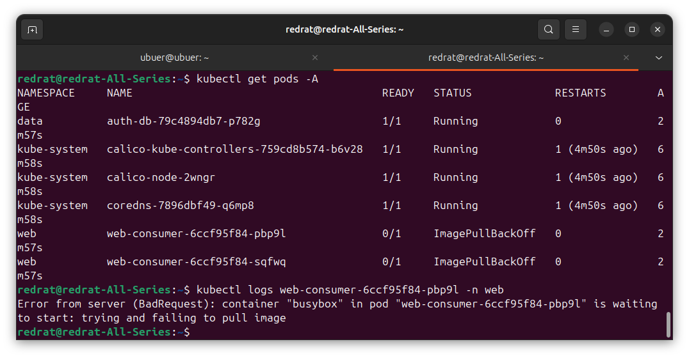
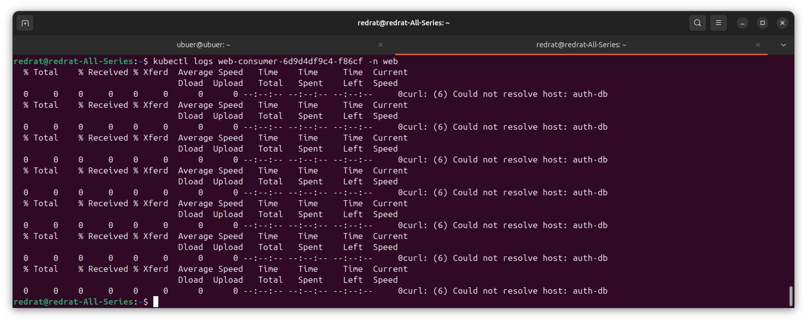
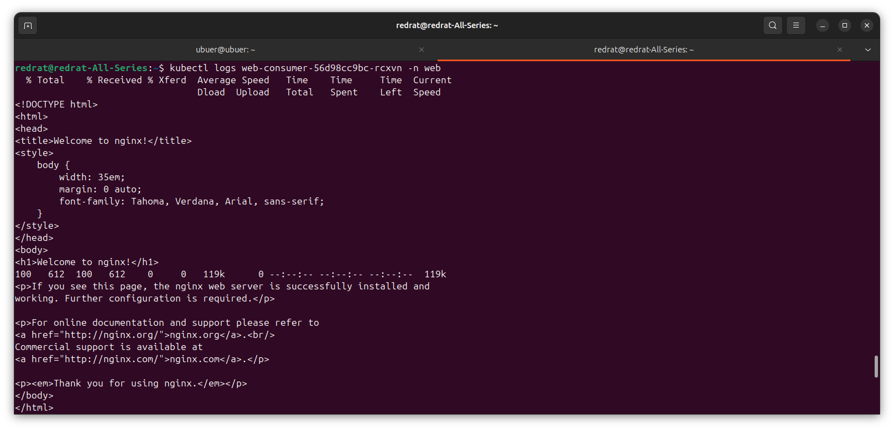

## Задание. При деплое приложение web-consumer не может подключиться к auth-db. Необходимо это исправить

1. Установить приложение по команде:
```shell
kubectl apply -f https://raw.githubusercontent.com/netology-code/kuber-homeworks/main/3.5/files/task.yaml
```
2. Выявить проблему и описать.
3. Исправить проблему, описать, что сделано.
4. Продемонстрировать, что проблема решена.

---

### Решение

Сначала проблемы возникают с отсутствием namespace'ов:



Это к проблеме не относится, но всё равно мужественно решаем эту напасть, заведя нужные namespace'ы. 

Следующая проблема -- образ не загружается.



Если попытаться скачать его вручную, появится ошибка, связанная с сертификатами. Увы, ничего конкретного, похоже на несовместимость версий. Это тоже не очень относится к проблеме, поставленной в задаче, так что просто меняем образ на busybox с curl (использован `vukomir/busybox`).

Итак, контейнеры наконец поднялись, и можно посмотреть на подразумеваемую ошибку:



Контейнер ни сном ни духом, что у нас где-то там в другом namespace есть auth-db. Заменяем обращение на полный путь `auth-db.data.svc.cluster.local`.

Проверяем:



Вот теперь хорошо. И во втором контейнере картина такая же.