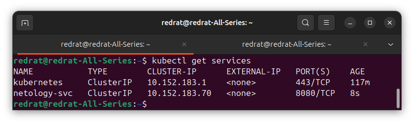
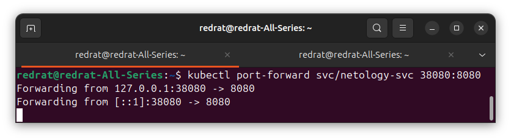
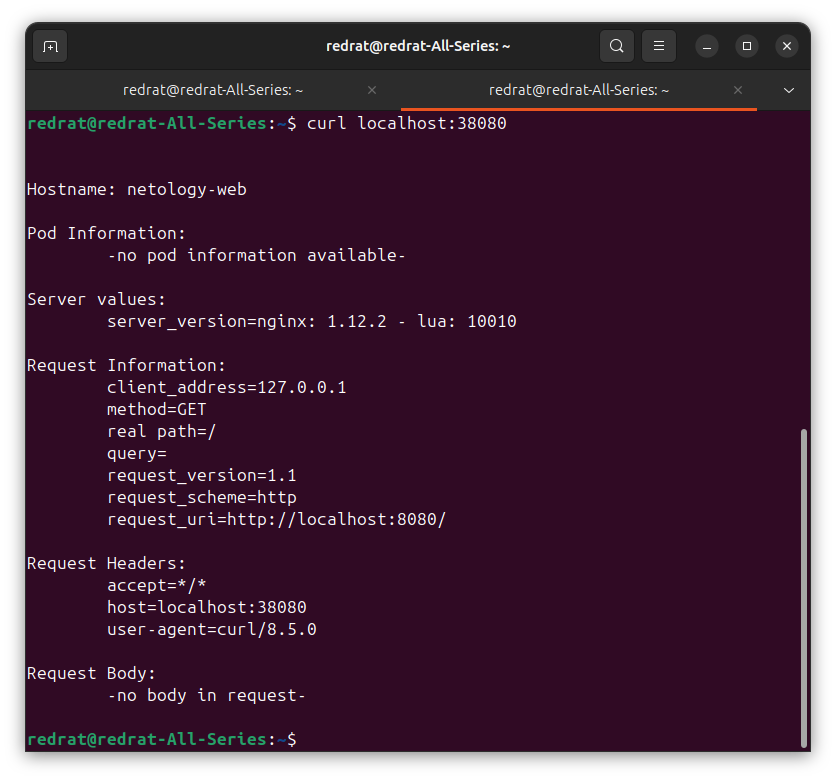

### Задание 1. Создать Pod с именем hello-world

1. Создать манифест (yaml-конфигурацию) Pod.
2. Использовать image - gcr.io/kubernetes-e2e-test-images/echoserver:2.2.
3. Подключиться локально к Pod с помощью `kubectl port-forward` и вывести значение (curl или в браузере).

---

#### Решение

Для pod'а создана конфигурация [echoserver-pod.yml](k8s/echoserver-pod.yml). Под создан на удалённом сервере:

Настроен port-forward:

Проверяем подключение:

Успех.

---

### Задание 2. Создать Service и подключить его к Pod

1. Создать Pod с именем netology-web.
2. Использовать image — gcr.io/kubernetes-e2e-test-images/echoserver:2.2.
3. Создать Service с именем netology-svc и подключить к netology-web.
4. Подключиться локально к Service с помощью `kubectl port-forward` и вывести значение (curl или в браузере).

---

#### Решение

Создан отдельный файл [another-echoserver-pod.yml](k8s/another-echoserver-pod.yml), чтобы не пересекаться с заданием 1.

Для service создан конфигурационный файл [echoserver-pod.yml](k8s/echoserver-pod.yml). Сервис успешно запустился:

Настроен port-forward для сервиса:

Проверяем подключение:

Мы прекрасны!