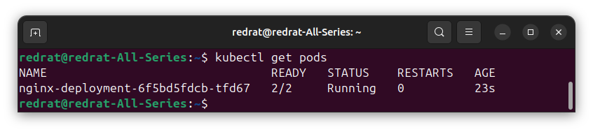
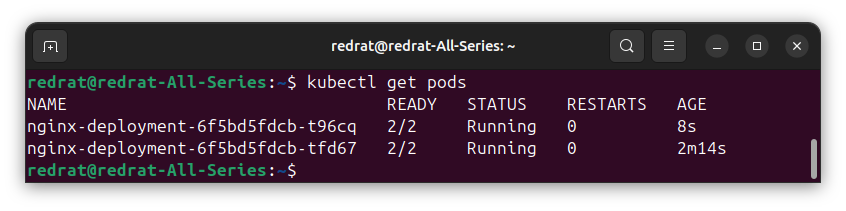
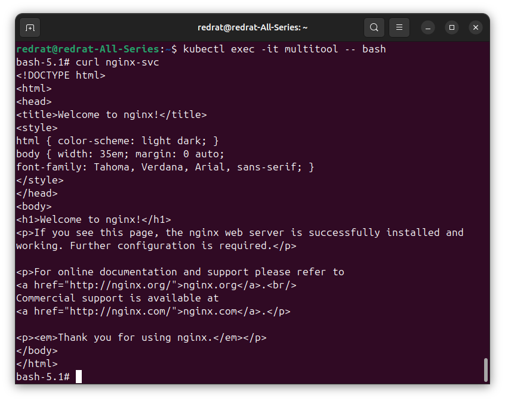

### Задание 1. Создать Deployment и обеспечить доступ к репликам приложения из другого Pod

1. Создать Deployment приложения, состоящего из двух контейнеров — nginx и multitool. Решить возникшую ошибку.
2. После запуска увеличить количество реплик работающего приложения до 2.
3. Продемонстрировать количество подов до и после масштабирования.
4. Создать Service, который обеспечит доступ до реплик приложений из п.1.
5. Создать отдельный Pod с приложением multitool и убедиться с помощью `curl`, что из пода есть доступ до приложений из п.1.

---

#### Решение

При запуске контейнеров nginx и multitool последний падает, а сам под сначала падает в Error, потом в CrashLoopBackOff. Как гласит документация multitool, наличие других приложений на порту 80 может вызвать конфликт. И действительно, из-за особенностей multitool (который, судя по описанию, содержит тот же nginx), контейнеры передрались за port. В конфигурации контейнера меняем переменную окружения. Теперь всё хорошо:

Как говорил Боб Росс, всем нужен друг. Добавляем друга нашему поду:

Happy little pods.

Итак, delpoyment завершён: [nginx-deployment.yml](k8s/nginx-deployment.yml). Добавляем service [nginx-svc.yml](k8s/nginx-svc.yml) и pod с multitool [multitool-pod.yml](k8s/multitool-pod.yml). Врываемся в него и пытаемся получить данные через сервис:

Получилось.

---

### Задание 2. Создать Deployment и обеспечить старт основного контейнера при выполнении условий

1. Создать Deployment приложения nginx и обеспечить старт контейнера только после того, как будет запущен сервис этого приложения.
2. Убедиться, что nginx не стартует. В качестве Init-контейнера взять busybox.
3. Создать и запустить Service. Убедиться, что Init запустился.
4. Продемонстрировать состояние пода до и после запуска сервиса.