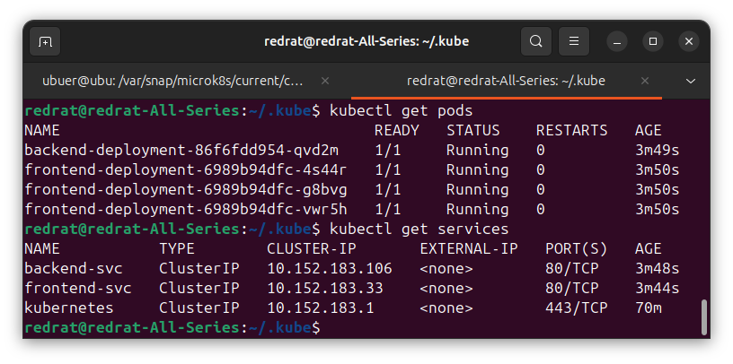
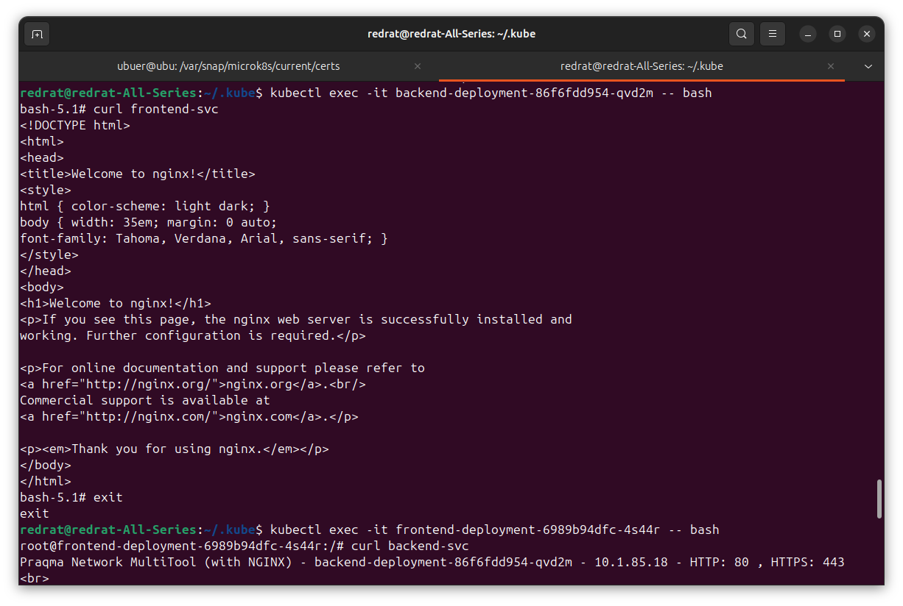
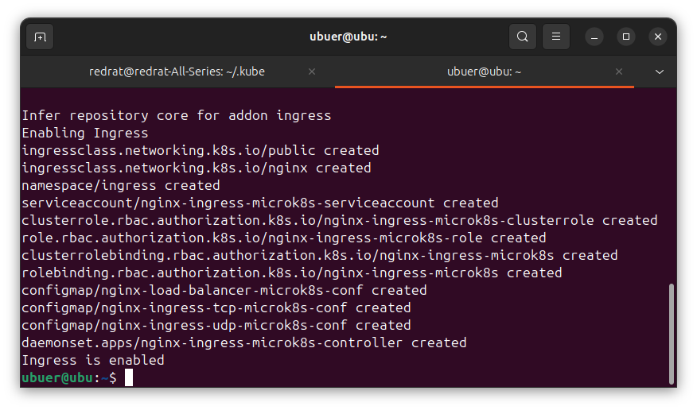

### Задание 1. Создать Deployment приложений backend и frontend

1. Создать Deployment приложения _frontend_ из образа nginx с количеством реплик 3 шт.
2. Создать Deployment приложения _backend_ из образа multitool. 
3. Добавить Service, которые обеспечат доступ к обоим приложениям внутри кластера. 
4. Продемонстрировать, что приложения видят друг друга с помощью Service.
5. Предоставить манифесты Deployment и Service в решении, а также скриншоты или вывод команды п.4.

---

#### Решение

Созданы файлы конфигураций для deployment ([multitool.yml](k8s/deployment/multitool.yml) и [nginx.yml](k8s/deployment/nginx.yml)) и соответствующих им serviсe ([multitool.yml](k8s/service/multitool.yml) и [nginx.yml](k8s/service/nginx.yml))

Проверяем, видят ли приложения друг друга:

Есть контакт.

---

### Задание 2. Создать Ingress и обеспечить доступ к приложениям снаружи кластера

1. Включить Ingress-controller в MicroK8S.
2. Создать Ingress, обеспечивающий доступ снаружи по IP-адресу кластера MicroK8S так, чтобы при запросе только по адресу открывался _frontend_ а при добавлении /api - _backend_.
3. Продемонстрировать доступ с помощью браузера или `curl` с локального компьютера.
4. Предоставить манифесты и скриншоты или вывод команды п.2.

---

#### Решение

Ingress-controller влкючен на машине с microk8s:

Составлен файл [ingress.yml](k8s/ingress/ingress.yml), а на локальной машине изменён файл hosts для обращения по доменному имени. Теперь приложения доступны и с локальной машины тоже:

