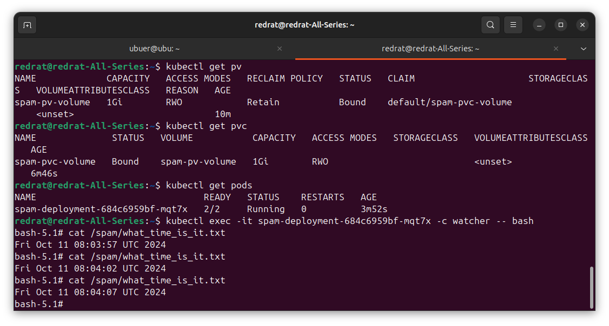
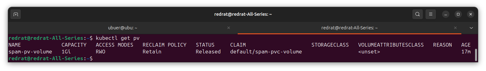
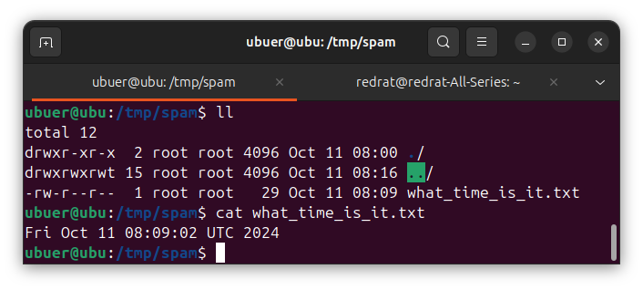
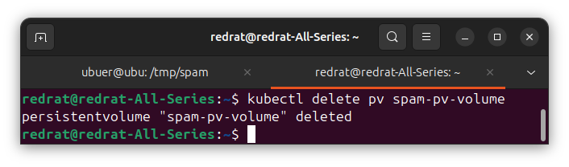
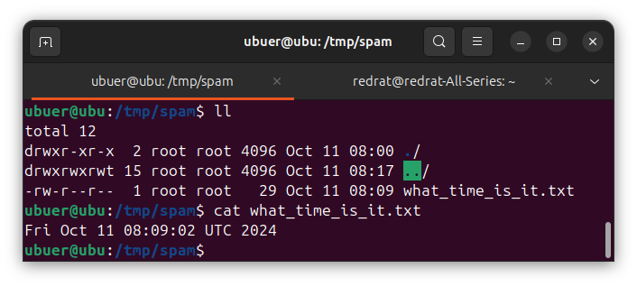
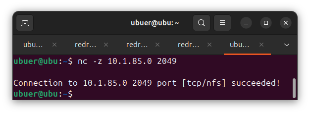
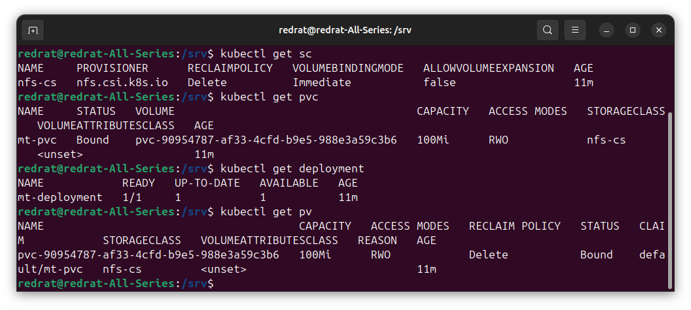
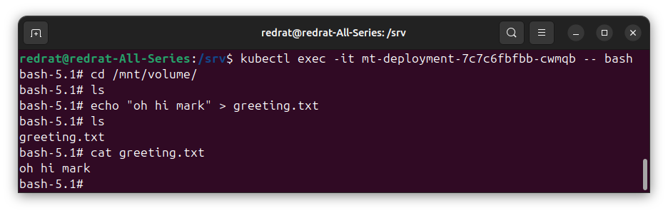
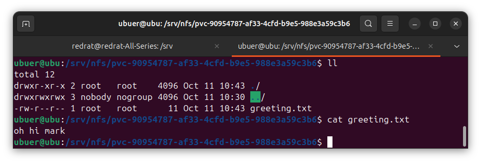

## Задание 1

**Что нужно сделать**

Создать Deployment приложения, использующего локальный PV, созданный вручную.

1. Создать Deployment приложения, состоящего из контейнеров busybox и multitool.
2. Создать PV и PVC для подключения папки на локальной ноде, которая будет использована в поде.
3. Продемонстрировать, что multitool может читать файл, в который busybox пишет каждые пять секунд в общей директории. 
4. Удалить Deployment и PVC. Продемонстрировать, что после этого произошло с PV. Пояснить, почему.
5. Продемонстрировать, что файл сохранился на локальном диске ноды. Удалить PV.  Продемонстрировать что произошло с файлом после удаления PV. Пояснить, почему.
5. Предоставить манифесты, а также скриншоты или вывод необходимых команд.

---

### Решение

Созданы конфигурации для [pv](k8s/pv/spam.yml), [pvc](k8s/pvc/spam.yml) и [deployment](k8s/deployment/spam.yml).

На поде один контейнер спамит в файл, в другом контейнере это можно считать:

После удаления deployment и pvc, у pv сменился статус – с bound на released. То есть раньше он был привязан, а теперь отпущен на волю.

Pv освобождённый ждёт наших действий.

Мы можем найти файл по пути, указанном в pv:

После удаления pv ничего не меняется:

Так происходит, потому что выставленная по умолчанию reclaim policy требует оставить ресурсы после удаления pv.

## Задание 2

**Что нужно сделать**

Создать Deployment приложения, которое может хранить файлы на NFS с динамическим созданием PV.

1. Включить и настроить NFS-сервер на MicroK8S.
2. Создать Deployment приложения, состоящего из multitool, и подключить к нему PV, созданный автоматически на сервере NFS.
3. Продемонстрировать возможность чтения и записи файла изнутри пода. 
4. Предоставить манифесты, а также скриншоты или вывод необходимых команд.

---

### Решение

NFS-сервер настроен:

Для подлючения к нему добавлен [storage class](k8s/sc/nfs.yml). Также созданы манифесты для [pvc](k8s/pvc/multitool.yml) и [deployment](k8s/deployment/multitool.yml).

Объекты успешно созданы, а pv выделен автоматически:

В контейнере можно создать файл. Он же будет виден в соответствующем разделе на хосте:

