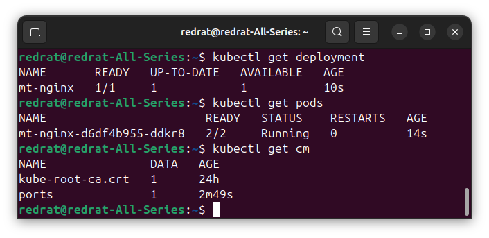
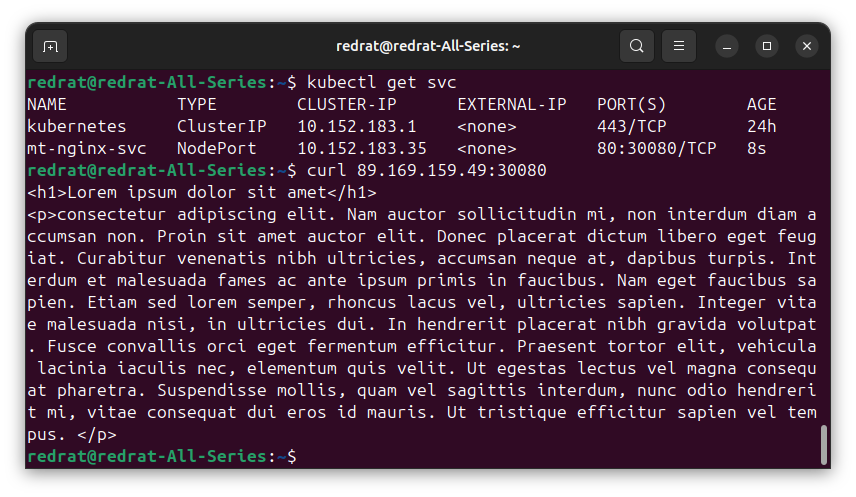
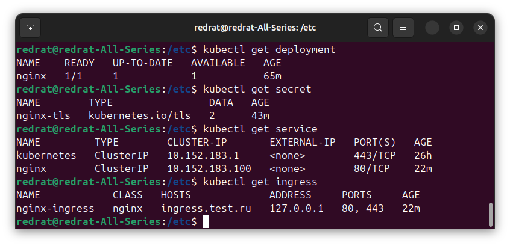
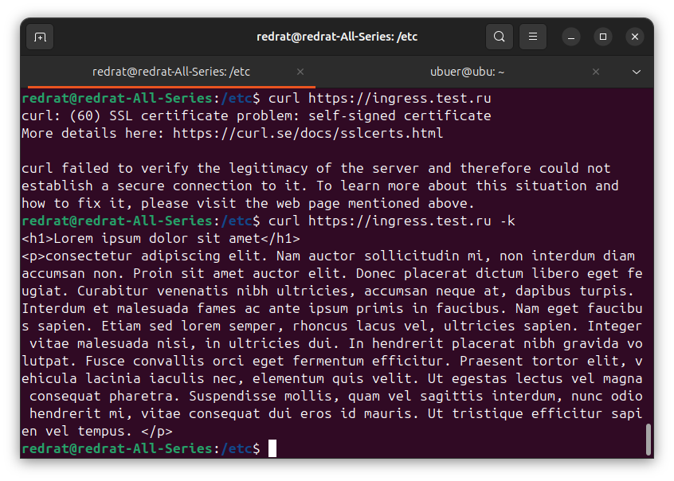

## Задание 1. Создать Deployment приложения и решить возникшую проблему с помощью ConfigMap. Добавить веб-страницу

1. Создать Deployment приложения, состоящего из контейнеров nginx и multitool.
2. Решить возникшую проблему с помощью ConfigMap.
3. Продемонстрировать, что pod стартовал и оба конейнера работают.
4. Сделать простую веб-страницу и подключить её к Nginx с помощью ConfigMap. Подключить Service и показать вывод curl или в браузере.
5. Предоставить манифесты, а также скриншоты или вывод необходимых команд.

---

### Решение

Создаём манифесты [ConfigMap](k8s/config/ports-cm.yml) и [Deployment](k8s/deployment/mt-nginx.yml). В ConfigMap есть только одна переменная, HTTP_PORT, так что файл подключается целиком.

Проверяем:

Контейнеры пода больше не конфликтуют за 80 порт и поднимаются оба.

Добавляем [ConfigMap с index.html](k8s/config/nginx-files-cm.yml), подключаем в Deployment. Поднимаем [Service](k8s/service/mt-nginx.yml) (типа NodePort).

Страница успешно подменена:

---

## Задание 2. Создать приложение с вашей веб-страницей, доступной по HTTPS 

1. Создать Deployment приложения, состоящего из Nginx.
2. Создать собственную веб-страницу и подключить её как ConfigMap к приложению.
3. Выпустить самоподписной сертификат SSL. Создать Secret для использования сертификата.
4. Создать Ingress и необходимый Service, подключить к нему SSL в вид. Продемонстировать доступ к приложению по HTTPS. 
4. Предоставить манифесты, а также скриншоты или вывод необходимых команд.

### Решение

Добавлен [Deployment для Nginx](k8s/deployment/nginx.yml). В манифесте подключается тот же конфиг, что и в первом задании.

Добавляем [Secret](k8s/secret/nginx.yml) с самоподписным сертификатом.

Добавляем [Service](k8s/service/nginx.yml) и [Ingress](k8s/service/nginx-ingress.yml).

Вот они все красавцы:

Теперь можно подключиться и получить ~~предупреждение~~ начальную страницу:

