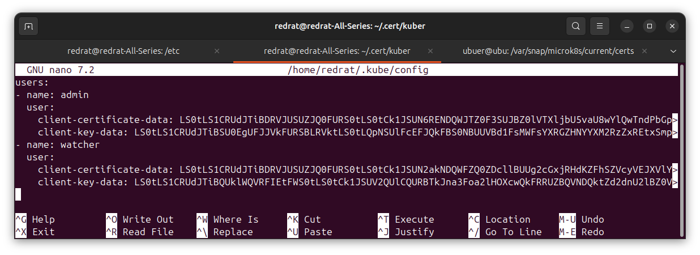
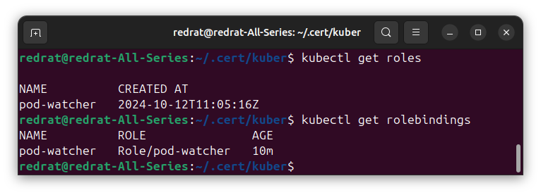
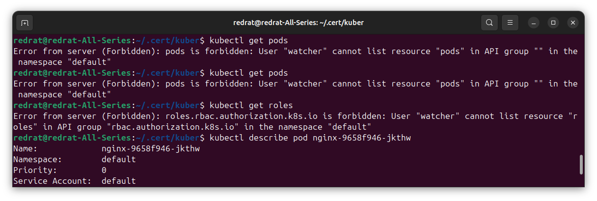
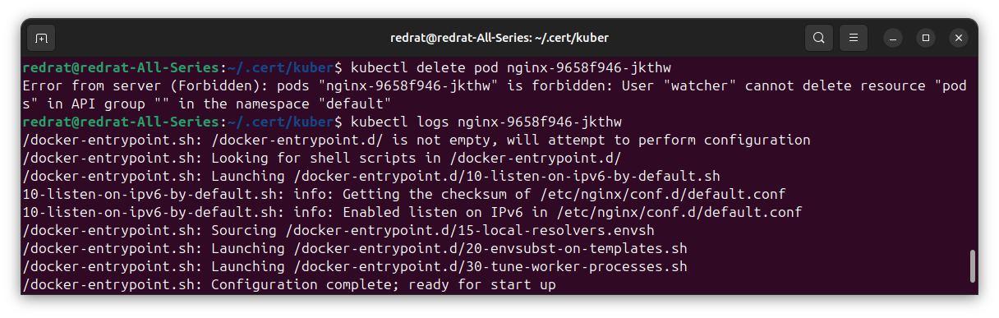

## Задание 1. Создайте конфигурацию для подключения пользователя

1. Создайте и подпишите SSL-сертификат для подключения к кластеру.
2. Настройте конфигурационный файл kubectl для подключения.
3. Создайте роли и все необходимые настройки для пользователя.
4. Предусмотрите права пользователя. Пользователь может просматривать логи подов и их конфигурацию (`kubectl logs pod <pod_id>`, `kubectl describe pod <pod_id>`).
5. Предоставьте манифесты и скриншоты и/или вывод необходимых команд.

---

### Решение

Генерим ключ. Создаём сертификат и с помощью стянутых с хоста файлов `ca.crt` и `ca.key` подписываем его.

Добавляем в конфигурацию пользователя `watcher` с созданными данными:

Создаём [Role](k8s/role/watcher-role.yml) с разрешениями посмотреть на поды и посмотреть на их логи, и привязываем к тем, кто стучится с именем watcher, в [RoleBinding](k8s/role/watcher-role-binding.yml).

Поключаем RBAC в microk8s (`microk8s enable rbac`)

Создаём контекст для watcher'а, переключаемся на него и проверяем:

Теперь не получается посмотреть ни на что, кроме конкретных подов, даже списка нет; да и те удалить нельзя. Никакого праздника.