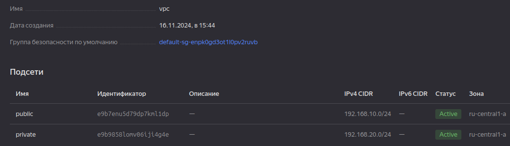

## Задание 1. Yandex Cloud 

**Что нужно сделать**

1. Создать пустую VPC. Выбрать зону.
2. Публичная подсеть.

 - Создать в VPC subnet с названием public, сетью 192.168.10.0/24.
 - Создать в этой подсети NAT-инстанс, присвоив ему адрес 192.168.10.254. В качестве image_id использовать fd80mrhj8fl2oe87o4e1.
 - Создать в этой публичной подсети виртуалку с публичным IP, подключиться к ней и убедиться, что есть доступ к интернету.
3. Приватная подсеть.
 - Создать в VPC subnet с названием private, сетью 192.168.20.0/24.
 - Создать route table. Добавить статический маршрут, направляющий весь исходящий трафик private сети в NAT-инстанс.
 - Создать в этой приватной подсети виртуалку с внутренним IP, подключиться к ней через виртуалку, созданную ранее, и убедиться, что есть доступ к интернету.

 ### Решение

 Созадна сеть vps с подсетями public и private (см. [vpc.tf](terraform/vpc.tf)):

 

Добавлена security group (впрочем, используется только для приватной вм, см. [secruity-groups.tf](terraform/secrurity-groups.tf)):

Добавлены виртуальные машины NAT, public и private (см. [vm.tf](terraform/vm.tf)):

Создан route table (см. [route-table.tf](terraform/route-table.tf)):

Проверяем доступ с виртуальных машин. 
С публичной:

С приватной (через публичную ВМ):

