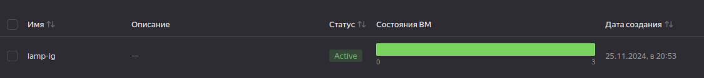

## Задание 1. Yandex Cloud 

**Что нужно сделать**

1. Создать бакет Object Storage и разместить в нём файл с картинкой:

 - Создать бакет в Object Storage с произвольным именем (например, _имя_студента_дата_).
 - Положить в бакет файл с картинкой.
 - Сделать файл доступным из интернета.
 
2. Создать группу ВМ в public подсети фиксированного размера с шаблоном LAMP и веб-страницей, содержащей ссылку на картинку из бакета:

 - Создать Instance Group с тремя ВМ и шаблоном LAMP. Для LAMP рекомендуется использовать `image_id = fd827b91d99psvq5fjit`.
 - Для создания стартовой веб-страницы рекомендуется использовать раздел `user_data` в [meta_data](https://cloud.yandex.ru/docs/compute/concepts/vm-metadata).
 - Разместить в стартовой веб-странице шаблонной ВМ ссылку на картинку из бакета.
 - Настроить проверку состояния ВМ.
 
3. Подключить группу к сетевому балансировщику:

 - Создать сетевой балансировщик.
 - Проверить работоспособность, удалив одну или несколько ВМ.
 
4. (дополнительно)* Создать Application Load Balancer с использованием Instance group и проверкой состояния.

### Решение

Создан bucket (один раз, чтобы засорять тем же названием, но со случайным суффиксом), автоматизирована загрузка в него изображения: [buckets.yml](../23.common/buckets.tf).

Добавлена группа машин: [instance-groups.tf](../23.common/instance-groups.tf):

Добавлен сетевой балансировщик: [balancers.tf](../23.common/balancers.tf):

При обращении по его ip получаем ту же картину:

Удаляем одну из созданных виртуальных машин:

Томми всё ещё здесь:

А через некоторое время создаётся новая машина:

---

Заменяем сетевой балансировщик на L7-балансировщик: [balancer.tf](../23.common/balancers.tf).

Получаем:

При обращении по адресу балансировщика, выпадаем... ну, туда же, в комнату:

