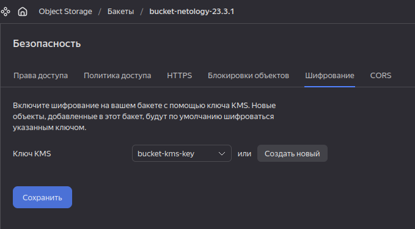
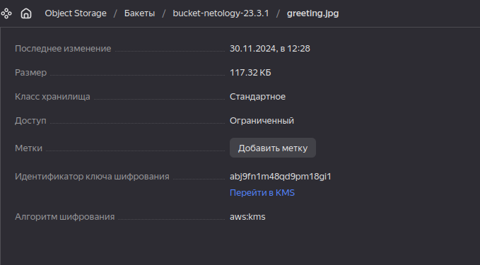
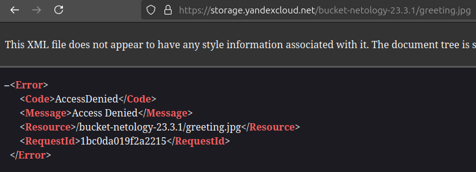

## Задание 1. Yandex Cloud   

1. С помощью ключа в KMS необходимо зашифровать содержимое бакета:

 - создать ключ в KMS;
 - с помощью ключа зашифровать содержимое бакета, созданного ранее.

 ### Решение

Добавлен KMS ключ: [kms.tf](../23.common/kms.tf). 
Добавлен отдельный bucket, содержимое которого будет этим ключом шифроваться: [buckets.tf](../23.common/buckets.tf).

Проверяем:

Отправленный файл зашифрован:

При попытке получить файл безо всяких аргументов, получаем решительный отказ:

___

