# Задание 1. Yandex Cloud

1. Настроить с помощью Terraform кластер баз данных MySQL.

 - Используя настройки VPC из предыдущих домашних заданий, добавить дополнительно подсеть private в разных зонах, чтобы обеспечить отказоустойчивость. 
 - Разместить ноды кластера MySQL в разных подсетях.
 - Необходимо предусмотреть репликацию с произвольным временем технического обслуживания.
 - Использовать окружение Prestable, платформу Intel Broadwell с производительностью 50% CPU и размером диска 20 Гб.
 - Задать время начала резервного копирования — 23:59.
 - Включить защиту кластера от непреднамеренного удаления.
 - Создать БД с именем `netology_db`, логином и паролем.

2. Настроить с помощью Terraform кластер Kubernetes.

 - Используя настройки VPC из предыдущих домашних заданий, добавить дополнительно две подсети public в разных зонах, чтобы обеспечить отказоустойчивость.
 - Создать отдельный сервис-аккаунт с необходимыми правами. 
 - Создать региональный мастер Kubernetes с размещением нод в трёх разных подсетях.
 - Добавить возможность шифрования ключом из KMS, созданным в предыдущем домашнем задании.
 - Создать группу узлов, состояющую из трёх машин с автомасштабированием до шести.
 - Подключиться к кластеру с помощью `kubectl`.
 - *Запустить микросервис phpmyadmin и подключиться к ранее созданной БД.
 - *Создать сервис-типы Load Balancer и подключиться к phpmyadmin. Предоставить скриншот с публичным адресом и подключением к БД.

## Решение

В VPC добавлены ещё две приватные подсети (одна из них является уже использованной зоной a; в zone d конфигурация b1.medium не поддерживается, так что остаётся только заговорщицки подмигивать): [vpc.tf](../23.common/vpc.tf)

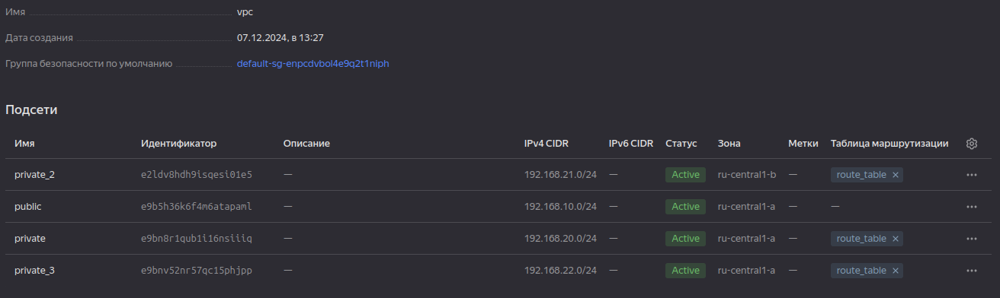

Для кластера добавлена группа безопасности: [security-groups.tf](../23.common/secrurity-groups.tf)

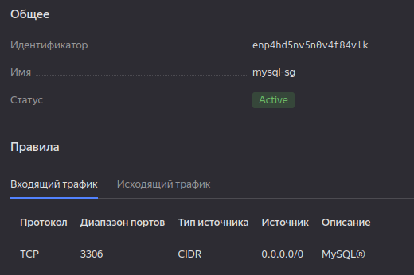

Добавлен, собственно, кластер из трёх нод: [mysql-cluster.tf](../23.common/mysql-cluster.tf)

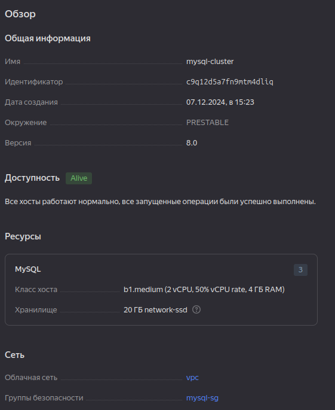

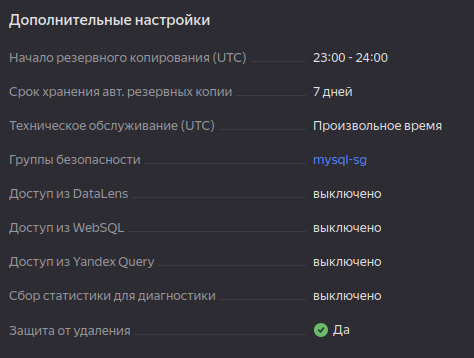

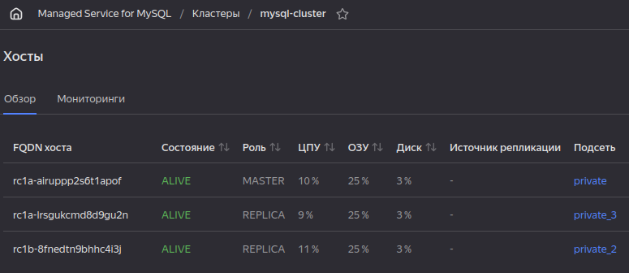

Не мудрствуя лукаво подключаемся к базе данных через nat-инстанс, и видим, что запрошенные пользователь и база данных созданы:

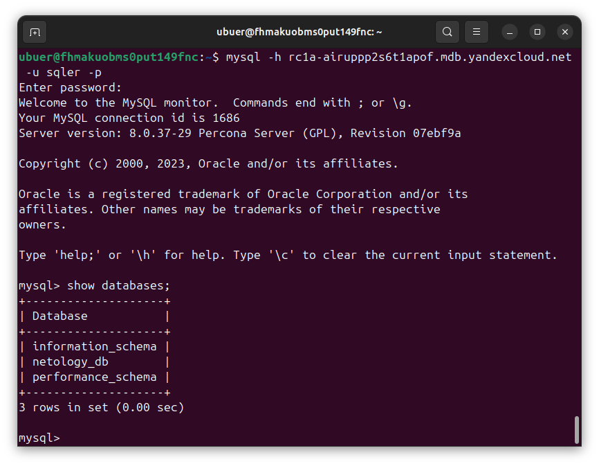

---

В файл [text](../23.common/vpc.tf) добавлены дополнительные публичные сети (от греха подальше также без зоны d, хотя стоило попробовать):

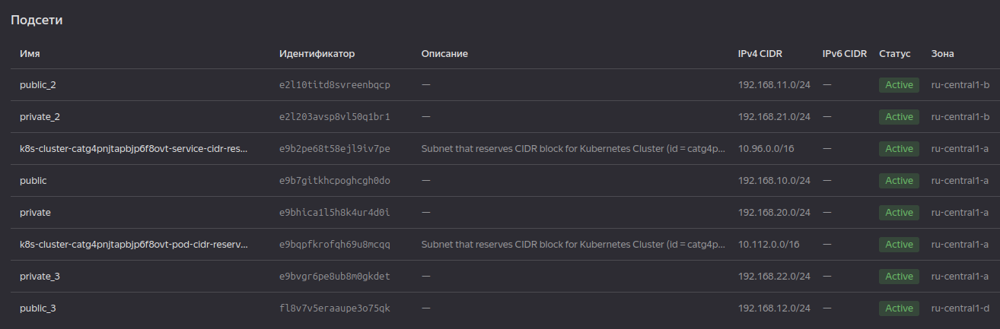

Добавлены новые сервисный аккаунт ([service-accounts.tf](../23.common/service-accounts.tf)) и группа безопасности [security-groups.tf](../23.common/secrurity-groups.tf).

Созданы master-ноды и worker-ноды: [k8s.tf](../23.common/k8s.tf):

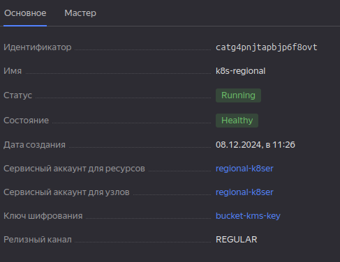

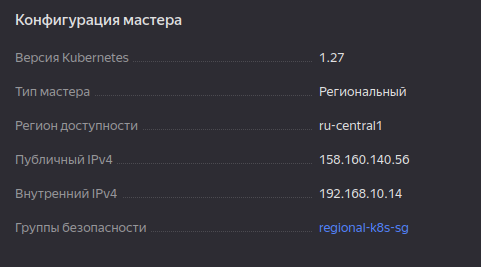

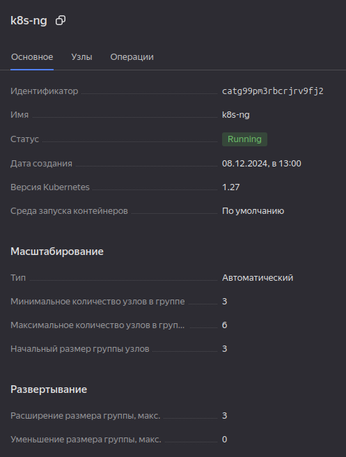

Подключаемся:

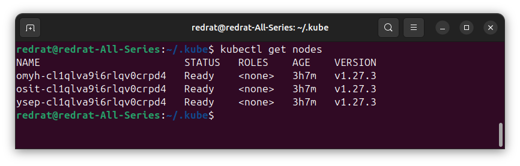

Контакт есть.

Добавляем [deployment](../23.common/k8s/phpmyadmin.yml) с phpmyadmin и [loadbalancer](../23.common/k8s/load-balancer.yml) для узлов:

Компоненты развернулись, а в yandex cloud добавился network balancer:

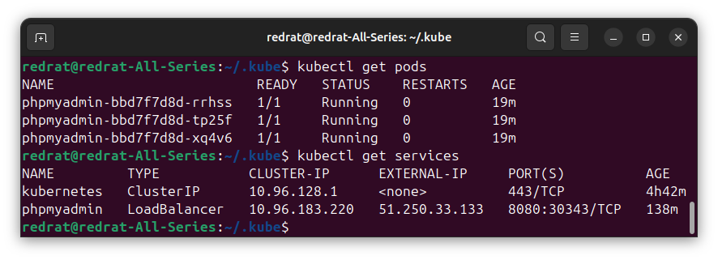

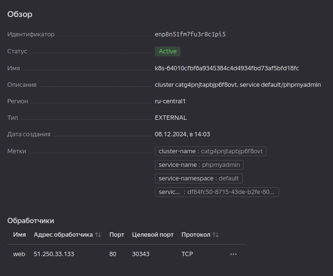

Проверяем подключение к ранее созданной MySQL БД:

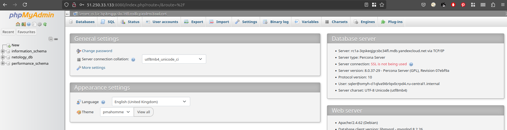